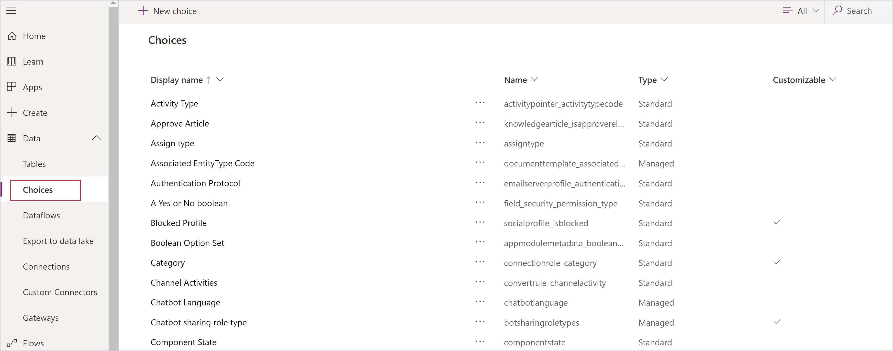
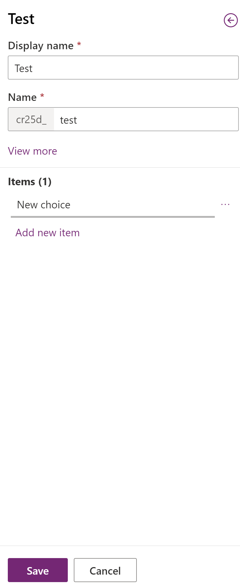
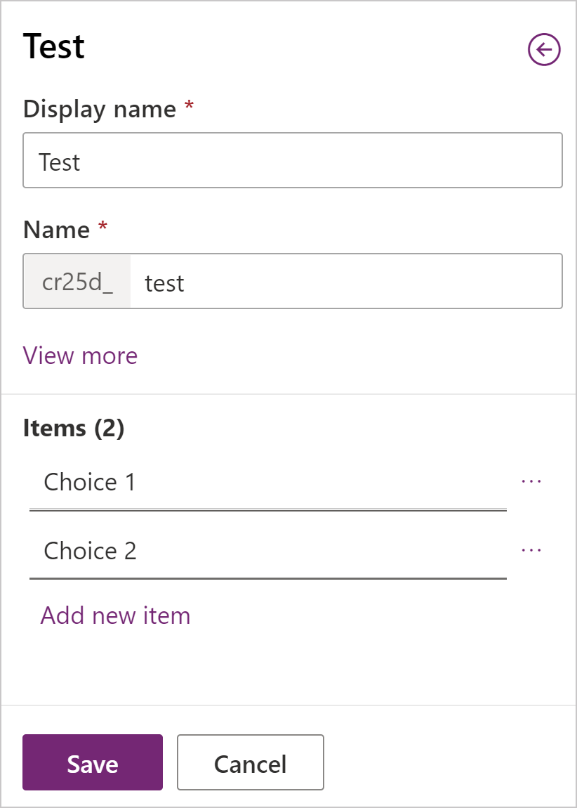

# Create a choice

Choice columns allow you to include dropdown lists of fixed values to a user within your app to ensure data consistency. Choice columns, were formerly referred to as option sets and are sometimes called picklists. Similar to tables, there are both standard choices or makers have the ability to create custom choice columns to use in apps.

Choices can be created while working in a table in the table hub, in a table form in the form designer, or directly from a solution in powerapps.com.

Choice columns can be single selection only (choice) or can allow multi-selection (choices). The following screenshot shows a multi-select choices column in a model-driven app.

::image type="content" source="media/data-platform-cds-newoptionset/multi-select-choice.png" alt-text="A multi-select choices column displayed on a model-driven app main form":::

## Global and local choice columns

Choices can be local or global. Local choices can only be used by the table and column they are created against, and can't be reused with other tables. More information: [Create and edit global choices overview](create-edit-global-option-sets.md)

## Create a global choice within a solution

When you follow these steps to create a choice in a solution, you're creating a global choice that is single selection.

1. Sign into [powerapps.com](https://make.powerapps.com/?utm_source=padocs&utm_medium=linkinadoc&utm_campaign=referralsfromdoc), select Solutions, and then open the solution you want.

1. On the command bar, select **New** > **Choice**.

1. In the **New choice** panel, enter the **Display name** for your column. The **Display name** is used when presenting this column to your users.

1. Create the options for your choice:
   - In the **Label** field, enter the label you want displayed for the choice option.
   - The **Value** number represents a unique value for the option and is not displayed in the choice column in an app. Notice there's a number generated for each **Value** automatically. We recommend that you not change this. Having a unique **Value** helps ensure that the value will be different from other option values that might be defined in other solutions and imported into your environment.
   - Select the color picker to the left of the **Label** if you want a color to appear for the option in model-driven app charts.

1. Select **+ New choice** to create additional options for the choice list. Repeat steps 4-5 until all the options you want are created.

1. Optionally, expand **Advanced options** to display the following properties:
   - **Name**. This is the unique name used by the system and is automatically generated based on the display name and solution publisher prefix. After a new choice column is saved you can't change this.
   - **External type name**: This value is used for virtual tables to map a value in an external data source with this option.
   - **Description**: Add an optional description for the choice.

   :::image type="content" source="media/data-platform-cds-newoptionset/choice-created-in-solution.png" alt-text="New choice properties pane.":::

1. Select **Save**.

## Creating n Choice from the Choice list

1. On [powerapps.com](https://make.powerapps.com/?utm_source=padocs&utm_medium=linkinadoc&utm_campaign=referralsfromdoc), expand the **Data** section and click or tap **Choices** in the left navigation pane.

    > [!div class="mx-imgBorder"] 
    > 

2. Click **New Choice**

3. A new panel will open to create the choice, enter the **Display name** and **Name**. Click **Add new item** to start creating your list of options. Repeat this step until all your items are created.

    > [!div class="mx-imgBorder"] 
    > 

4. Once you've entered your items, click **Save** to create your choice.

    > [!div class="mx-imgBorder"] 
    > 

5. You can now use this choice  by creating new column on a table.

> [!IMPORTANT]
> Once a choice  is created as local or global, this cannot be changed.

[!INCLUDE[footer-include](../../includes/footer-banner.md)]