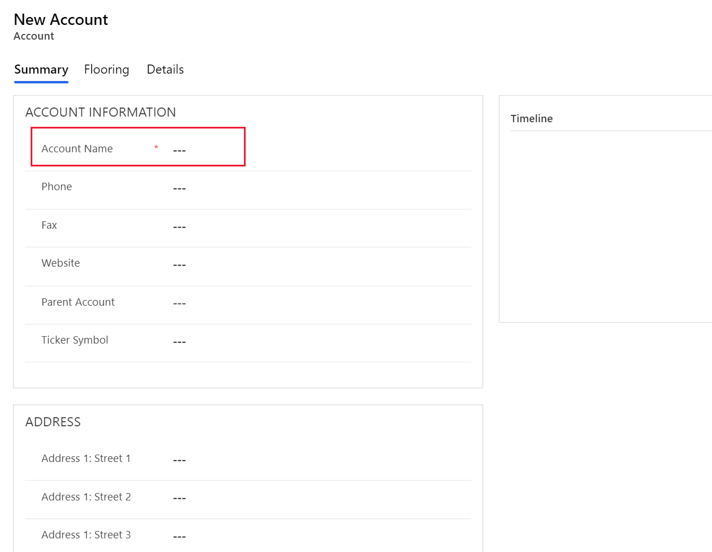

# Create a business rule for a table

[!INCLUDE[cc-data-platform-banner](../../includes/cc-data-platform-banner.md)]

You can create business rules and recommendations to apply logic and validations without writing code or creating plug-ins. Business rules provide a simple interface to implement and maintain fast-changing and commonly used rules.

> [!IMPORTANT]
> Business rules defined for a table apply to both *canvas apps* and *model-driven apps* if the table is used in the app. Not all business rule actions are available on canvas apps at this time. More information: [Differences between canvas and model-driven apps](#differences-between-canvas-and-model-driven-apps)  
> Business rules don’t work with multi-select choices.
>
> To define a business rule that applies to a form in a model-driven app, see [Create business rules to apply logic in a model-driven app form](../model-driven-apps/create-business-rules-recommendations-apply-logic-form.md).

By combining conditions and actions, you can do any of the following with business rules:  
  
* Set column values  
* Clear column values  
* Set column requirement levels  
* Show or hide columns  
* Enable or disable columns  
* Validate data and show error messages  
* Create business recommendations based on business intelligence.  
  
## Differences between canvas and model-driven apps

Model driven apps can use all actions available on business rules, however not all business rule actions are available for canvas apps at this time. The following actions are **not** available on Canvas apps :

* Show or hide columns  
* Enable or disable columns  
* Create business recommendations based on business intelligence.  

## Prerequisites

To follow this topic, you must switch to an [environment](/power-platform/admin/working-with-environments) in which you can create and edit tables.

## Create a business rule
  
1. Sign in to [Power Apps](https://make.powerapps.com/?utm_source=padocs&utm_medium=linkinadoc&utm_campaign=referralsfromdoc), and then click or tap the down arrow for **Dataverse** near the left edge.

2. In the list that appears, click or tap **Tables**.
  
3. Open the table you want to create the business rule for (for example, open the **Account** table), and then click the **Business Rules** tab.  

4. Click **New**.  
  
    The Business Rule designer window opens with a single condition already created for you. Every rule starts with a condition. The business rule takes one or more actions based on that condition.  

    > [!TIP]
    > If you want to modify an existing business rule, you must deactivate it before you can modify it.  
  
5. Add a description, if you want, in the description box in the upper-left corner of the window.
  
6. Set the scope, according to the following:  
  
    |||  
    |-|-|  
    |**If you select this item...**|**The scope is set to...**|  
    |**table**|Model Driven forms and server|  
    |**All Forms**|Model Driven forms|  
    |Specific form (**Account** form, for example)|Just that Model Driven form|  

    > [!TIP]
    > If you're building a Canvas app, you must use table as the scope.
  
7. **Add conditions.** To add more conditions to your business rule:  
  
    1. Drag the **Condition** component from the **Components** tab to a plus sign in the designer.  
  
          
  
    2. To set properties for the condition, click the **Condition** component in the designer window, and then set the properties in the **Properties** tab on the right side of the screen. As you set properties, the Microsoft Dataverse creates an expression at the bottom of the **Properties** tab.  
  
    3. To add an additional clause (an AND or OR)  to the  condition, click **New** in the **Properties** tab to create a new rule, and then set the properties for that rule. In the **Rule Logic** column, you can specify whether to add the new rule as an AND or an OR.  
  
          
  
    4. When you're done setting properties for the condition, click **Apply**.  
  
8. **Add actions.** To add an action:  
  
    1. Drag one of the action components from the **Components** tab to a plus sign next to **Condition** component. Drag the action to a plus sign next to a check mark if you want the business rule to take that action when the condition is met, or to a plus sign next to an  x if you want the business rule to take that action if the condition is not met.
  
          
  
    2. To set properties for the action, click the **Action** component in the designer window, and then set the properties in the **Properties** tab.  
  
    3. When you're done setting properties, click **Apply**.  
  
9. **Add a business recommendation. (Model Driven only)** To add a business recommendation:  
  
    1. Drag the **Recommendation** component from the **Components** tab to a plus sign next to a **Condition** component. Drag the **Recommendation** component to a plus sign next to a check mark if you want the business rule to take that action when the condition is met, or to a plus sign next to an  x if you want the business rule to take that action if the condition is not met.  
  
    2. To set properties for the recommendation, click the **Recommendation** component in the designer window, and then set the properties in the **Properties** tab.  
  
    3. To add more actions to the recommendation, drag them from the **Components** tab, and then set properties for each action in the **Properties** tab.  
  
        > [!NOTE]
        >  When you create a recommendation, the Dataverse adds a single action by default. To see all the actions in a recommendation, click **Details** on the **Recommendation** component.  
  
    4. When you're done setting properties, click **Apply**.  
  
10. To validate the business rule, click **Validate** on the action bar.  
  
11. To save the business rule, click **Save** on the action bar.  
12. To activate the business rule, select it in the Solution Explorer window, and then click **Activate**. You can't activate the business rule from the designer window.  
  
    > [!TIP]
    >  Here are a few tips to keep in mind as you work on business rules in the designer window:  
    >   
    > - To take a snapshot of everything in the Business Rule window, click **Snapshot** on the action bar. This is useful, for example, if you want to share and get comments on the business rule from a team member.  
    > - Use the mini-map to navigate quickly to different parts of the process. This is useful when you have a complicated process that scrolls off the screen.  
    > - As you add conditions, Actions, and business recommendations to your business rule, Dataverse builds the code for the business rule at the bottom of the designer window. This code is read only.  
  
## Localize error messages used in business rules

 If you have more than one language provisioned for your organization, you will want to localize any error messages that you have set. Each time you set a message, a label is generated by the system. If you export the translations in your organization, you can add localized versions of your messages and then import those labels back into the Dataverse, so that people using languages other than your base language can view the translated messages.  
  
## Common issues

This section describes common issues that may occur when you use business rules.

### Composite attributes not supported with Unified Interface apps

Actions or conditions that use [Composite attributes](../../developer/model-driven-apps/clientapi/reference/composite-attributes.md) are not supported in apps based on the Unified Interface.  Alternatively, you can use actions or conditions on the attributes that comprise the composite attributes. For example, instead of using the **Full Name** (fullname) attribute, you can use the **First Name** (firstname) and **Last Name** (lastname) attributes. 

### Is your business rule not firing for a form?

A business rule may not execute because the field referenced in the business rule isn’t included with the form. 
1.	Open [solution explorer](../model-driven-apps/advanced-navigation.md#solution-explorer). Expand the entity that you want and then select **Forms**. 
2.	Open the form that you want and then on the form designer ribbon select **Business Rules**. 
3.	In the form designer, open the business rule. 
4.	In the business rule designer select each condition and action to verify all the fields referenced in each condition and action. 

     > [!div class="mx-imgBorder"] 
     > 

 5.	Verify that each field referenced in the business rule is also included on the form. If not, add the missing field to the form.

     > [!div class="mx-imgBorder"] 
     > 

## Frequently asked questions (FAQ)

*Can business rules unlock fields on a read-only form?*
- Yes, a business rule can unlock fields and edit actions on a read-only form.

*How do I troubleshoot a business rule that isn't working?* 
- See [Is your business rule not firing for a form?](#is-your-business-rule-not-firing-for-a-form) in this topic.

*Do business rules react to changes made by an onLoad script?*
- No, they will execute before an onload script is executed.

*When I update a business rule, is it executed against all existing records?*
- No. Business rules are run on clients. For example, they run when a form is opened by a user and when a field value changes on that open form. They are not executed inside Dataverse.
 
### See also

[Apply business logic in Microsoft Dataverse](processes.md)

[!INCLUDE[footer-include](../../includes/footer-banner.md)]
