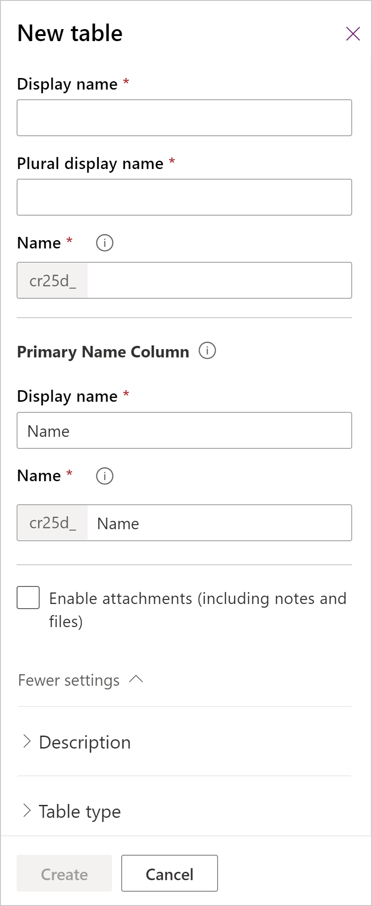

# Create a custom table
[!INCLUDE[cc-data-platform-banner](../../includes/cc-data-platform-banner.md)]

In Power Apps, a *table* defines information that you want to track in the form of records, which typically include properties such as company name, location, products, email, and phone. You can then surface that data by developing an app that refers to the table. Power Apps offers standard "out-of-the-box" tables to cover typical scenarios within an organization (such as tracking appointments), but there may be times when you need to create custom tables to store data that's specific to your organization.

Watch this video for a quick overview about how to create a table:
> [!VIDEO https://www.microsoft.com/en-us/videoplayer/embed/RWEEuM]

## Prerequisites
To create a table, you must have either a System Administrator or System Customizer security role within Microsoft Dataverse.

## Sign in to Power Apps
Sign in to Power Apps at [https://make.powerapps.com](https://make.powerapps.com/?utm_source=padocs&utm_medium=linkinadoc&utm_campaign=referralsfromdoc).

## Create a table
1. In the navigation pane, expand **Data**, and then select **Tables**.

2. On the command bar, select **New table**.

    Before you create a table, check out the [table reference](../../developer/data-platform/reference/about-entity-reference.md) for a description of available standard tables. These tables cover typical scenarios. If one of these tables meets your requirements as is or after minor changes, you can save time by starting with that table. 

3. In the **New table** panel, enter the following information columns. Required columns are designated with an asterisk (*) next to the column label. 

    

    |Section  |Column  |Description  |
    |---------|---------|---------|
    |Required columns   | **Display name &#42;**      | This is the singular name for the table that will be shown in the app. This can be changed later.     |
    |Required columns      |  **Plural display name &#42;**        | This is the plural name for the table that will be shown in the app. This can be changed later.      |
    |Required columns     |  **Display Name &#42;** (Primary column)     | By default, every table contains a Primary Field, which is used by lookup columns when establishing relationships with other tables. Typically the primary column stores the name or primary description of the data stored in the table. You may update the name and display name of the primary column before saving the table for the first time. Also, observe that the primary column also has its own **Name** box, which functions similarly to the table name described above. The primary column name is autopopulated when a display name is entered, uses the same prefix as the table, and cannot be changed after the table is created.      |
    |Required columns      | **Name &#42;**    |  This column is pre-populated based on the **Primary Column Display name** you enter. It includes the customization prefix for the Dataverse solution publisher. You cannot change this after the table is saved.     In order for the table name to work with [Dynamics 365 for Customer Service embedded knowledge search](/dynamics365/customer-engagement/customer-service/set-up-knowledge-management-embedded-knowledge-search), the maximum table name length including the publisher prefix can’t exceed 24 characters.         |
    | Required columns  | **Enable attachments**  | Adds the attachments control to the table. The control is used to add or remove files and notes to records. Enabling this option lets users add files, such as document files from their computer or existing photos from a mobile device. Attached files can be up to 10 MB in size. Once this option is set, it can’t be changed after the table is created.   |
    |**Description**     | **Description**      | Expand **More settings** > **Description**.  You can enter a description for your table if you wish. Descriptions are helpful if other people will use this table.     |
    |**Table type and ownership**   |  **Choose table type**    | Switch the table type to **Activity table** to create tables that can manage tasks.      |
    |**Table type and ownership**   |  **Ownership**     | The type of ownership defines who can perform operations on a row. **User or team** ownership allows the table records to contain data that relates to customers, such as accounts or contacts. Security can be defined according to the business unit for the user or team.  **Organization** ownership table records contain data involving something that belongs to or that can be viewed by the whole organization. *Organization-owned table records can't be assigned or shared.*      |
    |**Collaboration**     |  **Allow feedback**     |  Let customers write feedback for any table row, or rate table records within a defined rating range. Once enabled this setting can't be disabled. More information: [Configure a table for feedback/ratings](configure-entity-feedback.md)    |
    |**Collaboration**     | **Enable for activities**    | Associate activities to records for this table.  Once enabled this setting can't be disabled.      |
    |**Collaboration**     | **Enable connections**    | Use the connections feature to show how records for this table have connections to records of other tables that also have connections enabled. Once enabled this setting can't be disabled.    |
    |**Collaboration**     |  **Send email to table**     | Send emails using an email address stored in one of the columns for this table. If a **Single Line** of **Text column** with format set to email doesn’t already exist for this table, a new one will be created when you enable sending email. Once enabled this setting can't be disabled.   |
    |**Collaboration**     | **Support mail merge**   | Allows people to use this table with mail merge.     |
    |**Collaboration**     | **Enable SharePoint document management**  |  After other tasks have been performed to enable document management for your organization, enabling this feature allows for this table to participate in integration with SharePoint.       |
    |**Collaboration**     | **Auto create access teams**     |  Create team templates for this table.      |
    |**Collaboration**     |  **Enable queues**       | Use the table with queues. Queues improve routing and sharing of work by making records for this table available in a central place that everyone can access. Once enabled this setting can't be disabled.      |
    |**Create and update settings**     | **Enable quick create forms**     | After you have created and published a quick create form for this table, people will have the option to create a new row using the **Create** button in the navigation pane.    When this is enabled for a custom activity table, the custom activity will be visible in the group of activity tables when people use the **Create** button. However, because activities don’t support quick create forms, the main form will be used when the custom table icon is selected.      |
    |**Create and update settings**     | **Duplicate detection**     | Enabling this allows you to create duplicate detection rules for this table.     |
    |**Create and update settings**     |  **Enable change tracking**     | Enables data synchronization in a performant way by detecting what data has changed since the data was initially extracted or last synchronized.     |  
    | **Dynamics 365 for Outlook**  | **Enable offline capabilities**  | Enables row data for this table to be available while the Dynamics 365 for Outlook application is not connected to the network.  |

4. Select **Create**.
     
On the table details page, observe that the table is now being provisioned in the background. Once provisioning is completed, your table will be saved and available for use in apps. Fields, relationships, and keys can be added to your table at any time (even while provisioning is still in progress), but views, forms, charts, dashboards, and business rules can only be added to the table after provisioning is completed.

## Next steps
In this article, you learned how to create a custom table. Next, learn how to define relationships between tables.

> [!div class="nextstepaction"]
> [Create a relationship](data-platform-entity-lookup.md)

## Privacy notice
With the Microsoft Power Apps common data model, Microsoft collects and stores custom table and column names in our diagnostic systems. We use this knowledge to improve the common data model for our customers. The table and column names that app Creators create help us understand scenarios that are common across the Microsoft Power Apps community and ascertain gaps in the service’s standard table coverage, such as schemas related to organizations. The data in the database tables associated with these tables is not accessed or used by Microsoft or replicated outside of the region in which the database is provisioned. Note, however, that the custom table and column names may be replicated across regions and are deleted in accordance with our data retention policies. Microsoft is committed to your privacy as described further in our [Trust Center](https://www.microsoft.com/trustcenter/Privacy/default.aspx).

[!INCLUDE[footer-include](../../includes/footer-banner.md)]