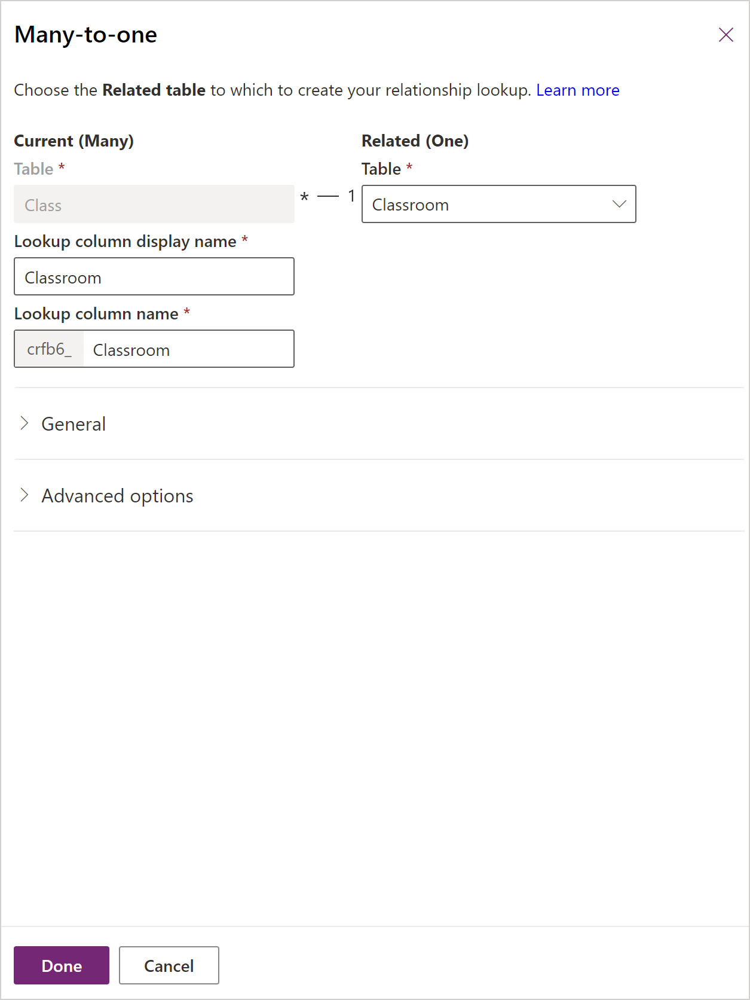
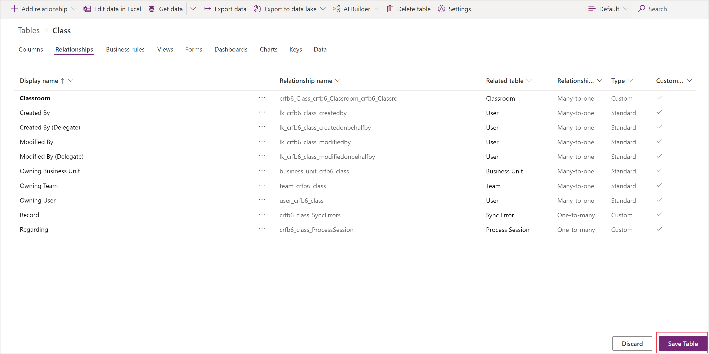
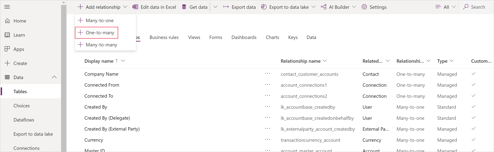
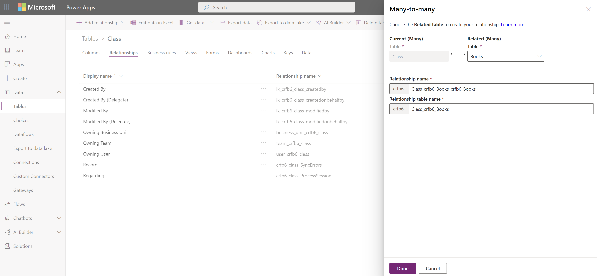
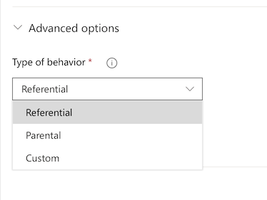
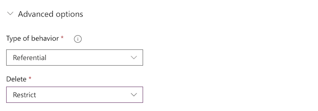
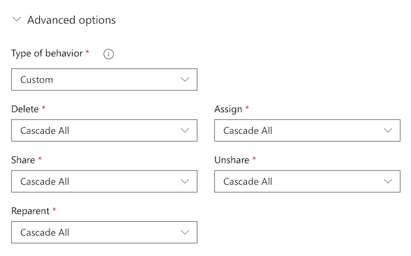

# Create a relationship between tables
[!INCLUDE[cc-data-platform-banner](../../includes/cc-data-platform-banner.md)]

Data in one table often relates to data in another table. For example, you might have a **Teachers** table and a **Class** table, and the **Class** table might have a lookup relation to the **Teachers** table to show which teacher teaches the class. You can use a lookup column to show data from the **Teachers** table. This is commonly referred to as a lookup column.

## Define a relationship
You can create several types of relationships from one table to another (or between a table and itself). Each table can have a relationship with more than one table, and each table can have more than one relationship to another table. Some common relationship types are:

* **Many-to-one** - In this type of relationship, each row in table A can match more than one row in table B, but each row in table B can match only one row in table A. For example, a class has a single classroom. This is the most common type of relationship and is shown in the column list as a **Lookup column**
* **One-to-many** - In this type of relationship, each row in table B can match more than one row in table A, but each row in table A can match only one row in table B. For example, a single teacher, teaches many classes.
* **Many-to-many** - In this type of relationship, each row in table A can match more than one row in table B, and vice versa. For example, students attend many classes, and each class can have multiple students.

Additionally, you can set advanced cascading behaviors on many-to-one and one-to-many relationships whenever an action is taken on the parent table.

## Add a lookup column (Many-to-one relationship)

To add a lookup relation to a table, create a relation under the **Relationships** tab and specify the table with which you want to create a relationship.

1. On [powerapps.com](https://make.powerapps.com/?utm_source=padocs&utm_medium=linkinadoc&utm_campaign=referralsfromdoc), expand the **Data** section, and then select **Tables** on the left navigation pane.

1. Select an existing table, or [Create a new table](data-platform-create-entity.md)

1. Select the **Relationships** tab.

1. Select **Add relationship**, and then select a relationship type, such as **Many-to-one**.

1. On the right pane, select a **Related** table for the **Current** table, and then select **Done**.

    > [!div class="mx-imgBorder"] 
    > 

1. Select **Save table**.

    > [!div class="mx-imgBorder"] 
    >  

## Add a One-to-many relationship

To add a One-to-many relationship, create a relation under the **Relationships** tab and specify the table with which you want to create a relationship.

1. On [powerapps.com](https://make.powerapps.com/?utm_source=padocs&utm_medium=linkinadoc&utm_campaign=referralsfromdoc), expand the **Data** section and select **Tables** in the left navigation pane.

2. Select an existing table, or [Create a new table](data-platform-create-entity.md)

3. Select the **Relationships** tab.

4. Select the down arrow to the right of **Add relationship**, and then select **One-to-many**.
    > [!div class="mx-imgBorder"] 
    > 

5. Select a table. Notice the **Look up** columns will be shown on the **Current** table, they will default with the tables name (in this example Teacher) but you can change them if needed. Select **Done** to add the relationship to your table.

    > [!NOTE]
    > In the case of a One-to-many relationships, the Look up column will be created on the related table, not the table you currently have selected. If you need the lookup on the current table, create a Many-to-one relationship.

    :::image type="content" source="media/data-platform-cds-newrelationship/one-to-many-example.png" alt-text="One to many example.":::
6. Select **Save table**.

## Add a Many-to-many relationship
To add a Many-to-many relationship, create a relation under the **Relationships** tab and specify the table with which you want to create a relationship.

1. On [powerapps.com](https://make.powerapps.com/?utm_source=padocs&utm_medium=linkinadoc&utm_campaign=referralsfromdoc), expand the **Data** section and select **Tables** in the left navigation pane.

2. Select an existing table, or [Create a new table](data-platform-create-entity.md)

3. Select the **Relationships** tab.

4. Select  **Add relationship** and then select **Many-to-many**. This opens a panel for you to choose the table you want to create a relationship to. Select the table from the **Related table** drop down.

5. After selecting a table, the names for the relationship and relationship table will appear. They will default with the names of the tables combined, but you can change them if needed.

    > [!div class="mx-imgBorder"] 
    > 

6. Select **Done** to add the relationship to your table, and then click **Save table**.

## Add advanced relationship behavior

While building a one-to-many or a many-to-one relationship, you can also set advanced behaviors.

These options are also referred to as cascading behaviors because they cascade down the hierarchy of related tables. For example, it may be desirable to delete the related tests and homework of a student if a student is removed from the system. This type of behavior is called a parental relationship.

On the other hand, you may decide that you don't want  actions to cascade down the hierarchy. For example, in the teacher to class relationship you may decide that the child table (class) should *not* be deleted when a parent (teacher) is deleted. This is called a referential relationship.

As you model your business data by creating custom tables or when using existing Common Data Model tables, consider the behavior you require and the implications for the entire hierarchy of related tables and choose between one of the following standard behaviors:

* **Referential, Remove Link:** In a referential relationship between two tables, you can navigate to any related rows, but actions taken on one will not affect the other. For example, if you have a one-to-many relationship between teachers and classes, deleting a teacher will have no impact on the related class.

* **Referential, Restrict Delete:** In a referential, restrict delete relationship between two tables, you can navigate to any related rows. Actions taken on the parent row will not be applied to the child row, but the parent row cannot be deleted while the child row exists. This is useful if you do not want child rows to become orphaned. This forces the user to delete all of the children before deleting the parent.

    > [!div class="mx-imgBorder"] 
    > 

* **Parental:** In a parental relationship between two tables, any action taken on a row of the parent table is also taken on any child table rows that are related to the parent table row. For example, this would cause all of the child rows to be deleted when the parent is deleted.

* **Custom:** In a custom relationship between two tables, you select the behavior associated with each of a set of possible actions. 

    > [!div class="mx-imgBorder"] 
    > 

For more information on defaults and custom behaviors: [Configure table relationship behavior](./create-edit-entity-relationships.md#table-relationship-behavior).

## Use a lookup column in an app
If you [create an app automatically](../canvas-apps/data-platform-create-app.md) from a table that contains a lookup column, it appears as a **Drop down** control that contains data from the **Primary name** column of the table.

## Add 1:N and N:N relationships for canvas apps
Use the **Relate** function to link two rows through a one-to-many or many-to-many relationship in Microsoft Dataverse. More information: [Relate and Unrelate functions in Power Apps](../canvas-apps/functions/function-relate-unrelate.md)

## Next steps
* [Generate an app by using a Dataverse database](../canvas-apps/data-platform-create-app.md)
* [Create an app from scratch using a Dataverse database](../canvas-apps/data-platform-create-app-scratch.md)

[!INCLUDE[footer-include](../../includes/footer-banner.md)]
