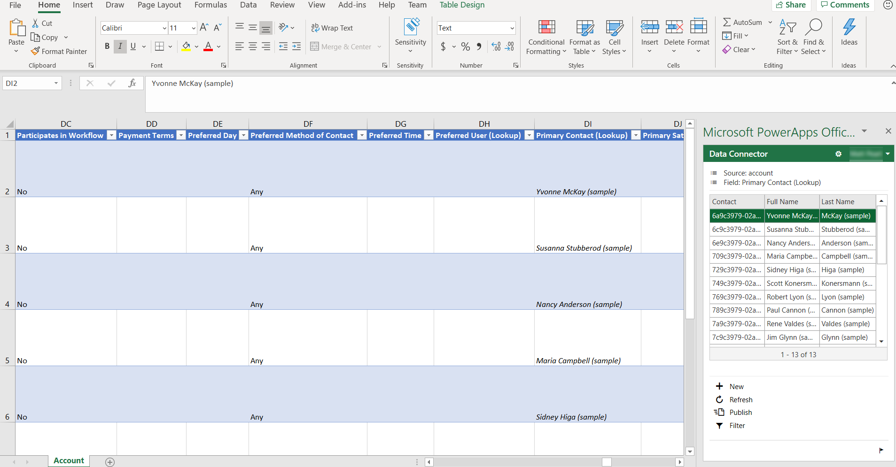

# Open table data in Excel
[!INCLUDE[cc-data-platform-banner](../../includes/cc-data-platform-banner.md)]

By opening table data in Microsoft Excel, you can quickly and easily view and edit data by using the Microsoft Power Apps Excel Add-in. <!-- The Power Apps Excel Add-in requires Microsoft Excel 2016. -->

> [!div class="mx-imgBorder"] 
> 

To install the Power Apps Excel Add-in, see [Microsoft PowerApps Office Add-in](https://appsource.microsoft.com/en-us/product/office/WA104380330?tab=Overview). For more information about how to add or remove an Office Excel Add-in, see [Add or remove add-ins in Excel](https://support.office.com/en-us/article/add-or-remove-add-ins-in-excel-0af570c4-5cf3-4fa9-9b88-403625a0b460).

## Open table data in Excel
1. Sign in to [Power Apps](https://make.powerapps.com/?utm_source=padocs&utm_medium=linkinadoc&utm_campaign=referralsfromdoc).

1. In the left pane, expand the **Data** section, and select **Tables**. All the tables are shown.

2. Select the ellipsis (...) to the right of the table that you're interested in, and then select **Edit data in Excel**. 

3. Open the Excel worksheet that is downloaded to your browser's default download folder named similar to *table-name (1591125669213).xlsx*. This workbook has binding information for the table, a pointer to your environment, and a pointer to the Power Apps Excel Add-in.

4. In Excel, select **Enable editing** to enable the Power Apps Excel Add-in to run. The Excel Add-in runs in a pane on the right side of the Excel window.

    > [!IMPORTANT]
    > If the pane displays an error message, see [Office Store Add-in download disabling](#office-store-add-in-download-disabling). 

5. If this is the first time that you've run the Power Apps Excel Add-in, select **Trust this Add-in** to allow the Excel Add-in to run.

6. If you're prompted to sign in, select **Sign in**, and then sign in by using the same credentials that you used on [Power Apps](https:///?utm_source=padocs&utm_medium=linkinadoc&utm_campaign=referralsfromdoc). The Excel Add-in will use a previous sign-in context and automatically sign you in if it can. Therefore, verify the user name in the upper right of the Excel Add-in.

The Excel Add-in automatically reads the data for the table that you selected. Note that there will be no data in the workbook until the Excel Add-in reads it in.

## View and refresh data in Excel
After the Excel Add-in reads table data into the workbook, you can update the data at any time by selecting **Refresh** in the Excel Add-in.

## Edit data in Excel
You can change table data as you require and then publish it back by selecting **Publish** in the Excel Add-in.

To edit a row, select a cell in the worksheet, and then change the cell value.

To add a new row, follow one of these steps:

* Select anywhere in the worksheet, and then select **New** in the Excel Add-in.
* Select in the last row of the worksheet, and then press the Tab key until the cursor moves out of the last column of that row, and a new row is created.
* Select in the row immediately below the worksheet and start to enter data in a cell. When you move the focus out of that cell, the worksheet expands to include the new row.

To delete a row, follow one of these steps:

* Right-click the row number next to the worksheet row to delete, and then select **Delete**.
* Right-click in the worksheet row to delete, and then select **Delete** > **Table Rows**.

## Add or remove columns
You can use the designer to adjust the columns and tables that are automatically added to the worksheet.

1. Enable the data source designer of the Excel Add-in by selecting the **Options** button (the gear symbol), expand the **Data Connector** section, and then select the **Enable design** check box.

2. Select **Design** in the Excel Add-in. All the data sources are listed.

3. Next to the data source, select the **Edit** button (the pencil symbol).

4. Adjust the list in the **Selected columns** column as you require:
   * To add a column from the **Available columns** column to the **Selected columns** column, select the column, and then select **Add**. Alternatively, double-click the column.
   * To remove a column from the **Selected columns** column, select the column, and then select **Remove**. Alternatively, double-click the column.
   * To change the order of columns, select the column in the **Selected columns** column, and then select **Up** or **Down**.

5. Apply your changes to the data source by selecting **Update**, and then select **Done** to exit the designer. If you added a column (column), select **Refresh** to pull in an updated set of data.

> [!NOTE]
> - Make sure to always include the ID and required columns in your workbook, as you may receive errors when publishing.
> - When adding look up columns, make sure to add both the ID and the Display columns.

## Troubleshooting
There are a few issues that can be resolved through some easy steps.

* Not all tables support editing and creation of new rows, these tables will open in Excel and allow you to view data but publishing will be disabled.
* Look up columns must be edited using the add-in to ensure the correct row is referenced, updating these columns via copy and past or typing directly into the column is not supported.
* The maximum table size when editing in Excel is one million cells. If there are too many rows or columns, not all data will be read or published.

If you encounter an issue that isn't described here, contact us via the [support pages](https://powerapps.microsoft.com/support/).

### Office Store add-in download disabling
If Office Store add-in downloading has been disabled for your organization, you might receive the following error message when you open the Excel worksheet after selecting the Edit data in Excel command. 

*Office 365 has been configured to prevent individual acquisition and execution of Office Store Add-ins.*

This setting prevents the Power Apps Excel Add-in from downloading. When this occurs, table row data will not be displayed in Excel. 

For more information about enabling Office Store Add-in downloading, contact your Office app administrator. 

For more information about preventing Office Store Add-in downloading from the Office Store, see [Prevent add-in downloads by turning off the Office Store across all clients](/microsoft-365/admin/manage/manage-deployment-of-add-ins?view=o365-worldwide#prevent-add-in-downloads-by-turning-off-the-office-store-across-all-clients-except-outlook).

## Other ways to export and view table row data
For more information about ways to export and view table row data, see these articles.
- [Export data to CSV](/powerapps/maker/data-platform/data-platform-import-export#export-data-to-csv) 
- [Export your data to Excel Online](/powerapps/user/export-to-excel-online)
- [Export table data to Azure Data Lake Storage Gen2](/powerapps/maker/data-platform/export-to-data-lake)
- [Self-service data prep with dataflows](/powerapps/maker/data-platform/self-service-data-prep-with-dataflows)

### See also
* [Manage columns in a table](data-platform-manage-fields.md)
* [Define relationships between tables](data-platform-entity-lookup.md)
* [Generate an app by using Microsoft Dataverse](../canvas-apps/data-platform-create-app.md)
* [Create an app from scratch using Dataverse](../canvas-apps/data-platform-create-app-scratch.md)

[!INCLUDE[footer-include](../../includes/footer-banner.md)]