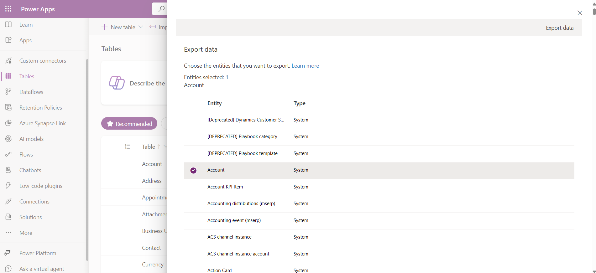

# Import data from Excel and export data to CSV

To get (import) data into Microsoft Dataverse tables, use an Excel worksheet file or a comma-separated values (CSV) file. 

When you export Dataverse table data, it's exported as a CSV file.

## Import from an Excel or CSV file

There are two ways to import data from Excel.

- [Option 1: Import by creating and modifying a file template](#option-1-import-by-creating-and-modifying-a-file-template)
- [Option 2: Import by bringing your own source file](#option-2-import-by-bringing-your-own-source-file)

> [!IMPORTANT]
>
> - To import or export data, you must have the **Environment Maker** security role.
> - Import from Excel or CSV file using the **Import** > **Import data from Excel** command isn’t available in GCC, GCC High, and DoD environments. To work around this limitation, from the **Tables** area in Power Apps select **Import** > **Import data**, and then choose a data source, such as **Excel workbook** or **Text/CSV**.

### Option 1: Import by creating and modifying a file template

Every table has required columns that must exist in your input file. We recommend that you create a template. To do this, export data from the table. Then, use the same file and modify it with your data. Finally, import the modified file back into the table. Using a template can save you time because you won't have to specify the required columns for each table.

#### Prepare the file template

1. [Export the table data](#export-data).
1. Define a plan to make sure data is unique before you import it. Use either primary keys or alternate keys. More information: [Ensure uniqueness when you import data into a table from Excel or CSV](#ensure-uniqueness-when-you-import-data-into-a-table-from-excel-or-csv)

#### Modify the file with your data

Copy data from your Excel or CSV file into the template that you created in the previous step.

#### Import the file

1. On [powerapps.com](https://make.powerapps.com/) select **Tables** in the left navigation pane. [!INCLUDE [left-navigation-pane](../../includes/left-navigation-pane.md)]
1. Select **Import** > **Import data from Excel**.
1. Select the tables where you want to import data, and then select **Next**.
1. On the **Import data** page, select **Upload**, and choose your file. Follow the prompts to upload your file.
1. After the file is uploaded and **Mapping status** indicates **Mapping was successful**, select **Import** from the top-right corner. Go to [Troubleshoot mapping errors with Excel](#troubleshoot-mapping-errors-with-excel) to navigate and fix any mapping errors.
   :::image type="content" source="media/data-platform-import-export/import-mapping-successful.png" alt-text="Import mapping successful":::
  After the import finishes successfully, you'll see the total number of inserts and updates.  

#### New import from Excel (preview)

[!INCLUDE [cc-beta-prerelease-disclaimer](../../includes/cc-beta-prerelease-disclaimer.md)]

The new import experience lets users import data directly from an Excel file into existing Dataverse tables using a unified UI. This experience improves upon the original import method by offering:

- **Assisted mapping**: Uses vector-based search to provide more contextually relevant column mapping suggestions.
- **Sheet selection**: Users can choose which sheet to import from within a multi-sheet Excel file.
- **Notifications**: Real-time feedback on import status, including success, in-progress, and error states.
- **Error logs**: Downloadable logs to help users self-diagnose and resolve issues.
- **Performance improvements**: Asynchronous ingestion offers better reliability and speed for large files.

[!INCLUDE [preview-note-pp.md](../../../shared/preview-includes/preview-note-pp.md)]

##### Prerequisites

To use the feature a Power Platform admin must enable the **"Import Excel to existing table with assisted mapping"** environment setting in the Power Platform admin center. Select the environment, and then select **Settings** > **Product** > **Features** and enable the **"Import Excel to existing table with assisted mapping"** setting.

> [!NOTE]
> The **Import Excel to existing table with assisted mapping** environment setting is being removed from the Power Platform admin center. This feature is currently being improved and that setting is no longer used.

##### Import from Excel (preview) steps

1. Go to the table you want to import data to, and then on the command bar select **Import** > **Import from Excel (Preview)**.
1. Upload your Excel file and select the sheet to import.  
   :::image type="content" source="./media/data-platform-import-export/import-v2-select-sheet.png" alt-text="Select the Excel sheet to import.":::
1. Map columns. A primary key is required if you want to update existing records in the table. If no primary key is selected ("None" option), then all records from the Excel sheet or CSV file are added as new records.
   :::image type="content" source="./media/data-platform-import-export/import-v2-mapping.png" alt-text="Map source columns to target attributes.":::
1. Review the summary and select **Import**.

Monitor the import status from notifications:

- In progress: Ongoing import activity with the message **Your data is importing** displayed.  
- Success: Data was processed or indexed with the message **Upload completed** displayed.  
- Error: **Upload completed with some errors** displayed that includes a link to download logs for troubleshooting.

### Option 2: Import by bringing your own source file

If you're an advanced user and know the required columns for a given table for Dataverse tables, define your own Excel or CSV source file. Follow the steps in [Import the file](#import-the-file).

### Troubleshoot mapping errors with Excel

If you get mapping errors after you upload your file, select **Map status**. Take the following steps to inspect and rectify the column mapping errors.

1. Use the drop-down menu on the right, under **Show**, to walk through the **Unmapped columns**, **Fields with error**, or **Required Fields**.

    > [!TIP]
    >
    > - Depending on whether you get a **Warning** or an **Error**, inspect **Unmapped columns** or **Fields with error** through the drop-down menu in **Column Mappings**.
    > - Use the *upsert* (**Update** or **Insert**) logic to either update the row, if it already exists, or to insert a new row.

1. After you resolve all the errors and warnings, select **Save Changes** in the top-right corner. You'll go back to the **Import Data** screen.
1. When the **Mapping status** column shows **Mapping was successful**, select **Import** from the top-right corner.

When the **Import completed successfully** message appears, the total inserts and updates are displayed.

### Ensure uniqueness when you import data into a table from Excel or CSV

Dataverse tables use a primary key to uniquely identify rows within a Dataverse table. The primary key for a Dataverse table is a globally unique identifier (GUID). It forms the default basis for row identification. Data operations, like importing data into Dataverse tables, surface the default primary keys.

Example:  
The primary key for an **Account** table is **accountid**.

> [!div class="mx-imgBorder"] 
> 

Sometimes, a primary key might not work when you integrate data from an external source. Use Dataverse to define alternate keys that uniquely identify a row in place of the primary key.

Example:  
For an **Account** table, you might set **transactioncurrencyid** as an alternate key by using a natural key-based identification. For example, use **US Dollar** instead of the GUID value **88c6c893-5b45-e811-a953-000d3a33bcb9** shown previously. You can also choose **currency symbol** or **currency name** as keys.  More information: [Define alternate keys using Power Apps portal](define-alternate-keys-portal.md)

> [!div class="mx-imgBorder"]
> 

> [!div class="mx-imgBorder"]
> 

You can still use primary keys as identifiers after you specify alternate keys. In the preceding sample, the first file is still valid if GUIDs are valid data.

## Export data

Export data from a single table in a comma-separated value (CSV) format.

1. Sign into [Power Apps](https://make.powerapps.com/?utm_source=padocs&utm_medium=linkinadoc&utm_campaign=referralsfromdoc), on the left navigation pane select **Tables**. [!INCLUDE [left-navigation-pane](../../includes/left-navigation-pane.md)]
1. Select **Export** > **Export data**.
1. Select the table from which you want to export data, and then select **Export data**.

   > [!div class="mx-imgBorder"]
   > 

1. After the export finishes successfully, select **Download exported data** to download the CSV file to the download folder specified in your web browser.

   :::image type="content" source="media/data-platform-import-export/export-success.png" alt-text="Sample export that shows successful export with a link to the downloadable file.":::

> [!NOTE]
> Exports have a 12 minute time limit. If the volume of data exported exceeds 12 minutes the export will fail. If this occurs, export data in smaller segments.

## Unsupported data types and fields

The following data types aren't currently supported for import or export.

- Timezone
- Choices (multiselect)
- Image
- File

The following fields are system fields and aren't supported for import and export.

- `Ownerid`
- `Createdby`
- `Createdonbehalfby`
- `Createdon`
- `Modifiedby`
- `Modifiedonbehalfby`
- `Modifiedon`
- `Overriddencreatedon`

 > [!NOTE]
 > Get Data from Excel and Export Data features are currently not included in the Power Apps Developer Plan.

## Import using a connector

Use a connector to import data from a selection of many different sources, such as Azure, SQL Server database, SharePoint, Access, OData, and more. More information: [Create and use dataflows in Power Apps](create-and-use-dataflows.md)

## See also

[Tables in Dataverse](entity-overview.md)

[!INCLUDE[footer-include](../../includes/footer-banner.md)]
