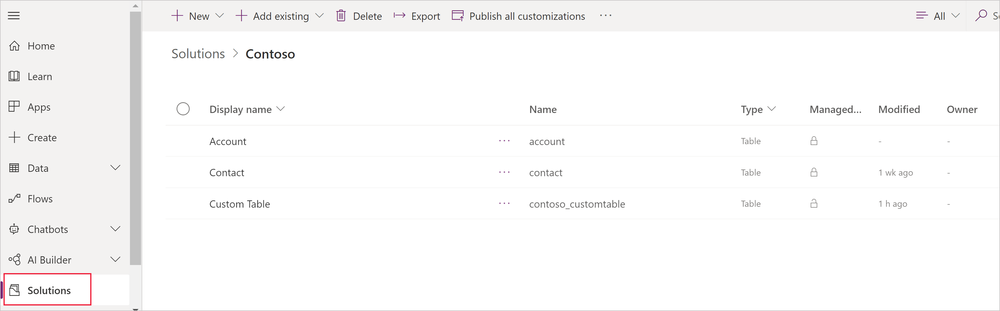
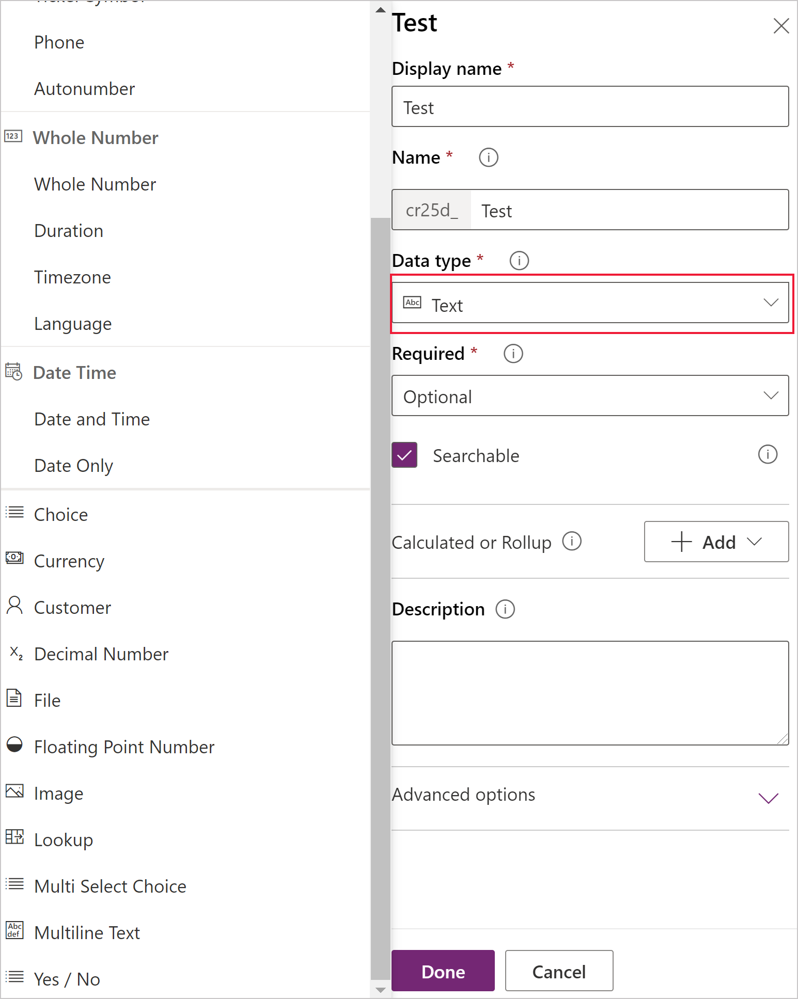
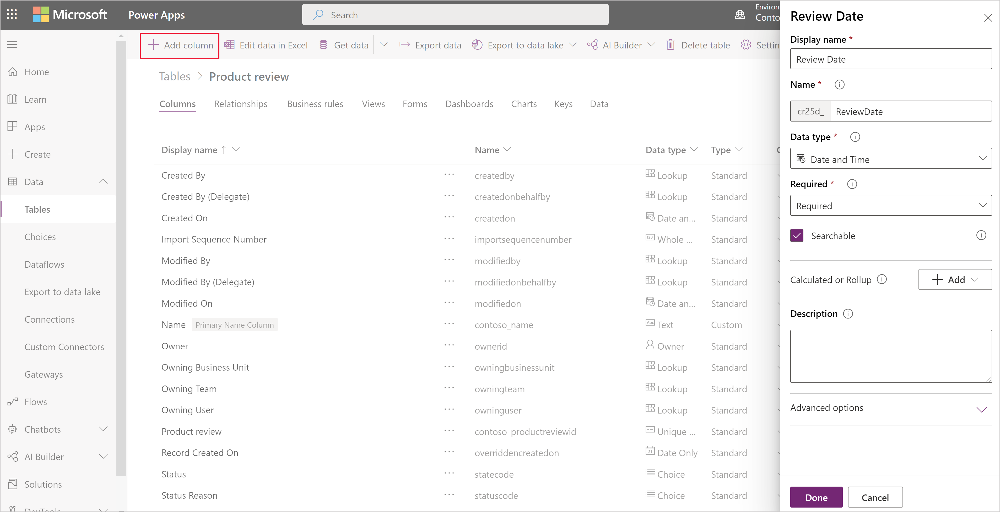

# Manage custom columns in a table
[!INCLUDE[cc-data-platform-banner](../../includes/cc-data-platform-banner.md)]

You can create and update one or more custom columns in any table. When you create a custom column, you specify a set of properties, such as the column's name, its display name, and the type of data that it will contain. For more information, see [table attribute metadata](../../developer/data-platform/entity-attribute-metadata.md).

> [!NOTE]
> Every table has system columns, such as columns that indicate when a row was last updated, and who updated it. In addition, standard tables have standard (default) columns. You can't modify or delete system columns or standard columns. If you create a custom column, it should provide functionality on top of these built-in columns.

## Create a column
1. On [powerapps.com](https://make.powerapps.com/?utm_source=padocs&utm_medium=linkinadoc&utm_campaign=referralsfromdoc), expand the **Dataverse** section and select **Tables** in the left navigation pane.

    

2. Click or tap an existing table, or [Create a new table](data-platform-create-entity.md)

3. Add a new column to your table by clicking **Add column**.

4. In the New Column panel, enter the **Display name** for your column, **Name** will be automatically populated and is used as the unique name for your column. The **Displayname** is used when presenting this column to your users, the **Name** is used when building your app, in expressions and formulas.

    > [!NOTE]
    > The **Display name** columns can be updated at anytime to display differently in your apps, the **Name** column cannot be changed after your table has been saved as this could result in breaking an existing app.

    > [!div class="mx-imgBorder"] 
    > 

5. Select the **Data type** of your column, this controls the way the information is stored as well as how it is presented in apps. For example, text is stored different to a decimal number or a URL. For more detailed information of the data types available, see [table attribute metadata](../../developer/data-platform/entity-attribute-metadata.md).

    If you're prompted, specify additional information for the data type that you specified. Depending on the data type, different columns will be presented. If you're creating a column of type Choice or Multi Select Option Set, you can select **New Option Set** and create a new Choice while creating your column. For more information, see [Create Option set](custom-picklists.md)

    > [!div class="mx-imgBorder"] 
    > 

7. Under **Required**, select the check box if you want to recommended this column as required in your apps. This does not provide hard enforcement through all connections to the Microsoft Dataverse. If you need to ensure the column is populated, create a [Business Rule](data-platform-create-business-rule.md)

8. Under **Searchable**, select the check box if you need this column to be available in Views, Charts, Dashboards and Advanced Find. In most cases this checkbox should be checked.

9. Click or tap **Done** to close the Column panel and return to the table. You can repeat steps 3-9 for each additional column.
   
    > [!IMPORTANT]
    > Your column is not yet saved and created, until you save the changes to the table.

10. Click or tap **Save Table** to finalize your changes and save them to the Dataverse.

    You're notified when the operation is completed successfully. If the operation is unsuccessful, an error message indicates the issues that occurred and how you can fix them.

## Create a Calculated or Roll up column
Calculated columns let you automate manual calculations used in your business processes. For example, a salesperson may want to know the weighted revenue for an opportunity which is based on the estimated revenue from an opportunity multiplied by the probability. Or, they want to automatically apply a discount, if an order is greater than $500. A calculated column can contain values resulting from simple math operations, or conditional operations, such as greater than or if-else, and many others. Calculated columns can be created using the following data types:

* Single line of text
* Option Set
* Two Options
* Whole Number
* Decimal Number
* Currency
* Date and Time

For more details on the types of expressions supported and examples, see [Define calculated columns](/dynamics365/customer-engagement/customize/define-calculated-fields)

## Update or delete a column
1. On [powerapps.com](https://make.powerapps.com/?utm_source=padocs&utm_medium=linkinadoc&utm_campaign=referralsfromdoc), expand the **Dataverse** section and select **Tables** in the left navigation pane, and then select a table.
2. In the list of columns for the table that you selected, click or tap a column, and then follow one of these steps:
   
   * Change one or more properties of the column.
   * Delete the column by clicking or tapping the ellipsis (...) near the right edge of the column, and then clicking or tapping **Delete**.

3. Click or tap **Save table** to submit your changes.
   
    > [!IMPORTANT]
    > Your changes will be lost if you don't save them before you open another page in the browser or exit the browser.

    You're notified when the operation is completed successfully. If the operation is unsuccessful, an error message indicates the issues that occurred and how you can fix them.

## Best practices and restrictions
As you create and modify columns, keep these points in mind:

* You can't modify or delete system columns or their values.
* In a standard table, you can't modify or delete a standard (default) column, add a column that requires data, or make any other change that might break an app that relies on that table.
* In a custom table, you should make sure that the changes that you make won't break any app that relies on that table.
* You must give each custom column a name that's unique within the table, and you can't rename a column after you create it.

## Next steps
* [Define relationships between tables](data-platform-entity-lookup.md)
* [Create a business rule](data-platform-create-business-rule.md)
* [Create an app using tables](../canvas-apps/data-platform-create-app.md)
* [Create an app from scratch using a Dataverse database](../canvas-apps/data-platform-create-app-scratch.md)

## Privacy notice
With the Microsoft Power Apps common data model we collect and store custom table and column names in our diagnostic systems.  We use this knowledge to improve the common data model for our customers. The table and column names that Creators create help us understand scenarios that are common across the Microsoft Power Apps community and ascertain gaps in the service’s standard table coverage, such as schemas related to organizations. The data in the database tables associated with these tables is not accessed or used by Microsoft or replicated outside of the region in which the database is provisioned. Note, however, the custom table and column names may be replicated across regions and are deleted in accordance with our data retention policies. Microsoft is committed to your privacy as described further in our [Trust Center](https://www.microsoft.com/trustcenter/Privacy/default.aspx).

[!INCLUDE[footer-include](../../includes/footer-banner.md)]