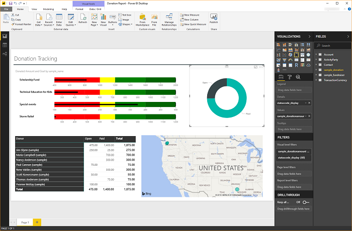
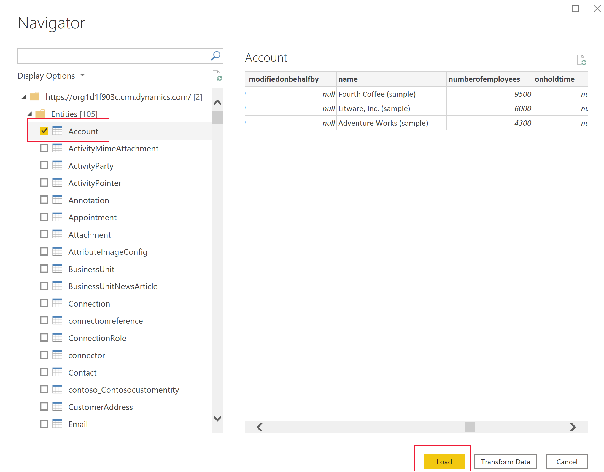
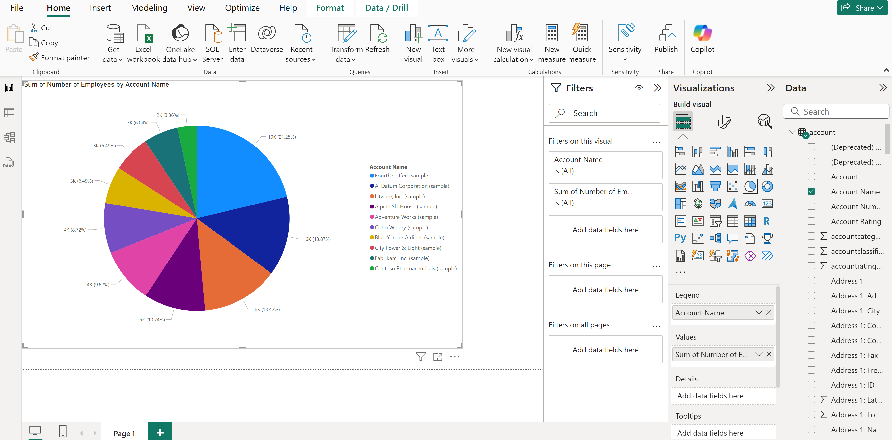

# Create a Power BI report using data from Dataverse
[!INCLUDE[cc-data-platform-banner](../../includes/cc-data-platform-banner.md)]

Microsoft Dataverse allows you to connect directly to your data using Power BI Desktop to create reports and publish them to Power BI. From Power BI, reports can be used in dashboards, shared to other users, and accessed cross platform on Power BI mobile apps.

## Prerequisites

To use Power BI with Dataverse, you need the following items:

* Download and install Power BI Desktop, which is a free application that runs on your local computer. You can download Power BI desktop [here](https://powerbi.microsoft.com/desktop/).
* Dataverse environment with maker permissions to access the portal and read permissions to access data within tables.
* You must have the appropriate Power BI [license](/power-bi/admin/service-admin-licensing-organization) to build and share Power BI reports.
* To use the **Dataverse** connector, the **Enable TDS endpoint** setting must be enabled in your environment. More information: [Manage feature settings](/power-platform/admin/settings-features)

## Find your Dataverse environment URL

1. Open [Power Apps](https://make.powerapps.com/?utm_source=padocs&utm_medium=linkinadoc&utm_campaign=referralsfromdoc), select the environment you're going to connect to, select **Settings** in the top-right corner, and then select **Session details**.

   :::image type="content" source="media/session-details.png" alt-text="Session details.":::
1. In the **Power Apps session details** dialog box, select **Copy Details**.
1. Paste the session details somewhere such as Notepad so that you can copy only the **Instance url**. The instance URL is the unique URL for your environment. The URL will be in the format: `https://yourenvironmentid.crm.dynamics.com/`. **Make sure you remove *https://* and the trailing */* from the URL before pasting it to connect to your environment.** Keep this somewhere handy so you can use it when creating your Power BI reports.

## Connect to Dataverse using the connector

1. Open **Power BI Desktop**. Select **File** > **Get Data** > **Power Platform**.

1. Select one of the following connectors, and then select **Connect**.

   * **Dataverse**: This connector is the most recent version and uses the tabular data stream (TDS) protocol.
   * **Common Data Service (Legacy)**: This is the earlier version of the connector. Use this connector when the query results will be greater than 80 MB. This version also supports paging of the query results and building reports that use the image data type.  

1. In the dialog box that appears, paste in your Dataverse environment URL into the **Environment domain** box, in the format *org.crm.dynamics.com*. Don't include the *https://* or ending */*. More information: [Find your Dataverse environment URL](#find-your-dataverse-environment-url)
   
   If you selected the **Dataverse** connector, select from the following **Data Connectivity** mode options: 
   * **Import**: We recommend that you import data to Power BI wherever possible. With this mode, data is cached in the Power BI service and imported on a scheduled interval.
   * **DirectQuery**: Connects directly to the data in Dataverse.  Use this mode for real-time data retrieval. This mode can also more strictly enforce the Dataverse security model. More information: [DirectQuery model guidance in Power BI Desktop](/power-bi/guidance/directquery-model-guidance).

   Select **OK**. You might be prompted to sign in using the same credentials you use to connect to Power Apps and Dataverse. Select **Connect**.

   > [!IMPORTANT]
   > To use the Dataverse connector, TCP ports 1433 and/or 5558 need to be open to connect. If only port 5558 is enabled, you must append that port number to the Dataverse environment URL, such as *yourenvironmentid.crm.dynamics.com:5558*.

1. The **Navigator** displays all tables available for your environment, such as the account and contact tables. Select the **account** table to see a preview of your data in the right pane. Select **Load**.

    > [!div class="mx-imgBorder"] 
    > 

1. Your table is now loaded into your report, and you can begin building reports, or repeat the previous steps to add additional tables. For example, in the **Columns** pane, select the **name** column and then select the **numberofemployees** column. In the **Visualizations** pane, select **Pie chart**. This adds a new visualization to your report canvas. 

    > [!div class="mx-imgBorder"] 
    > 

## Special column types

### Choice columns

Choice columns are used in tables to provide a drop-down list of items to a user to make a single selection in apps and flows. When using the Power BI connector choice columns will be presented as two columns to show both the unique value, and the display item value.

For example, if you had a choice column on your table called `approvalstatus`, you would see two columns in Power BI:

* `approvalstatus`  - This will show a unique integer value for each item in your choice. `approvalstatus` can help when you apply filters so the filters will not be impacted when you make future changes to the display name.
* `approvalstatusname`  - This will show the friendly display name of the item and is most commonly used when presenting the option in a table or chart.

    |`approvalstatus` |`approvalstatusname` |
    |---------|---------|
    1|Submitted
    2|In Review
    3|Approved
    4|Rejected

### Choices columns

Choices are similar to choice columns with the difference being that users can select multiple items from the list. Choices aren't currently fully supported with the Power BI connector.  When you use the Power BI connector with choices columns, you only receive the integer values, which are comma separated. The item value columns aren't returned. For more information about the Dataverse data types not supported with the Power BI connector, see [Supported operations and data types](../../developer/data-platform/dataverse-sql-query.md#supported-operations-and-data-types).

### Lookups

Lookup columns use a many-to-one (N:1) table relationship between the table you’re working with and the target row type defined for the lookup. Lookups are presented in Power BI Desktop as two columns, *lookup*id and *lookup*id-name.

## Navigating relationships

Relationships in Dataverse require you to create a relationship within Power BI desktop between the two tables using a GUID column, this is a system-generated unique identifier that ensures relationships are created for the create rows where ambiguity or duplication may exist with other columns. You can read more about managing relationships in Power BI desktop [here](/power-bi/desktop-create-and-manage-relationships).

While some relationships may be automatically created, you can still review and ensure the correct relationships are established when creating your report:

* The lookup column on the table will contain the GUID of the row in the related table.
* The related table will have a column in the format "[tableName]ID" that contains the GUID, for example `Accountid` or `MyCustomtableid`
* Using the Power BI desktop Manage Relationships feature, you would create a new relationship between your lookup column, and the ID column on the related table.

## Troubleshooting 

### Error message: Return records size cannot exceed 83886080

This error can occur with the Dataverse connector when you run or design a report with a result set greater than 80 MB. TDS has a result set size limit of 80 MB. 

:::image type="content" source="media/tls-record-limit-exceeded.png" alt-text="TLS record limit exceeded error message.":::
To work around this limit, optimize the query adding filters and dropping columns so that the query returns less data.

### Error message: Unable to connect (provider Named Pipes Provider, error: 40 – Could not open a connection to SQL Server)

When this error message occurs, the connector fails to connect to the TDS endpoint. This can occur when the URL used with the connector includes *https://* and/or the ending */*.

:::image type="content" source="media/tls-unable-to-connect.png" alt-text="Unable to connect error message.":::
Remove the https:// and ending forward slash so that the URL is in the form *orgname.crm.dynamics.com*.

### Troubleshooting connection issues

For information about troubleshooting connection issues when using the TDS endpoint, see [Troubleshooting connection problems](/powerapps/developer/data-platform/dataverse-sql-query#troubleshooting-connection-problems).

### See also

[Use composite models in Power BI Desktop](/power-bi/transform-model/desktop-composite-models)

[View Dataverse for Teams table data in Power BI Desktop](../../teams/view-table-data-power-bi.md)

[!INCLUDE[footer-include](../../includes/footer-banner.md)]
