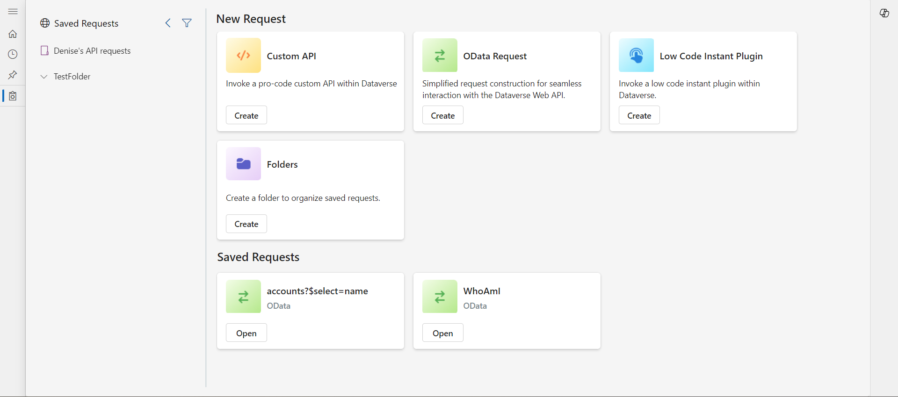
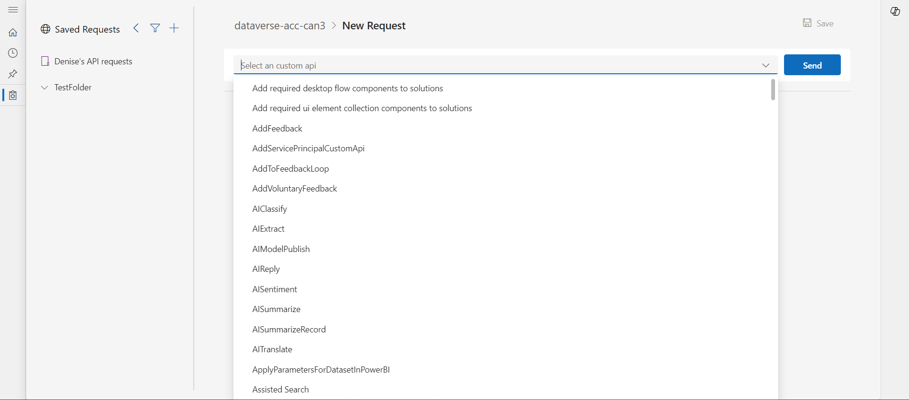
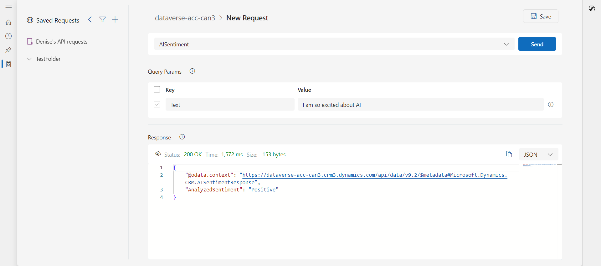
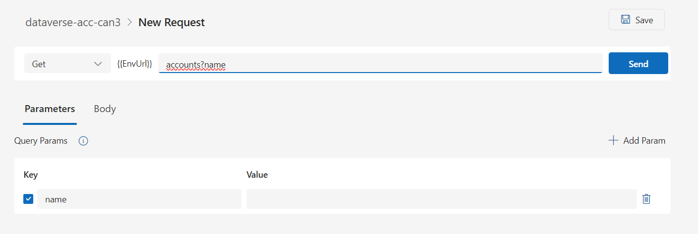
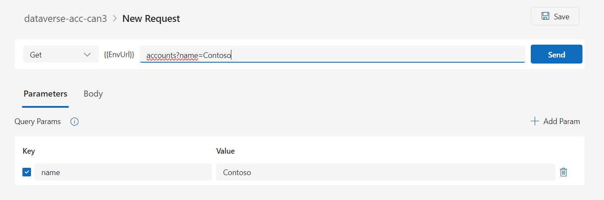
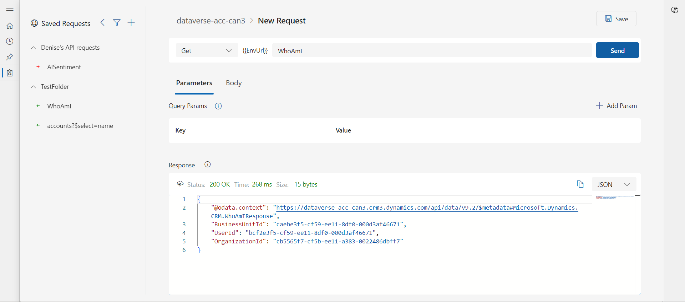

# Test and explore the Dataverse Web API (preview)

[!INCLUDE [cc-beta-prerelease-disclaimer](../../../includes/cc-beta-prerelease-disclaimer.md)]

The API playground is a pre-authenticated software testing tool that helps makers quickly and conveniently interact with the [Microsoft Dataverse Web API](/power-apps/developer/data-platform/webapi/overview). 

This web application allows developers to test and experiment with different API endpoints without the need for extensive setup or authentication processes. It also conveniently presents certain available actions, examples, and links to documentation for faster learning.

Use this tool to explore what's possible in the RESTful API, test user-defined workflows, and more.

> [!IMPORTANT]
> - This is a preview feature.
> - [!INCLUDE [cc-preview-features-definition](../../../includes/cc-preview-features-definition.md)]

## Prerequisites

You must have access to the Dataverse Web API and the Dataverse accelerator app.

## Key features

- Pre-authenticated: The API playground comes pre-authenticated, so developers can start testing and experimenting with API endpoints right away.
- Web-based: With the API playground, developers can quickly interact with the Dataverse Web API without the need for extensive setup like software downloads or third party account setup. You can access the tool from the Dataverse Accelerator, a first party app available in all new Microsoft Dataverse environments and can be installed in any environment.
- Convenient: Presents the various actions and capabilities available in the Dataverse Web API, making it easy to quickly learn what's possible and how to implement it.

## Installation

This feature is available in the Dataverse accelerator app. Go to the [Dataverse accelerator article](./dataverse-accelerator.md) for installation instructions.

## Get started

To get started with the API playground, simply run or install the Dataverse Accelerator and navigate to the API playground page to start interacting with the Dataverse Web API.

### Make web API requests

Choose the desired request type to open the request screen. The input options are determined based on the request type. There are three request types presented:

| Type | Description |
|-|-|
| Custom API | This includes any Microsoft Dataverse Web API first party [actions](/power-apps/developer/data-platform/webapi/use-web-api-actions), [functions](/power-apps/developer/data-platform/webapi/use-web-api-functions), or any public [user-defined Custom APIs](/power-apps/developer/data-platform/custom-api) registered in the working environment. |
| Instant low code plugin | [Instant low code plugins](/power-apps/maker/data-platform/low-code-plug-ins?tabs=instant) are classified as any user-defined workflows registered as a Custom API in the environment with a related FxExpression. |
| OData request | Provides an interface with more paramaters than the other types, allowing more granular control to create and send [OData requests](/power-apps/developer/data-platform/webapi/perform-operations-web-api). |

### Request a Custom API or instant low code plugin

These request types are designed to simplify calling plugins available in the working environment.

1. Select an option from the main dropdown, which presents the available plugins in the current environment.
   

1. If parameters are available, they are displayed in the *Query parameters* table that appears.

1. Click **Send**

Observe the [response](#view-the-response) in the lower section of the screen.

> [!NOTE]
> The interface provides convenience by listing the available plugins and auto-populating the associated parameters definitions. However, behind the scenes an OData call is still being made.

### Make an OData request

OData requests allow more control over the request parameters.

1. Select the *HTTP request method* in the first dropdown.

1. Type in the *endpoint Url*. Only include the request Url after `[OrgUrl]/api/data/v9.2/`

1. Add *query parameters* using one of the two methods:

    1. In the Url
        1. After the question mark (`?`) character in the Url, type in the query parameter key.
        
        1. Type an equals (`=`) character after the key
        1. Type in the value
        

        The keys and values will automatically populate the parameter table in the interface.

    1. Manually add query parameters by clicking the **+ Add param** button. This will add an empty parameter row to the table that you can type values into. The Url will be updated dynamically as values are entered.

1. Optionally provide a Body (if using all request methods except GET) by selecting the Body tab, then entering the body value in the editor control.
1. Click **Send**
1. Observe the [response](#view-the-response) in the lower section.

### View the response

After a request is sent, the response is displayed in the lower half of the screen.

1. The response status provides quick metrics on the request:
    1. Status message (e.g., "200 Success")
    1. Duration (in milliseconds)
    1. Size (in kilobytes)
1. The response body is displayed in an editor control below the response status.
    1. View in prettified JSON or in raw form by selecting the mode in the dropdown.
    2. Click the copy icon to copy the response body to clipboard.

### Save an API request

You can save requests for quick access later on. Saved requests will store the request details (such as the request method and endpoint for OData request, or the selected plugin for Custom API and instant low code plugin), and the input parameters with associated values.

1. In the request screen, click the save button in the top right corner of the page.
1. A side rail will appear inline on the right side of the page with form fields
1. Provide a name for the request. A default value is entered based on the request details, but you can update the value.
1. Optionally choose a folder to save the request under.
1. Click Save

The saved request is created and should appear in the left rail of the screen.

### Load a saved request

Saved requests are displayed in the left rail of any screen. You can only view saved requests that you have created.

To load a saved request, simply select a request name by clicking on the list item. This will load the request screen with the request details filled in.

### Create a folder

Use folders to manage saved requests into groups.

1. In the left rail, click the + (new) button > Create folder
1. In the dialog that appears, provide a name for the folder
1. Click save

## FAQs

### What privileges are required to access the API playground tool?

You must have access to the Dataverse accelerator app to use the tool.

### Does the API playground tool only connect to the Dataverse Web API?

Yes, the API playground tool only connects to the Dataverse Web API. No other services are available to connect to in this interface.

### How does the API playground tool authenticate to the Dataverse Web API?

The tool uses the auth token of the logged in user via the Power Platform framework, which is required for playing any application in Power Apps.

### Is the API playround feature available in all environments?

The feature is delivered through the Dataverse accelerator and is available in all environments that have the app installed. The app is automatically installed in all new environments, but can also be installed in older environments by following the [install instructions](dataverse-accelerator.md#install-the-dataverse-accelerator).

### How do I update or delete folders?

Use the table explorer to manage folders as rows in the **API Request Folder** table in the maker portal (make.powerapps.com). We will provide in-app experiences to manage the folders in subsequent updates.

## See also

[Get preview features early with the Dataverse accelerator (preview)](dataverse-accelerator.md)