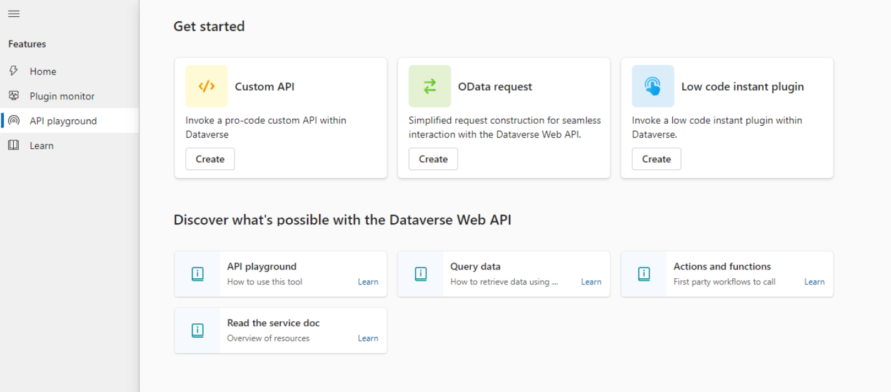

# Explore and test Dataverse in the Web API playground (preview)

[!INCLUDE [cc-beta-prerelease-disclaimer](../../../includes/cc-beta-prerelease-disclaimer.md)]

The API playground is a preauthenticated software testing tool that helps makers quickly and conveniently interact with the [Microsoft Dataverse Web API](/power-apps/developer/data-platform/webapi/overview).

This web application allows developers to test and experiment with different API endpoints without the need for extensive setup or authentication processes. It also conveniently presents certain available actions and links to documentation for faster learning.

Use this tool to explore what's possible in the RESTful API, test user-defined workflows, and more.

> [!IMPORTANT]
>
> - This is a preview feature.
> - [!INCLUDE [cc-preview-features-definition](../../../includes/cc-preview-features-definition.md)]

## Key features

- Preauthenticated: The API playground comes preauthenticated, so developers can start testing and experimenting with API endpoints right away.
- Web-based: With the API playground, developers can quickly interact with the Dataverse Web API without the need for extensive setup like software downloads or non-Microsoft account setup. You can access the tool from the Dataverse accelerator, a Microsoft app available in all new Dataverse environments and can be installed in any environment.
- Convenient: Presents the various actions and capabilities available in the Dataverse Web API, making it easy to quickly learn what's possible and how to implement it.

## Prerequisites

You must have [access to Dataverse](/power-apps/maker/data-platform/data-platform-entity-licenses), and [access to play the Dataverse accelerator app](./dataverse-accelerator.md#prerequisites-to-run-the-dataverse-accelerator). Members of the system customizer security role have access to play the app.

## Get started

To get started with the API playground, [play the Dataverse accelerator](dataverse-accelerator.md#play-the-dataverse-accelerator), and then select the **API playground** page.

### Make requests to the Dataverse Web API

On the landing screen, choose the request type to open the request editor by selecting **Create** on any of the top cards.

Three request types are presented:

| Type | Description |
|-|-|
| Custom API | This includes any Dataverse Web API [actions](/power-apps/developer/data-platform/webapi/use-web-api-actions), [functions](/power-apps/developer/data-platform/webapi/use-web-api-functions) from Microsoft, or any public [user-defined custom APIs](/power-apps/developer/data-platform/custom-api) registered in the working environment. |
| Instant plug-in | [Instant plug-ins](/power-apps/maker/data-platform/low-code-plug-ins?tabs=instant) are classified as any user-defined workflows registered as a custom API in the environment with a related FxExpression. |
| OData request | Allows more granular control over the request inputs to send [OData requests](/power-apps/developer/data-platform/webapi/perform-operations-web-api). |

### Request a custom API or instant plug-in

These request types are designed to simplify calling plug-ins available in the working environment.

1. Select an option from the main dropdown list, which presents the available plug-ins in the current environment.
   :::image type="content" source="media/api-play-list-customapi.svg" alt-text="Custom APIs are listed in the dropdown list" lightbox="media/api-play-list-customapi.svg":::

1. If parameters are available, they're displayed in the **Query params** table that appears. Provide values for required parameters.
   :::image type="content" source="media/api-play-customapi-params.svg" alt-text="Custom API parameters display automatically" lightbox="media/api-play-customapi-params.svg":::

    > [!NOTE]
    > Checkboxes to the left of each parameter indicate whether they are included in the request. Required parameters have disabled checkboxes while optional parameters have editable ones.

1. Select **Send**.

1. Observe the [response](#view-the-response) in the lower section of the screen.
   :::image type="content" source="media/api-play-response.svg" alt-text="Parameters are listed if registered" lightbox="media/api-play-response.svg":::
 
> [!NOTE]
> The interface provides a convenient listing of all available plug-ins in the environment. When selected, the associated parameters with data types are presented. Behind the scenes an OData call is still being made, but the interface simplifies the construction of the call.

### Make an OData request

OData requests allow more options for request parameters.

1. Select the **HTTP request method** in the first dropdown list.

1. Type in the *endpoint Url*. Only include the request URL after `[OrgUrl]/api/data/v9.2/`

1. Add *query parameters* using one of the two methods:

    1. In the URL.
        1. After the question mark (`?`) character in the URL, type in the query parameter key.
        :::image type="content" source="./media/api-play-key.svg" alt-text="Key typed into Url after question mark" lightbox="./media/api-play-key.svg":::

        1. Type an equals (`=`) character after the key.
        1. Type in the value.
        :::image type="content" source="./media/api-play-value.svg" alt-text="Value typed into Url after the equals sign" lightbox="./media/api-play-value.svg":::

        The keys and values will automatically populate the parameter table in the interface.

    1. Manually add query parameters by selecting **+ Add param**. This adds an empty parameter row to the table that you can type values into. The URL is updated dynamically as values are entered.

1. Optionally provide a body (if using all request methods except GET) by selecting the **Body** tab, and then enter the body value in the editor control.
1. Select **Send**.
1. Observe the [response](#view-the-response) in the lower section.

### View the response

After a request is sent, the response is displayed in the lower half of the screen.

:::image type="content" source="media/api-play-odata-response.svg" alt-text="OData response" lightbox="media/api-play-odata-response.svg":::

The response status provides quick metrics on the request:

- Status message
- Duration (in milliseconds)
- Size (in kilobytes)

The response body is displayed below the response status. Select the copy icon to copy the response body to your clipboard.

## FAQs

### What privileges are required to access the API playground tool?

You must have access to the Dataverse accelerator app to use the tool.

### Does the API playground tool only connect to the Dataverse Web API?

Yes, the API playground tool only connects to the Dataverse Web API. No other services are available to connect to in this interface.

### How does the API playground tool authenticate to the Dataverse Web API?

The tool uses the authentication token of the logged in user that is required to play the Dataverse accelerator application.

### Is the API playground feature available in all environments?

The feature is delivered through the Dataverse accelerator and is available in all environments that have the app installed. The app is automatically installed in all new environments, but can also be installed in older environments by following the [install instructions](dataverse-accelerator.md#install-or-update-the-dataverse-accelerator).

## See also

[Get preview features early with the Dataverse accelerator (preview)](dataverse-accelerator.md)