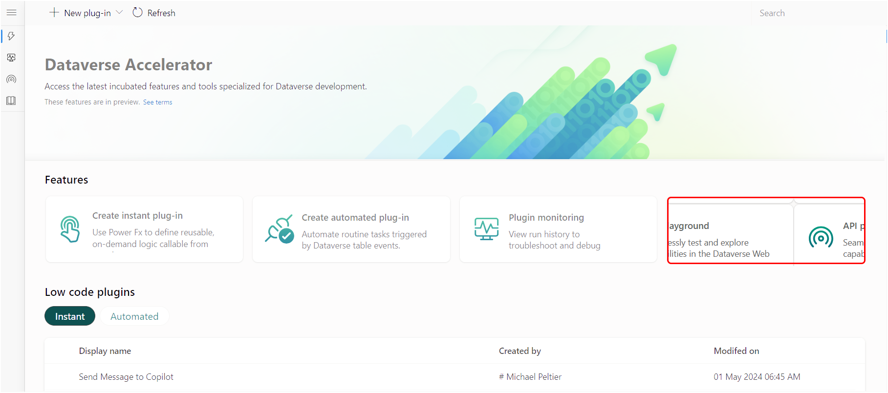
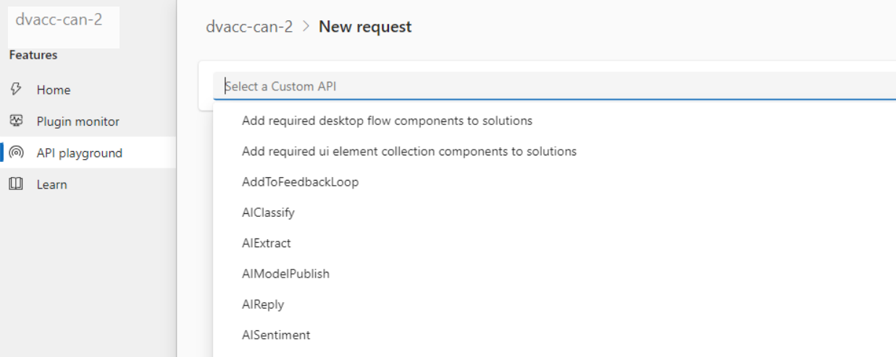
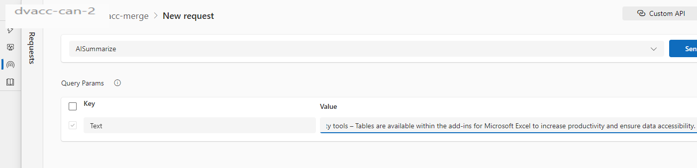
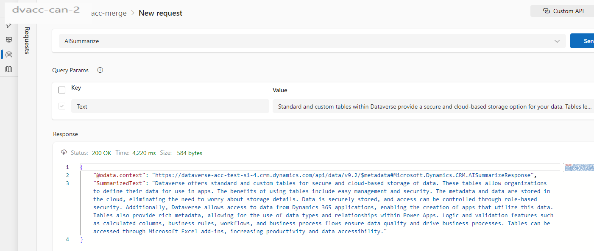
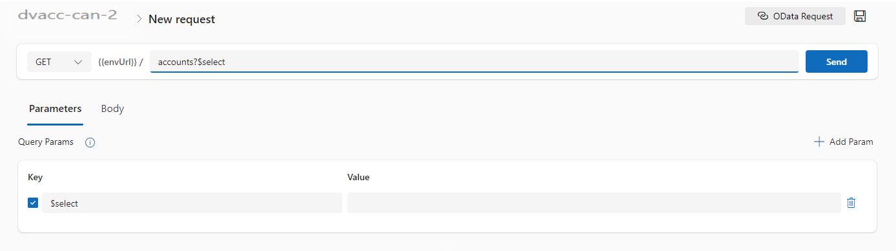
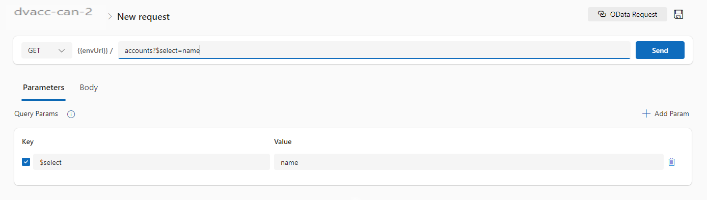
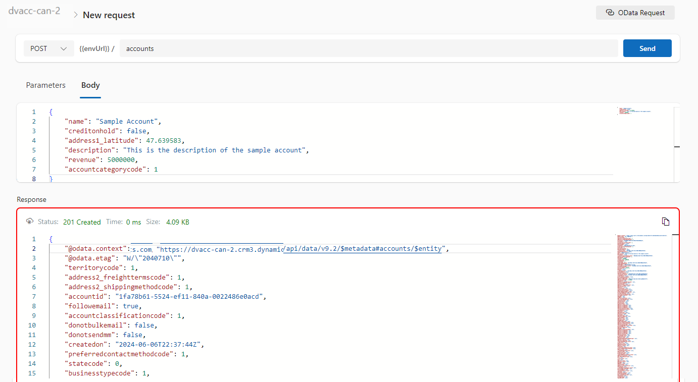

# Explore and test Dataverse in the Web API playground (preview)

[!INCLUDE [cc-beta-prerelease-disclaimer](../../../includes/cc-beta-prerelease-disclaimer.md)]

The API playground is a pre-authenticated software testing tool that helps makers quickly and conveniently interact with the [Microsoft Dataverse Web API](/power-apps/developer/data-platform/webapi/overview).

This web application allows developers to test and experiment with different API endpoints without the need for extensive setup or authentication processes. It also conveniently presents certain available actions and links to documentation for faster learning.

Use this tool to explore what's possible in the RESTful API, test user-defined workflows, and more.

> [!IMPORTANT]
>
> - This is a preview feature.
> - [!INCLUDE [cc-preview-features-definition](../../../includes/cc-preview-features-definition.md)]

## Key features

- Pre-authenticated: The API playground comes pre-authenticated, so developers can start testing and experimenting with API endpoints right away.
- Web-based: With the API playground, developers can quickly interact with the Dataverse Web API without the need for extensive setup like software downloads or third party account setup. You can access the tool from the Dataverse Accelerator, a first party app available in all new Microsoft Dataverse environments and can be installed in any environment.
- Convenient: Presents the various actions and capabilities available in the Dataverse Web API, making it easy to quickly learn what's possible and how to implement it.

## Prerequisites

You must have [access to Dataverse](/power-apps/maker/data-platform/data-platform-entity-licenses), and [access to run the Dataverse accelerator app](./dataverse-accelerator.md#prerequisites-to-run-the-dataverse-accelerator).

## Get started

To get started with the API playground, [run](dataverse-accelerator.md#play-the-dataverse-accelerator) the Dataverse accelerator and navigate to the API playground page.

### Make requests to the Dataverse Web API

On the landing screen, choose the request type to open the request editor by clicking the 'Create' button on any of the top cards.

Three request types are presented:

| Type | Description |
|-|-|
| Custom API | This includes any Microsoft Dataverse Web API first party [actions](/power-apps/developer/data-platform/webapi/use-web-api-actions), [functions](/power-apps/developer/data-platform/webapi/use-web-api-functions), or any public [user-defined Custom APIs](/power-apps/developer/data-platform/custom-api) registered in the working environment. |
| Instant low code plugin | [Instant low code plugins](/power-apps/maker/data-platform/low-code-plug-ins?tabs=instant) are classified as any user-defined workflows registered as a Custom API in the environment with a related FxExpression. |
| OData request | Allows more granular control over the request inputs to send [OData requests](/power-apps/developer/data-platform/webapi/perform-operations-web-api). |

### Request a Custom API or instant low code plugin

These request types are designed to simplify calling plugins available in the working environment.

1. Select an option from the main dropdown, which presents the available plugins in the current environment.
   

1. If parameters are available, they are displayed in the *Query params* table that appears. Provide values for required parameters.

    

    > [!NOTE]
    > Checkboxes to the left of each parameter indicate whether they are included in the request. Required parameters have disabled checkboxes, while optional parameters have editable ones.

1. Click **Send**

1. Observe the [response](#view-the-response) in the lower section of the screen.

    

> [!NOTE]
> The interface provides a convenient listing of all available plugins in the environment. When selected, the associated parameters with data types are presented. Behind the scenes an OData call is still being made, but the interface simplifies the construction of the call.

### Make an OData request

OData requests allow more options for request parameters.

1. Select the *HTTP request method* in the first dropdown.

1. Type in the *endpoint Url*. Only include the request Url after `[OrgUrl]/api/data/v9.2/`

1. Add *query parameters* using one of the two methods:

    1. In the Url
        1. After the question mark (`?`) character in the Url, type in the query parameter key.
        
        1. Type an equals (`=`) character after the key
        1. Type in the value
        

        The keys and values will automatically populate the parameter table in the interface.

    1. Manually add query parameters by clicking the **+ Add param** button. This will add an empty parameter row to the table that you can type values into. The Url will be updated dynamically as values are entered.

1. Optionally provide a Body (if using all request methods except GET) by selecting the Body tab, then entering the body value in the editor control.
1. Click **Send**
1. Observe the [response](#view-the-response) in the lower section.

### View the response

After a request is sent, the response is displayed in the lower half of the screen.

The response status provides quick metrics on the request:

- Status message
- Duration (in milliseconds)
- Size (in kilobytes)

The response body is displayed below the response status. You can click the copy icon to copy the response body to your clipboard.

### Save an API request

You can save requests for quick access later on. Saved requests will store the request details (such as the request method and endpoint for OData request, or the selected plugin for Custom API and instant low code plugin), and the input parameters with associated values.

1. In the request screen, click the save button in the top right corner of the page.
1. A dialog appears with form fields.
1. Provide a name for the request. A default value is provided based on the request details, but you can update the value.
    
1. Click **Save**
1. The saved request appears in the left rail of the screen.
    

### Load a saved request

To load a saved request, select a request name. This will load the request screen with the request details filled in, including input parameters and values.

> [!NOTE]
> You can only view saved requests that you have created.

## FAQs

### What privileges are required to access the API playground tool?

You must have access to the Dataverse accelerator app to use the tool.

### Does the API playground tool only connect to the Dataverse Web API?

Yes, the API playground tool only connects to the Dataverse Web API. No other services are available to connect to in this interface.

### How does the API playground tool authenticate to the Dataverse Web API?

The tool uses the authentication token of the logged in user that was required to play the Dataverse accelerator application.

### Is the API playround feature available in all environments?

The feature is delivered through the Dataverse accelerator and is available in all environments that have the app installed. The app is automatically installed in all new environments, but can also be installed in older environments by following the [install instructions](dataverse-accelerator.md#install-the-dataverse-accelerator).

## See also

[Get preview features early with the Dataverse accelerator (preview)](dataverse-accelerator.md)