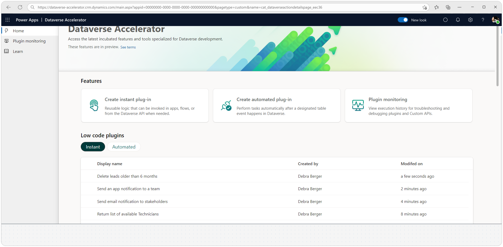
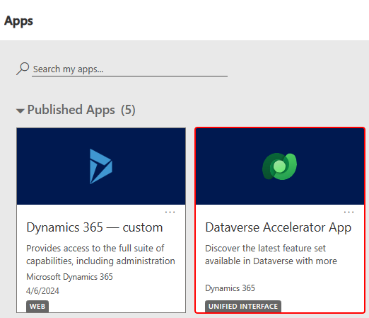

# Get preview features early with the Dataverse accelerator (preview)

[!INCLUDE [cc-beta-prerelease-disclaimer](../../../includes/cc-beta-prerelease-disclaimer.md)]

The Microsoft Dataverse accelerator is an application that provides access to select preview features and tooling related to Dataverse development. The featured set of capabilities include early prototype experiences that represent backlog features scheduled to be in the native platform and tools for enriching Dataverse development for makers, delivered in a convenient and accessible web application built with low-code.



While preview features shouldn't be used in production instances, the accelerator offers the opportunity to proactively evaluate, share feedback, and prepare for integration. Using features available with the Dataverse accelerator helps you leverage cutting-edge capabilities to enhance productivity, optimize Dataverse processes, and maintain a competitive edge in Power Platform.

> [!IMPORTANT]
>
> - This is a preview feature.
> - Preview features aren’t meant for production use and might have restricted functionality. These features are available before an official release so that customers can get early access and provide feedback.

The Dataverse accelerator interface adheres to the same UX and accessibility standards as any Microsoft Power Platform experience. Furthermore, it serves as a demonstration of our platform's powerful low-code capability to ship enterprise-grade applications.

## Play the Dataverse accelerator

Play the Dataverse accelerator app in any environment where it's installed.

The app is automatically available in all new Microsoft Dataverse environments. If your environment doesn't already have it, you can  [install the Dataverse accelerator](#install-the-dataverse-accelerator).

The app appears in two places:

1. In [Power Apps](https://make.powerapps.com/), select **Apps**

   :::image type="content" source="media/apps.svg" alt-text="Power Apps app list" lightbox="media/apps.svg":::

1. In the **Unified Interface apps** view:

   

When you play the Dataverse accelerator, features are displayed in the accelerator that you can try out.

### Prerequisites to run the Dataverse accelerator

You must have the following privileges in your Dataverse environment:

- Security role: System customizer.
- App-level access to the Dataverse accelerator model driven app, such as system customizer or direct access from a security role.

### Features available with the Dataverse accelerator

| Feature | Description |
| -- | -- |
| [Low-code plug-ins](../low-code-plug-ins.md) | Reusable, real-time workflows that execute a specific set of commands within Dataverse. Low-code plug-ins run server-side and are triggered by personalized event handlers, defined in Power Fx. |
| [Plug-in monitor](plugin-monitoring.md) | A modern interface to surface the existing plug-in trace log table in Dataverse environments, designed for developing and debugging Dataverse plug-ins and custom APIs.  |
| [API playground](api-playground.md) | A preauthenticated software testing tool that helps makers quickly and conveniently interact with the [Dataverse Web API](/power-apps/developer/data-platform/webapi/overview). |

## Manage the Dataverse accelerator app

The Dataverse accelerator is automatically installed as a Microsoft package in all new environments. It's hosted and distributed using the App Source framework as a [Dynamics 365 app](/power-platform/admin/manage-apps).

### Prerequisites for managing the app

You must have the following security role assignment and your Dataverse environment must be the same or later than the minimum version:

- Security role: You must have the system administrator security role in the environment.

- A Dataverse environment with minimum database (DB) version of `9.2.22122.00148`. Check the database version:  
  - In the [Power Platform admin center](https://admin.powerplatform.microsoft.com/) > **Environments**, and then select the environment you want. Select **Detailed view**, and under **Version** the version is displayed.
  - By using the [RetrieveVersion function](/power-apps/developer/data-platform/webapi/reference/retrieveversion) with your browser. Type `https://<your org>.<your region code>.dynamics.com/api/data/v9.2/RetrieveVersion` in your browser address bar and view the JSON returned.

### Install the Dataverse accelerator

If the Dataverse accelerator isn't already installed in the environment, follow the steps to [install an app in the environment view](/power-platform/admin/manage-apps#install-an-app-in-the-environment-view) for the Dataverse Accelerator offering.

### Update the Dataverse accelerator

If the Dataverse accelerator is already installed and you want to install the latest version, follow these steps:

1. In the [Power Platform admin center](https://admin.powerplatform.microsoft.com/), select **Environments**.
1. Open the [environment-level view of apps](/power-platform/admin/manage-apps#environment-level-view-of-apps)
1. Locate the **Dataverse Accelerator** app.
1. When there's an update available, select **Update available** next to the app.
1. Follow the instructions on your screen to apply the update.

### Uninstall the Dataverse accelerator

You can delete the Dataverse accelerator app from an environment using Power Platform CLI.

> [!NOTE]
> Deleting the Dataverse accelerator app doesn't delete all underlying capabilities presented in the app. The app provides a modern shell to the underlying platform API.

Using Power Platform CLI, [connect to the target environment](/power-platform/developer/cli/reference/connection#pac-connection-create) and execute the three [solution delete](/power-platform/developer/cli/reference/solution#pac-solution-delete) commands here:

```powershell
pac solution delete --solution-name msdyn_DataverseAcceleratorApp
pac solution delete --solution-name DataverseAccelerator
pac solution delete --solution-name DataverseAccelerator_Anchor
```

## Frequently asked questions (FAQs)

**What is Dataverse accelerator?**

Dataverse accelerator is a toolkit designed to expedite the development process within the Dataverse environment. It provides capabilities designed to help makers get more out of Dataverse by providing modern experiences for new and existing Dataverse features.

**Who can use Dataverse accelerator?**

Members of the system customizer security role have access to the app and underlying features. A custom security role can also be assigned to a user by the environment's system admin with similar privileges if desired.

**What are the key benefits of using Dataverse accelerator?**

Dataverse accelerator offers experimental and preview features that are designed to enhance or accelerate development in certain areas of Dataverse capabilities. Although in preview, accessing these [features](#features-available-with-the-dataverse-accelerator) earlier in development can help you stay competitive and know about features coming in the native platform.

**Is Dataverse accelerator compatible with my existing Dataverse environment?**

Yes, Dataverse accelerator is compatible with existing Power Platform environments that have a Dataverse database enabled. It can be installed into your environment to enhance development capabilities without disrupting ongoing operations.

**How do I install Dataverse Accelerator?**

Follow the [install instructions](#install-the-dataverse-accelerator) of this article to install the Dataverse accelerator, which points to the documentation for installing any Dynamics 365 app in a Dataverse environment.

**If I don't want the Dataverse accelerator installed in my environment, can I delete it?**

Yes, you can remove any instance of the Dataverse accelerator from an environment. To remove the Dataverse accelerator from your environment, follow the [delete instructions](#uninstall-the-dataverse-accelerator) of this article.

**Can I customize Dataverse accelerator components to fit my specific requirements?**

The Dataverse Accelerator app provides an experience on top of existing capabilities available in Dataverse by default. Several settings related to the experiences provided in the app are surfaced, and are based on and limited to the context of the respective features. However, don't customize any of the managed solution components.

**Is there a cost associated with using Dataverse accelerator?**

The features available in the Dataverse accelerator are available at no additional cost for users with appropriate licenses for Power Platform and Dataverse. However, additional costs might apply for storage capacity utilized by some of the features.

**Where can I find support and resources for Dataverse accelerator?**

See the section on [contacting help and support](#contacting-help-and-support) for instructions on getting support either with the features in the Dataverse accelerator, or if you encounter problems using the Dataverse accelerator application.

**How often is Dataverse accelerator updated?**

Dataverse accelerator is regularly updated to incorporate new features, improvements, and bug fixes. Major updates are announced based on the individual features, and are indicated in the feature details, which are available in the app itself, release notes, and blog posts.

## Contacting help and support

For issues with the Dataverse accelerator solution installation or with features, such as low-code plug-ins errors, [use the help + support experience](/power-platform/admin/get-help-support) and include the following information:

- Problem type: **Dataverse Web API and SDK**
- Problem subtype: **Accelerator kit for Dataverse**

## Limitations and known issues

The Dataverse accelerator isn't available in GCC or GCC High environments.
