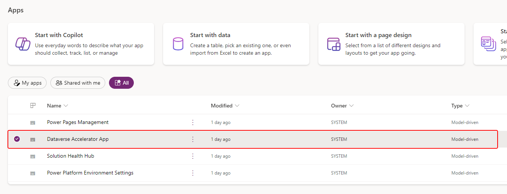

# Dataverse Accelerator App (preview)

[This topic is pre-release documentation and is subject to change.]

The Dataverse Accelerator is a first party application designed to streamline the release of more features for Microsoft Dataverse and Power Platform. It offers a distinct advantage by providing early access to preview features, facilitating a deeper understanding and exploration of upcoming enhancements in the maker portal.


Accessing features ahead of general release lets you proactively evaluate, offer feedback, and prepare more for integration. Stay ahead of the curve and leverage cutting-edge capabilities to enhance productivity, optimize Dataverse processes, and maintain a competitive edge in Power Platform.

> [!IMPORTANT]
> - This is a preview feature.
> - Preview features aren’t meant for production use and may have restricted functionality. These features are available before an official release so that customers can get early access and provide feedback.

## Features

| Feature | Description |
| -- | -- |
| [Low Code Plugins](/powerapps-docs/maker/data-platform/low-code-plug-ins.md) | Reusable, real-time workflows that execute a specific set of commands within Dataverse, running server-side and triggered by personalized event handlers, defined in Power Fx. |
| [Plugin monitoring](./plugin-monitoring.md) | A modern interface to surface the existing plugin trace log table in Dataverse environments, designed for developing and debugging Dataverse plugins and custom APIs.  |

## Get started

Simply play the Dataverse Accelerator app in any environment where it's installed.

The app is automatically available in all new Microsoft Dataverse environments, but you can also [manually install it](./dataverse-accelerator.md#installation-instructions) in existing Dataverse environments.

### Prerequisites to run the Dataverse Accelerator

You must have the following privileges in your Dataverse environment:

- Security role: System customizer
- App-level access to the Dataverse accelerator model driven app (e.g., system customizer or direct access from a security role)

### How the app appears in your environment

The app appears in two places:

1. In [Power Apps](https://make.powerapps.com/), select **Apps**

   

1. In the **Unified Interface apps** view:

   

## Manage the Dataverse Accelerator app

The Dataverse Accelerator is automatically installed as a first party package in all new environments. It's hosted and distributed using the App Source framework as a [Dynamics 365 app](/power-platform/admin/manage-apps).

### Prerequisites for managing the app

You must have the following security role assignment and your Dataverse environment must be above the minimum version.

- Security role: You must have the System administrator security role on the environment.

- A Dataverse environment with minimum Database (DB) version of `9.2.22122.00148`. You can check the Database version:  
  - In the [Power Platform admin center](https://admin.powerplatform.microsoft.com/) > Environment page > Version card.
  - By using the [RetrieveVersion function](/power-apps/developer/data-platform/webapi/reference/retrieveversion) with your browser. Type `https://<your org>.<your region code>.dynamics.com/api/data/v9.2/RetrieveVersion` in your browser address bar and view the JSON returned.

### Install the Dataverse Accelerator

If the Dataverse Accelerator is not already installed in an environment, follow the steps to [install an app in the environment view](/power-platform/admin/manage-apps#install-an-app-in-the-environment-view) for the Dataverse Accelerator offering.

<!---
#### Validating successful install

To verify that the Dataverse Accelerator application installed successfully:

1. In the Power Platform Admin Center > Select Environments.
1. Select the environment you chose to install the Dataverse Accelerator application.
1. In the Resources card, select the Dynamics 365 apps link.
1. You should find the Dataverse Accelerator app listed with a Status of Installed.
--->

### Update the Dataverse Accelerator

If the Dataverse Accelerator is already installed and you want to install the latest version, follow these steps:

1. In the [Power Platform admin center](https://admin.powerplatform.microsoft.com/) > Environment page
1. Open the [environment-level view of apps](/power-platform/admin/manage-apps#environment-level-view-of-apps)
1. Locate the **Dataverse Accelerator** app listing.
1. If an update is available, click the **Update available** link next to the listing.

### Uninstall the Dataverse Accelerator

You can delete the Dataverse Accelerator app from an environment using pac cli.

> [!NOTE]
> Deleting the Dataverse Accelerator app will not delete all underlying capibilities presented in the app. The app provides a modern shell to the underlying platform API.

Using pac cli, [connect to the target environment](/power-platform/developer/cli/reference/connection#pac-connection-create) and execute the three [solution delete](/power-platform/developer/cli/reference/solution#pac-solution-delete) commands below:

```powershell
pac solution delete --solution-name msdyn_DataverseAcceleratorApp
pac solution delete --solution-name DataverseAccelerator
pac solution delete --solution-name DataverseAccelerator_Anchor
```

## Frequently Asked Questions (FAQs)

1. **What is Dataverse Accelerator?**
   - Dataverse Accelerator is a toolkit designed to expedite the development process within the Microsoft Dataverse environment. It provides pre-built components, templates, and sample applications to help makers quickly deploy solutions tailored to common business scenarios.

1. **Who can use Dataverse Accelerator?**
   - Dataverse Accelerator is designed for Power Platform makers, developers, and organizations utilizing the Microsoft Dataverse platform for their applications and data management needs.

1. **What are the key benefits of using Dataverse Accelerator?**
   - Dataverse Accelerator offers several benefits, including accelerated development, enhanced data management capabilities, and customization options. It enables makers to deliver solutions more quickly while maintaining high standards of quality and efficiency.

1. **Is Dataverse Accelerator compatible with my existing Dataverse environment?**
   - Yes, Dataverse Accelerator is compatible with existing Power Platform environments that have Microsoft Dynamics enabled. It can be seamlessly integrated into your environment to enhance development capabilities without disrupting ongoing operations.

1. **How do I install Dataverse Accelerator?**
   - Follow the [install instructions](#install-the-dataverse-accelerator) of this article to install the Dataverse Accelerator, which points to the documentation for installing any Dynamics 365 app in a Microsoft Dataverse environment.

1. **If I don't want the Dataverse Accelerator installed in my environment, can I delete it?**
   - Yes, you can remove any instance of the Dataverse Accelerator from any environment. Follow the [delete instructions](#uninstall-the-dataverse-accelerator) of this article to remove the Dataverse Accelerator from your environment.

1. **Can I customize Dataverse Accelerator components to fit my specific requirements?**
   - Yes, Dataverse Accelerator provides extensive customization options. You can tailor existing components or create new ones from scratch to meet your organization's unique business needs and requirements.

1. **Is there a cost associated with using Dataverse Accelerator?**
   - The features available in the Dataverse Accelerator are available at no additional cost for users with appropriate licenses for Microsoft Power Platform and Dataverse. However, additional costs may apply for storage capacity utilized by some of the features.

1. **Where can I find support and resources for Dataverse Accelerator?**
   - See the section on [contacting help and support](#contacting-help-and-support) for instructions on getting support either with the features in the Dataverse Accelerator, or if you encounter problems using the application.

1. **How often is Dataverse Accelerator updated?**
   - Dataverse Accelerator is regularly updated to incorporate new features, improvements, and bug fixes. Major updates are announced based on the individual features, and will be indicated in the feature details.

## Contacting help and support

For issues with the Dataverse Accelerator solution installation or with features (e.g., low-code plug-ins errors), [use the Help + support experience](/power-platform/admin/get-help-support) and include the following information:

- Problem Type: **Dataverse Web API and SDK**
- Problem Subtype: **Accelerator kit for Dataverse**

## Limitations and known issues

> [!IMPORTANT]
> The Dataverse Accelerator user interface is built on the Power Platform [custom pages feature](../../model-driven-apps/model-app-page-overview.md). As part of these updates we're deploying into environments using system maintenance accounts. In some circumstances these accounts have had an unexpected side effect of presenting as a [break-glass account](/entra/identity/role-based-access-control/security-emergency-access). We're working to correct this behavior as quickly as possible. In the meantime the following apps might appear in the Power Platform admin center:
> - Dataverse Accelerator app – &lt;model-driven app&gt;, created by a global admin account
> - Dataverse Actions page - &lt;canvas app&gt; This is a Custom page on which the low-code plugin is built, created with the user name associated to the global admin account.
> - Overview page - &lt;canvas app&gt; This is a custom page on which the low-code plugin is built, created with the user name associated to the global admin account.

- The Dataverse Accelerator is not available in GCC/GCC High.