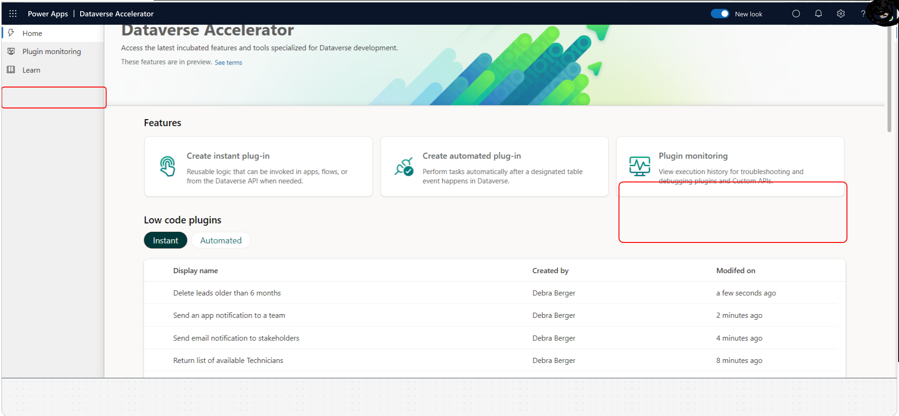
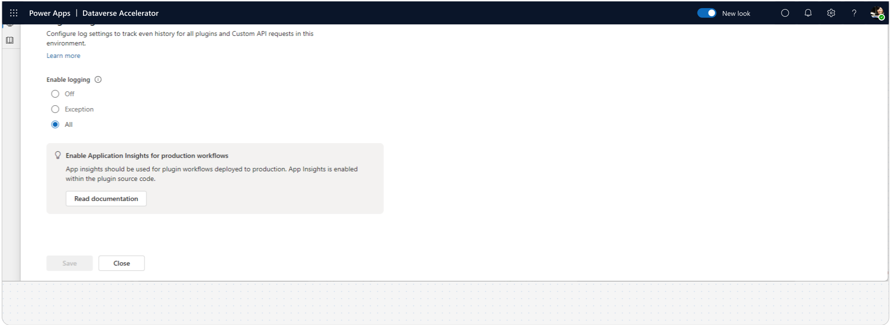

# Monitor and troubleshoot Dataverse plug-in runs (preview)

[!INCLUDE [cc-beta-prerelease-disclaimer](../../../includes/cc-beta-prerelease-disclaimer.md)]

Use tracing to troubleshoot low-code and pro code plug-ins. Tracing helps makers by recording run-time information as an aid in diagnosing the cause of failures, or for general validation of certain states during development.

> [!IMPORTANT]
>
> - This is a preview feature.
> - [!INCLUDE [cc-preview-features-definition](../../../includes/cc-preview-features-definition.md)]

The plug-in monitoring module of the [Dataverse accelerator](dataverse-accelerator.md) is an enhanced view of the existing [tracing and logging](/power-apps/developer/data-platform/logging-tracing) capabilities available in Microsoft Dataverse for plug-ins. The interface helps improve the troubleshooting and debugging processes during development phase by collocating relevant details in a modern treatment.

All events surfaced in the app are read from the [Trace](/power-apps/developer/data-platform/reference/entities/tracelog) table for 24 hours by the following workflow types:

- Plug-ins
- Custom APIs
- Instant and automated low-code plug-ins

:::image type="content" source="media/plugin-monitoring.svg" alt-text="Plug-in monitoring interface" lightbox="media/plugin-monitoring.svg":::

## Prerequisites

You must have the following security role assignment and access to the Dataverse accelerator app:

- Security role: Both system customizer and system administrator security roles have the necessary privileges to enable logs and use the app by default.

- Alternatively, you can create custom roles with specific access to each capability by configuring the following privileges:
  - To *read* logs, organization-level read privilege to the [Trace](/power-apps/developer/data-platform/reference/entities/tracelog) table is required.  
  - To *enable* logging in the environment, organization-level write privilege in the [Organization table's](/power-apps/developer/data-platform/reference/entities/organization#BKMK_PluginTraceLogSetting) `PluginTraceLogSetting` is required.

## Key features

- Centralized log viewer: Access and view trace logs from Dataverse custom APIs, low-code plug-ins, and pro code plug-in executions in an environment from one central location.
- Filtering capabilities: Conveniently filter log history to quickly find logs relevant to your debugging needs.

## Installation

This feature is available in the Dataverse accelerator app. Go to the [Dataverse accelerator article](./dataverse-accelerator.md) for installation instructions.

## Try the plug-in monitoring feature

1. [Play the Dataverse accelerator](dataverse-accelerator.md#play-the-dataverse-accelerator).

1. Go to the **Plugin monitoring** feature (on the left navigation pane or the feature card on the landing screen).
 

### Enable log capturing

If log capturing isn't enabled in your environment, the landing page displays an off state with two options to enable logging: **All** or **Exceptions**. Choose the appropriate option based on your needs, go to the [Logging and tracing article](/power-apps/developer/data-platform/logging-tracing#enable-trace-logging) for more information.

You can change these settings later on the **Settings** screen if needed, which can be accessed on the command bar of the main screens.

> [!TIP]
> Tracing and logging are ideal for debugging during plug-in development. For plug-in workflows in production, use [Azure App Insights for monitoring](/power-apps/developer/data-platform/application-insights-ilogger).

### View logs

When logs are enabled, plug-in events start to show in the main list displayed on the screen.

> [!TIP]
> If there are no logs showing, you can [create and run a new low-code plug-in](/power-apps/maker/data-platform/low-code-plug-ins?tabs=instant#create-an-instant-low-code-plug-in) to start showing logs.

### Filter logs

Utilize the filtering capabilities to quickly find logs relevant to the plug-ins you're working on.

Select **Filter** on the top right side of the command bar to open the filter pane. You can also quickly filter by keywords using the search bar.

:::image type="content" source="media/plugin-monitor-filtering.svg" alt-text="Filter logs" lightbox="media/plugin-monitor-filtering.svg":::

| Filter | Description |
| - |-|
| Name | Select the logical name of the plug-in. |
| Starts after / before | The date time for when the plug-in was invoked. |
| Enable exception only | Shows runs with failure status. |
| Duration min / max | Minimum and maximum range of the plug-in duration. |
| Type | The classification of the plug-in workflow. Available types include:  <ul><li>Instant low-code plug-in</li><li>Automated low-code plug-in</li><li>Plug-ins</li><li>Custom API</li></ul> |
| Mode | Whether the plug-in is synchronous or asynchronous. |

### Read log details

Select a specific log entry to view detailed information about the plug-in execution. Log details include timestamp, plug-in name, execution status, output parameters, error messages, and more. Message block and exception block fields are displayed below the basic details in the pane, and are expanded if data exists in the respective columns.

## Best practices

### Examine log details

- Select a specific log entry to view detailed information about the plug-in execution.
- Log details might include timestamp, plug-in name, execution status, input/output parameters, error messages, and more.

### Troubleshoot issues

- Use the information provided in the trace logs to troubleshoot any issues that arise during plug-in execution.
- Analyze error messages, input/output parameters, and execution details to identify the root cause of the problem.
- Use trace messages to provide helpful pointers. Writing to the trace service is available in the [Dataverse SDK](/power-apps/developer/data-platform/logging-tracing?branch=dataverse-acc-plugin-monitoring#write-to-the-tracing-service) and in low-code plug-ins as the [Trace function](/power-platform/power-fx/reference/function-trace) in Power Fx.

### Take action

- Based on the insights gathered from trace logs, take appropriate action to address any performance issues or bugs identified.
- This might involve adjusting plug-in configurations, updating code logic, or seeking assistance from support resources.

### Plan to test

- Make it a habit to plan test cases you can execute in trace logs to validate plug-in performance during development.
- Address any issues or anomalies promptly to maintain the overall stability and reliability of your Dataverse plug-ins.

### Monitor plug-in performance

- Regularly monitor plug-in performance in production by reviewing trace logs registered with [Application Insights](/power-apps/developer/data-platform/application-insights-ilogger).
- Keep an eye on execution status, error messages, and any anomalies that might indicate performance issues or bugs.

## FAQs

### What privileges are required to access the Trace Log Viewer?

You must have at least read privileges to the [Trace](/power-apps/developer/data-platform/reference/entities/tracelog) table to view logs.

### Who can enable log capturing within the environment?

System administrators with the appropriate security role can enable log capturing within their environment. Specifically, write access to the [Organization table](/power-apps/developer/data-platform/reference/entities/organization) is needed to update the [PluginTraceLogSetting](/power-apps/developer/data-platform/reference/entities/organization#BKMK_PluginTraceLogSetting) column value.

### Can I filter log history to find specific logs?

Yes, the trace log viewer provides filtering capabilities, allowing users to conveniently find logs relevant to their debugging needs.

### Is the plug-in monitoring feature available in all environments?

The feature is delivered through the Dataverse accelerator and is available in all environments that have the app installed. The app is automatically installed in all new environments, but can also be installed in older environments by following the [install instructions](dataverse-accelerator.md#install-or-update-the-dataverse-accelerator).

### After I enabled logging, it still shows the "Logging is turned off" screen

If you have the correct privileges and are certain you have enabled logging, refresh the browser tab. You can [validate whether logging is enabled using the legacy experience](/power-apps/developer/data-platform/logging-tracing?branch=dataverse-acc-plugin-monitoring#enable-trace-logging).

## See also

[Get preview features early with the Dataverse accelerator (preview)](dataverse-accelerator.md)