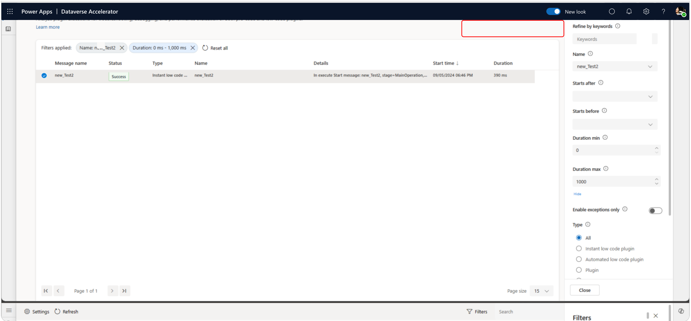

# Monitor and troubleshoot Dataverse plugin runs (preview)

Use tracing to troubleshoot low code and pro code plugins. Tracing helps makers by recording run-time information as an aid in diagnosing the cause of failures, or for general validation of certain states during development.

The plugin monitoring module of the [Dataverse Accelerator](dataverse-accelerator.md) is an enhanced view of the existing [tracing and logging](/power-apps/developer/data-platform/logging-tracing) capibilities available in Dataverse for plugins. The interface helps improve the troubleshooting and debugging processes during development phase by colocating relevent details in a modern treatment.

All events surfaced in the app are read from the [Trace](/power-apps/developer/data-platform/reference/entities/tracelog) table for 24 hours by the following workflow types:
- Plugins
- Custom APIs
- Instant and automated low code plugins

## Prerequisites

You must have the following security role assignment and access to the Dataverse Accelerator app:

- Security role: Both **System customizer** and **System administrator** security roles have the necessary privileges to enable logs and use the app by default.

- Alternatively, you can create custom roles with specific access to each capibility by configuring the following:
  - To *read* logs, organization-level read privilege to the [Trace](/power-apps/developer/data-platform/reference/entities/tracelog) table is required.  
  - To *enable* logging in the environment, organization-level write privilege in the [Organization table's](/power-apps/developer/data-platform/reference/entities/organization#BKMK_PluginTraceLogSetting) `PluginTraceLogSetting` is required.

## Key features

- **Centralized log viewer:** Access and view trace logs from Dataverse Custom APIs, low code plugins, and pro-code plugin executions in an environment from one central location.
- **Filtering capabilities:** Conveniently filter log history to quickly find logs relevant to debugging needs.

## Installation

This feature is available in the Dataverse Accelerator app. Refer to the [Dataverse Accelerator documentation](./dataverse-accelerator.md) for installation instructions.

## Get started

1. [Run the Dataverse Accelerator app](dataverse-accelerator.md#get-started)
1. Navigate to the **Plugin monitoring** feature (via left navigation or the feature card on the landing screen).

### Enable log capturing

If log capturing is not enabled in your environment, the landing page will display an 'off' state with two options to enable logging: All or Exceptions. Choose the appropriate option based on your needs, see the [main documentation](/power-apps/developer/data-platform/logging-tracing#enable-trace-logging) for more information.

You can change these settings later in the Settings screen if needed, which can be accessed in the command bar of the main screens.

> [!TIP]
> Tracing and logging are ideal for debugging during plugin development. For plugin workflows in production, use [Azure App Insights for monitoring](/power-apps/developer/data-platform/application-insights-ilogger).

### View logs

When logs are enabled, plugin events will start to show in the main list displayed in the screen.

> [!TIP]
> If there are no logs showing, you can [create and run a new low code plugin](/power-apps/maker/data-platform/low-code-plug-ins?tabs=instant#create-an-instant-low-code-plug-in) to start showing logs.

### Filter logs

Utilize the filtering capabilities to quickly find logs relevant to the plugins you're working on.

Click the **Filter** button in the top right side of the command bar to open the filter pane. You can also quickly filter by keywords using the search bar.

**Filter options**

| Filter | Description |
| - |-|
| Name | Select the logical name of the plugin |
| Starts after / before | The date time for when the plugin was invoked |
| Enable exception only | Shows runs with failure status |
| Duration min / max | Minimum and maximum range of the plugin duration |
| Type | The classification of the plugin workflow. Available types include:  <ul><li>Instant low code plugin</li><li>Automated low code plugin</li><li>Plugins</li><li>Custom API</li></ul> |
| Mode | Whether the plugin is synchronous or asynchronous. |

### Read log details

Click on a specific log entry to view detailed information about the plugin execution. Log details include timestamp, plugin name, execution status, output parameters, error messages, and more. Message block and exception block fields are displayed below the basic details in the pane, and are expanded if data exists in the respective columns.

## Best practices

1. **Read log details**
   - Click on a specific log entry to view detailed information about the plugin execution.
   - Log details may include timestamp, plugin name, execution status, input/output parameters, error messages, and more.

1. **Troubleshoot issues:**
   - Use the information provided in the trace logs to troubleshoot any issues that arise during plugin execution.
   - Analyze error messages, input/output parameters, and execution details to identify the root cause of the problem.
   - Use trace messages to provide helpful pointers. Writing to the trace service is available in the [Dataverse SDK](/power-apps/developer/data-platform/logging-tracing?branch=dataverse-acc-plugin-monitoring#write-to-the-tracing-service) and in low code plugins as the [Trace function](/power-platform/power-fx/reference/function-trace) in Power Fx.

1. **Take action:**
   - Based on the insights gathered from trace logs, take appropriate action to address any performance issues or bugs identified.
   - This may involve adjusting plugin configurations, updating code logic, or seeking assistance from support resources.

1. **Plan to test:**
   - Make it a habit to plan test cases you can execute in trace logs to validate plugin performance during development.
   - Address any issues or anomalies promptly to maintain the overall stability and reliability of your Dataverse plugins.

1. **Monitor plugin performance:**
   - Regularly monitor plugin performance in production by reviewing trace logs registered with [Application Insights](/power-apps/developer/data-platform/application-insights-ilogger).
   - Keep an eye on execution status, error messages, and any anomalies that may indicate performance issues or bugs.

## FAQs

1. **What privileges are required to access the Trace Log Viewer?**
   - Users must have at least read privileges to the [Trace](/power-apps/developer/data-platform/reference/entities/tracelog) table to view logs.

1. **Who can enable log capturing within the environment?**
   - System administrators with the appropriate security role are able to enable log capturing within their environment. Specifically, write access to the [Organization table](/power-apps/developer/data-platform/reference/entities/organization) is needed to update the [PluginTraceLogSetting](/power-apps/developer/data-platform/reference/entities/organization#BKMK_PluginTraceLogSetting) column value.

1. **Can I filter log history to find specific logs?**
   - Yes, the Trace Log Viewer provides filtering capabilities, allowing users to conveniently find logs relevant to their debugging needs.

1. **Is the Plugin Monitoring feature available in all environments?**
   - The feature is delivered through the Dataverse Accelerator and is available in all environments that have the app installed. The app is automatically installed in all new environments, but can also be installed in older environments by following the [install instructions](dataverse-accelerator.md#install-the-dataverse-accelerator).

## Troubleshooting

1. **After I enabled logging, it still shows the "Logging is turned off" screen**
    - If you have the correct privileges and are certain you have enabled logging, please refresh the browser page. You can [validate whether logging is enabled using the legacy experience](/power-apps/developer/data-platform/logging-tracing?branch=dataverse-acc-plugin-monitoring#enable-trace-logging).
