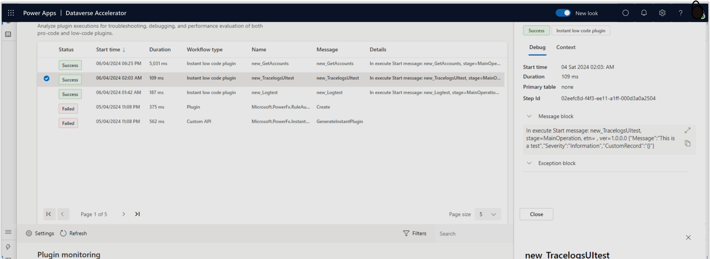

# Monitor and troubleshoot Dataverse plugins (preview)

Use tracing to troubleshoot low code and pro code plugins. Tracing helps makers by recording run-time information as an aid in diagnosing the cause of failures, or for general validation of certain states during development.

The plugin monitoring module of the [Dataverse Accelerator](dataverse-accelerator.md) is an enhanced view of the existing [tracing and logging](/power-apps/developer/data-platform/logging-tracing) capibilities available in Dataverse for plugins and Custom APIs. The interface help improve the troubleshooting and debugging processes during development phase by colocating relevent details in a modern treatment.

All system plugins (low code and pro code) and Custom API tracing and logging events are surfaced, which are stored in this table for 24.

## Prerequisites

You must have the following security role assignment and access to the Dataverse Accelerator app:

- Security role: Both **System customizer** and **System administrator** security roles have the necessary privileges to enable logs and use the app by default.

- Alternatively, you can create custom roles with specific access to each capibility by configuring the following:
  - To *read* logs, organization-level read privilege to the [Trace](/power-apps/developer/data-platform/reference/entities/tracelog) table is required.  
  - To *enable* logging in the environment, organization-level write privilege in the [Organization table's](/power-apps/developer/data-platform/reference/entities/organization#BKMK_PluginTraceLogSetting) `PluginTraceLogSetting` is required.

## Key features

- **Centralized log viewer:** Access and view trace logs from Dataverse Custom APIs, low code plugins, and pro-code plugin executions in an environment from one central location.
- **Filtering capabilities:** Conveniently filter log history to quickly find logs relevant to debugging needs.

## Installation

Accessing the Plugin Monitoring feature requires installation of the Dataverse Accelerator. Refer to the [Dataverse Accelerator documentation](./dataverse-accelerator.md) for installation instructions.

## Get started

1. [Run the Dataverse Accelerator app](dataverse-accelerator.md#get-started)
1. Navigate to the **Plugin monitoring** feature, either using the left navigation or the feature card.

### Enable log capturing (for administrators)

If log capturing is not enabled in your environment, the landing page will display an 'off' state with two options to enable logging: All or Exceptions. Choose the appropriate option based on your needs, see the [main documentation](/power-apps/developer/data-platform/logging-tracing#enable-trace-logging) for more information. You can change these settings later on if needed.

> [!TIP]
> Tracing and logging are ideal for debugging during plugin development. For plugin workflows in production, use [Azure App Insights for monitoring](/power-apps/developer/data-platform/application-insights-ilogger).

### View logs

When logs are enabled, plugin events will start to show in the list.

Logs may be categorized based on the type of plugin (Custom APIs, low code plugins, or pro-code plugins) and execution history.

### Filter logs

Utilize the filtering capabilities to quickly find logs relevant to your debugging needs.

Filter options include filtering by plugin type, execution status (success, failure), date range, or specific keywords.

### Read log details

Click on a specific log entry to view detailed information about the plugin execution. Log details include timestamp, plugin name, execution status, input/output parameters, error messages, and more.

## Best practices

1. **Read log details**
   - Click on a specific log entry to view detailed information about the plugin execution.
   - Log details may include timestamp, plugin name, execution status, input/output parameters, error messages, and more.

1. **Monitor Plugin Performance:**
   - Regularly monitor plugin performance by reviewing trace logs in the Trace Log Viewer.
   - Keep an eye on execution status, error messages, and any anomalies that may indicate performance issues or bugs.

1. **Troubleshoot Issues:**
   - Use the information provided in the trace logs to troubleshoot any issues that arise during plugin execution.
   - Analyze error messages, input/output parameters, and execution details to identify the root cause of the problem.

1. **Take Action:**
   - Based on the insights gathered from trace logs, take appropriate action to address any performance issues or bugs identified.
   - This may involve adjusting plugin configurations, updating code logic, or seeking assistance from other team members or support resources.

1. **Regularly Review Logs:**
   - Make it a habit to regularly review trace logs to ensure ongoing monitoring of plugin performance.
   - Address any issues or anomalies promptly to maintain the overall stability and reliability of your Dataverse environment.

## FAQs

1. **What privileges are required to access the Trace Log Viewer?**
   - Users must have at least read privileges to access and view trace logs.

1. **Who can enable log capturing within the environment?**
   - System administrators with the appropriate security role are able to enable log capturing within their environment.

1. **Can I filter log history to find specific logs?**
   - Yes, the Trace Log Viewer provides filtering capabilities, allowing users to conveniently find logs relevant to their debugging needs.

1. **Is the Plugin Monitoring feature available in all environments?**
   - Yes, the feature is delivered through the Dataverse Accelerator and is available in all environments.
