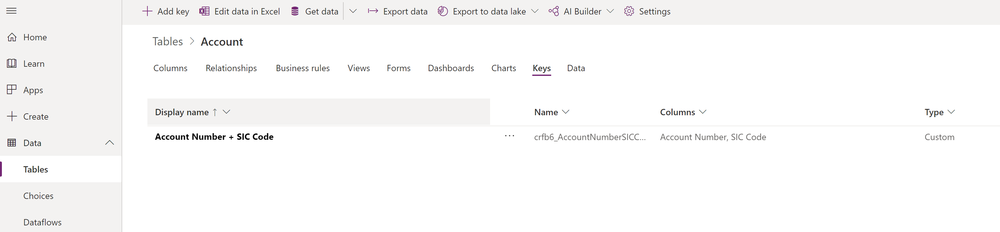
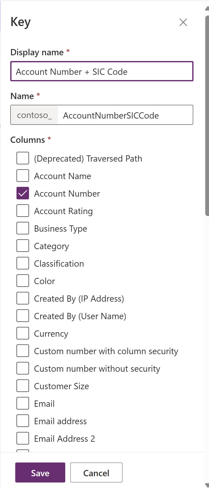

# Define alternate keys using Power Apps portal

[!INCLUDE[cc-data-platform-banner](../../includes/cc-data-platform-banner.md)]

[Power Apps](https://make.powerapps.com/?utm_source=padocs&utm_medium=linkinadoc&utm_campaign=referralsfromdoc) provides an easy way to view and create table alternate keys with the Microsoft Dataverse. For more information about alternate keys, see [Define alternate keys to reference rows](define-alternate-keys-reference-records.md).

Power Apps enables configuring the most common options, but certain options can only be set using solution explorer. More information: [Define alternate keys using solution explorer](define-alternate-keys-solution-explorer.md)

> [!IMPORTANT]
> If the data within a column that is used in an alternate key will contain one of the following characters `/`,`<`,`>`,`*`,`%`,`&`,`:`,`\\`,`?` then `GET` or `PATCH` actions will not work. If you only need uniqueness then this approach will work, but if you need to use these keys as part of data integration then it is best to create the key on columns that won't have data with those characters.

## View alternate keys

1. From the [Power Apps portal](https://make.powerapps.com/?utm_source=padocs&utm_medium=linkinadoc&utm_campaign=referralsfromdoc), select **Data** > **Tables** and select the table that you want to view.
2. Select **Keys** to view a list of any alternate keys that are defined.

   > [!div class="mx-imgBorder"] 
	 > 

## Create an alternate key

1. While [viewing alternate keys](#view-alternate-keys), select **Add key**.
2. Use the panel to set a **Display name** and choose the columns to use to create the alternate key.

    The **Name** column will be populated based on the display name.

    

1. Select **Done** to close the panel.
2. Select **Save table** to create the alternate key.

> [!NOTE]
> The alternate key will not be immediately available. A system job is initiated when you save the table to create database indexes to support the alternate key.

## Delete an alternate key

While [viewing alternate keys](#view-alternate-keys), select the key you want to delete and choose **Delete Key** from the command bar.

### See also

[Developer Documentation: Work with alternate keys](../../developer/data-platform/define-alternate-keys-entity.md)

[!INCLUDE[footer-include](../../includes/footer-banner.md)]