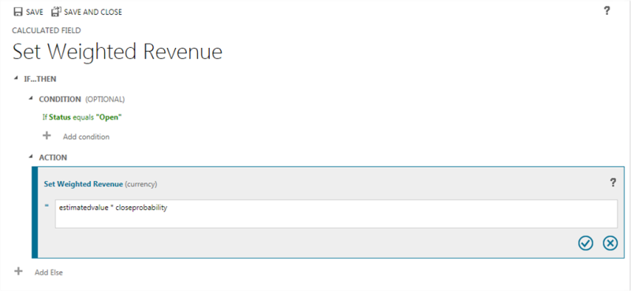

# Define calculated columns to automate calculations

[!INCLUDE[cc-data-platform-banner](../../includes/cc-data-platform-banner.md)]

Use calculated columns to automate otherwise manual calculations used in your business processes.

For example, a salesperson may want to know the weighted revenue for an opportunity, which is based on the estimated revenue from an opportunity multiplied by the probability. Or, they want to automatically apply a discount, if an order is greater than $500. A calculated column can contain values resulting from simple math operations, or conditional operations, such as greater than or if-else, and many others. You can accomplish all this by using Power Apps, no need to write code.  
  
## Capabilities
  
- Calculated columns use the columns from the current table or related parent tables.  
- The expression support is available on the current table and the related parent table columns in the **Condition** sections and the **Action** sections. The built-in functions include:  
 **ADDHOURS**, **ADDDAYS**, **ADDWEEKS**, **ADDMONTHS**, **ADDYEARS**, **SUBTRACTHOURS**, **SUBTRACTDAYS**, **SUBTRACTWEEKS**, **SUBTRACTMONTHS**, **SUBTRACTYEARS**, **DIFFINDAYS**, **DIFFINHOURS**, **DIFFINMINUTES**, **DIFFINMONTHS**, **DIFFINWEEKS**, **DIFFINYEARS**, **CONCAT**, **TRIMLEFT**, and **TRIMRIGHT**.  More information: [Functions syntax](#functions-syntax) 
- A rich conditional support provides branching and multiple conditions. The logical operations include **AND** and **OR** operators.  
- The visual editing capabilities include modern user interface and intellisense in the **ACTION** section. 
- A seamless integration of the calculated columns with the forms, views, charts, and reports are available in real time.  
- You can configure calculated columns to use custom controls.  
  
## Scenarios
  
- **Weighted Revenue**: Estimated revenue multiplied by probability  
- **Net Worth**: Assets subtracted by the liabilities for a given account  
- **Cost of Labor**: Base rate up to 40 hours, plus additional overtime  
- **Contact Number**: Phone number for an opportunity based on account or contact  
- **Lead Score**: Single column that provides insights to the quality of a given lead  
- **Follow Up By**: Follow up on an activity by a specified number of days based on priority  
  
> [!IMPORTANT]
>  To create a calculated column you must have the Write privilege on the [Field Security Profile table](../../developer/data-platform/reference/entities/fieldsecurityprofile.md). If the calculated column uses the secured columns in a calculation, you should consider securing the calculated column as well, to prevent users from accessing data for which they don’t have sufficient permissions. The calculated column editor gives you a warning if you are creating a calculated column that uses secured columns in a calculation, suggesting you secure the calculated column. More information:  [Column level security to control access](/dynamics365/customer-engagement/admin/column-level-security).  

## Column types that support calculations

- Text
- Choice  
- Yes/No  
- Whole Number  
- Decimal Number  
- Currency  
- Date Time

## Create a calculated column

1. Sign into [Power Apps](https://make.powerapps.com/?utm_source=padocs&utm_medium=linkinadoc&utm_campaign=referralsfromdoc)
1. Expand **Dataverse** > **Tables**.  
1. Open the table you want, select the **Columns** tab, and then select **Add Column**.  
1. Provide the required information for the column, including the **Display name**, **Name**, and **Data type**.
1. If the data type is one of the [column types that support calculations](#column-types-that-support-calculations), you can make the column a calculated column by selecting **Add** > **Calculation**.

    

1. By selecting **Calculation**, you're prompted to save the changes to the table. On the **Pending changes** dialog, select **Save**.
1. On the **Columns** tab, open the column that you saved in the previous step.
1. On the column properties pane, select **Open calculation**.

   

1. In the calculated column definition editor, notice that the new calculated column has been created, but no formula has been set. The calculated column definition consists of two sections: **CONDITION** and **ACTION**.  
  
   1. In the **Condition** section, select **Add condition** to specify a table, column, operator, type, and value. In the dropdown box for the **Table**, you can choose a current table or a related table. In the **Column** dropdown box, you have a selection of all available columns for the table. Depending on the operator you choose, you may need to provide type and value. You can specify multiple conditions using the `AND` or `OR` operators. When you're finished specifying the condition, select the check mark :::image type="content" source="../canvas-apps/media/sharepoint-scenario-build-app/icon-check-mark.png" alt-text="Save condition.":::.
   1. After you've specified the condition, in the **Action** section, select **Add action** to provide the formula for the calculated column. When you're finished specifying the action, select the check mark :::image type="content" source="../canvas-apps/media/sharepoint-scenario-build-app/icon-check-mark.png" alt-text="Save condition.":::.
  
   > [!NOTE]
   >  You can use data from Lookup rows within your Action. You first have to select the Lookup column and then type a period. After that, you can select one of the columns available on the related table. For example, in the case of *`<LookupFieldName>.<RelatedFieldName>`*, you can select: `ParentAccountId.AccountNumber`.  
   >   
   >  Note that column level security will be ignored on the related table, so if there is sensitive data in the accessed column we suggest securing your calculated column as well.  
1. In the calculated column definition editor, select **Save and Close**.

 
  
## Examples  

Let’s take a look at calculated column examples in more detail. 
  
### Weighted revenue of opportunity

In this example, we are using the columns of the opportunity table to calculate the weighted revenue based on the opportunity’s probability. In the column editor for an opportunity table, we create a column called **Weighted Revenue** and specify the column type as **Calculated** and the data type is **Currency**.

In the calculated column definition editor, in the **Condition** section, we specify the opportunity with the Status = Open. In the **ACTION**, the formula calculates the weighted revenue based on the opportunity estimated revenue multiplied by the probability of the opportunity.  The following screenshots show step by step how to define the **Weighted Revenue** calculated column.  
  
#### Set the condition on the opportunities:
  
  
  
#### Provide the formula for the weighted revenue: 
  
  
  
#### Altogether:
  
  
  
### Follow up date of opportunity 
 
In this example, we are using the columns of the originated lead of an opportunity to calculate the appropriate date when to follow up on the opportunity. 

In the column editor for an opportunity table, we create a column called **Follow-up date** and specify the type as **Calculated** and the data type is **Date and Time**.  

In the calculated column definition editor, in the **Condition** section, we specify two conditions the purchase time frame and the estimated value of the lead. 

In the **ACTION**, we provide two formulas:
 - To follow up in one week on the immediate opportunity
 - To follow up in one month if the opportunity is not likely to happen right away. 

The following screenshots show step by step how to define the **Follow-up date** calculated column.  
  
#### Set the two conditions on the originating lead:
  
  
  
  
  
#### Provide the formula to follow up in one week:
  
  
  
#### Provide the formula to follow up in one month:
  
  
  
#### Altogether:
  
   
  
### Days from a row creation 
 
In this example, we are using the **DIFFINDAYS** function, to compute the difference in days from the time when a row was created to the current date. 

Create a new Whole Number column called **Calculated difference in days**.
  
#### Provide the formula for computing the difference in days
  
  
  
#### Altogether:
  
  
  
 
  
## Functions syntax  

The following table contains information about the syntax for the functions provided in the **ACTION** section of the calculated column.  
  
> [!TIP]
>  The function names are specified in uppercase letters.  
  
|Function Syntax|Description|Return type|  
|---------------------|-----------------|-----------------|  
|**ADDDAYS** (whole number, date and time)|Returns a new date and time that is equal to the given date and time, plus the specified number of days.|Date and Time|  
|**ADDHOURS** (whole number, date and time)|Returns a new date and time that is equal to the given date and time, plus the specified number of hours.|Date and Time|  
|**ADDMONTHS** (whole number, date and time)|Returns a new date and time that is equal to the given date and time, plus the specified number of months.|Date and Time|  
|**ADDWEEKS** (whole number, date and time)|Returns a new date and time that is equal to the given date and time, plus the specified number of weeks.|Date and Time|  
|**ADDYEARS** (whole number, date and time)|Returns a new date and time that is equal to the given date and time, plus the specified number of years.|Date and Time|  
|**SUBTRACTDAYS** (whole number, date and time)|Returns a new date and time that is equal to the given date and time, minus the specified number of days.|Date and Time|  
|**SUBTRACTHOURS** (whole number, date and time)|Returns a new date and time that is equal to the given date and time, minus the specified number of hours.|Date and Time|  
|**SUBTRACTMONTHS** (whole number, date and time)|Returns a new date and time that is equal to the given date and time, minus the specified number of months.|Date and Time|  
|**SUBTRACTWEEKS** (whole number, date and time)|Returns a new date and time that is equal to the given date and time, minus the specified number of weeks.|Date and Time|  
|**SUBTRACTYEARS** (whole number, date and time)|Returns a new date and time that is equal to the given date and time, minus the specified number of years.|Date and Time|  
|**DIFFINDAYS** (date and time, date and time)|Returns the difference in days between two **Date and Time** columns. If both dates and times fall on the same day, the difference is zero.|Whole Number|  
|**DIFFINHOURS** (date and time, date and time)|Returns the difference in hours between two **Date and Time** columns.|Whole Number|  
|**DIFFINMINUTES** (date and time, date and time)|Returns the difference in minutes between two **Date and Time** columns.|Whole Number|  
|**DIFFINMONTHS** (date and time, date and time)|Returns the difference in months between two **Date and Time** columns. If both dates and times fall on the same month, the difference is zero.|Whole Number|  
|**DIFFINWEEKS** (date and time, date and time)|Returns the difference in weeks between two **Date and Time** columns. If both dates and times fall on the same week, the difference is zero.|Whole Number|  
|**DIFFINYEARS** (date and time, date and time)|Returns the difference in years between two **Date and Time** columns. If both dates and times fall on the same year, the difference is zero.|Whole Number|  
|**CONCAT** (single line of text, single line of text, … single line of text)|Returns a string that is the result of concatenating two or more strings.|String|  
|**TRIMLEFT** (single line of text, whole number)|Returns a string that contains a copy of a specified string without the first N-characters.|String|  
|**TRIMRIGHT** (single line of text, whole number)|Returns a string that contains a copy of a specified string without the last N-characters.|String|  
  
> [!NOTE]
>  All DIFF functions require that the first **Date and Time** column and the second **Date and Time** column have the same behavior: **User Local**, **Date Only** or **Time-Zone Independent**. If the behavior of the second column doesn’t match the behavior of the first column, the error message is shown, indicating that the second column can’t be used in the current function. More information: [Behavior and format of the Date and Time column](behavior-format-date-time-field.md).  
  
> [!NOTE]
>  You cannot enter a date, such as 01/01/2015, as the Date value in a calculated column. Date and DateTime values can only be set or compared using other DateTime columns.  
  
In the **CONCAT** function, you can use literal strings as single lines of text, table columns that contain a single line of text, or a combination of both. For example: **CONCAT** (FirstName, LastName, "is a manager."). If a literal string contains quotation marks, precede each mark with the backslash (\\) escape character, like this: `This string contains the \"quotation marks.\"` This ensures that the quotation marks inside the string aren’t treated as special characters that separate the strings.  
  
The following examples show how to use the **TRIMLEFT** and **TRIMRIGHT** functions. They contain the initial strings and the resulting strings, returned by the **TRIMLEFT** and **TRIMRIGHT** functions:  
  
**TRIMLEFT** ("RXX10-3456789", 3), returns the string `10-3456789`    
**TRIMRIGHT** ("20-3456789RXX", 3), returns the string `20-3456789` 
  
 
  
## Considerations 
 
You should be aware of certain conditions and limitations when working with calculated columns:  
  
- [Saved queries](../../developer/data-platform/saved-queries.md), charts, and visualizations can have a maximum of 10 unique calculated columns.  
- The calculated column values are not displayed in the Outlook Client Offline mode in the tile views or on table main forms.  
- A maximum number of chained calculated columns is 5.  
- A calculated column can’t refer to itself or have cyclic chains.  
- If you change one of the condition operators in a multiple condition clause, all of the condition operators will update to that condition. For example, in the clause `IF (x > 50) OR (y ==10) OR (z < 5)`, if you change the `OR` operator to the `AND` operator, then all `OR` operators in the clause will become `AND` operators.  
- You can access parental columns via the Lookup column to the parent table, such as *`<LookupFieldName>.<FieldName>`*. This is not possible with multi-table lookup columns like Customer which can be Account or Contact. However, some tables have individual Lookup columns for a specific table, such as  `ParentAccountid.`*`<FieldName>`* or `ParentContactid.`*`<FieldName>`*.  
- Sorting is disabled on:  
  - A calculated column that contains a column of a parent row.  
  - A calculated column that contains a logical column (for example, address column)
  - A calculated column that contains another calculated column.  
- Calculated columns can span two tables only.  
  - A calculated column can contain a column from another table (spanning two tables – current table and parent row).  
  - A calculated column can’t contain a calculated column from another table that also contains another column from a different table (spanning three tables):   
    (Current table) Calculated Column &larr; (Parent Row) Calculated Column 1 &larr; (Parent Row) Calculated Column 2.  
- You can’t trigger workflows or plug-ins on calculated columns.  
- You can’t change an existing simple column to a calculated column. If your current application is using JavaScript or plug-ins to calculate a column, you would not be able to use the calculated columns feature without creating a new column.  
- Duplicate detection rules are not triggered on calculated columns.  
- A rollup can't reference a calculated column that uses another calculated column, even if all the columns of the other calculated column are on the current table.  
  
### See also
 
[Create and edit columns](create-edit-fields.md) 
[Define rollup columns that aggregate values](define-rollup-fields.md) 
[Video: Rollup and calculated columns](https://go.microsoft.com/fwlink/p/?LinkId=517727)

[!INCLUDE[footer-include](../../includes/footer-banner.md)]