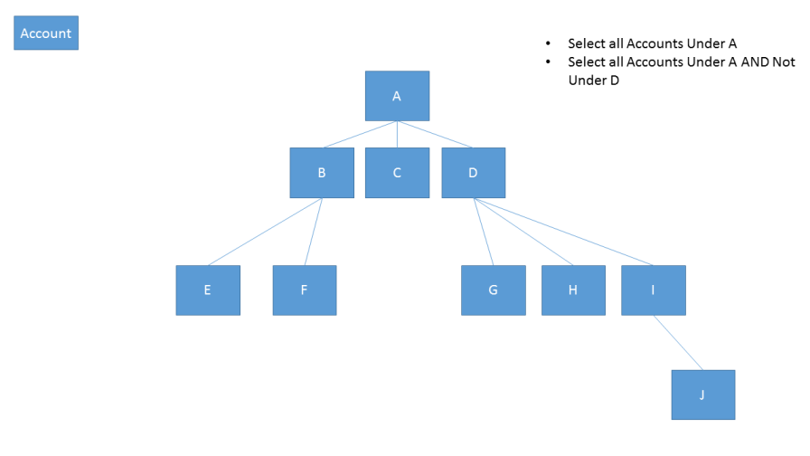
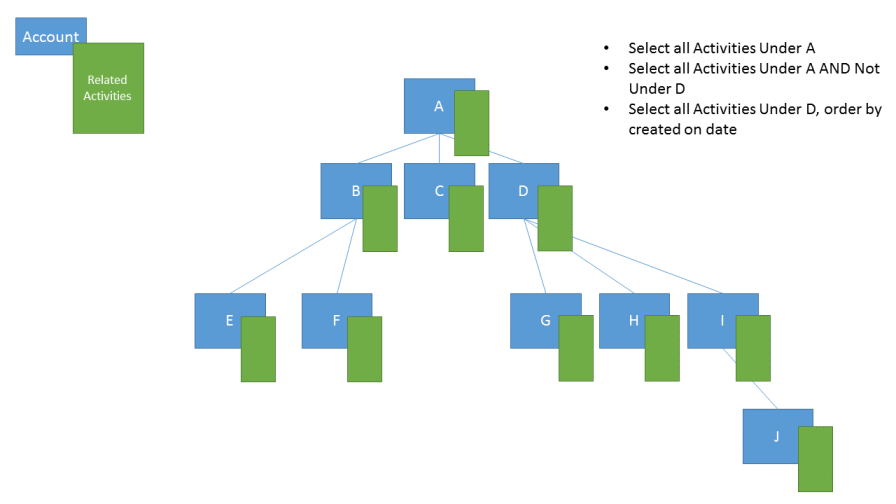
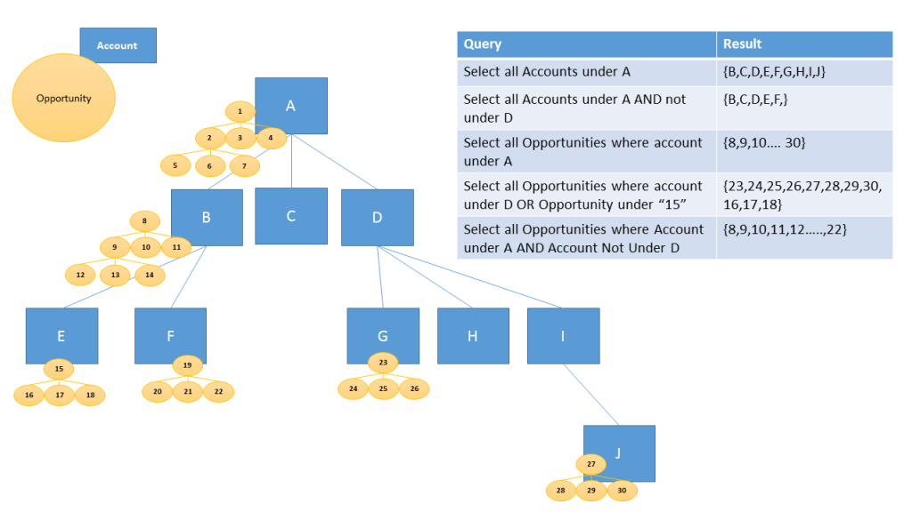

# Define and query hierarchically related data

[!INCLUDE[cc-data-platform-banner](../../includes/cc-data-platform-banner.md)]

You can get valuable business insights by defining and querying hierarchically related data. The hierarchical modelling and visualization capabilities give you a number of benefits:  
  
- View and explore complex hierarchical information.  
- View key performance indicators (KPIs) in the contextual view of a hierarchy.  
- Visually analyze key information across the web and the tablets.  
  
Some standard tables already have hierarchies defined. Other tables, including custom tables, can be enabled for a hierarchy and you can create the visualizations for them. 

## Define hierarchical data

With Microsoft Dataverse, hierarchical data structures are supported by *self-referential* one-to-many (1:N) relationships of the related rows. 

> [!NOTE]
> *Self-referential* means that the table is related to itself. For example, the account table has a lookup column to associate it with another account table row.

When a self-referential one-to-many (1:N) relationship exists, in the relationship definition the **Hierarchical** option is available to be set to **Yes**.

To query the data as a hierarchy, you must set one of the table’s one-to-many (1:N) self-referential relationships as hierarchical. 

To turn the hierarchy on:  
  
1. While [viewing 1:N relationships](create-edit-1n-relationships-solution-explorer.md#view-table-relationships), select the self-referential relationship  you want to edit.
2. In the relationship definition, set **Hierarchical** to **Yes**.  
  
> [!NOTE]
> - Some of the out-of the-box (1:N) relationships can’t be customized. This will prevent you from setting those relationships as hierarchical.
> - You can specify a hierarchical relationship for the system self-referential relationships. This includes the 1:N self-referential relationships of system type,  such as the "contact_master_contact" relationship.  

> [!IMPORTANT]
> You can have multiple self-referential relationships, but only one relationship per table can be defined as the hierarchical relationship. If you try to change the setting once applied you will get a warning:
>
> - **When disabling:** If you turn off the hierarchy setting for this relationship, all rollup definitions, processes, and views that use this hierarchy won't work. Do you want to continue? 
> - **When enabling:** If you enable the hierarchy setting for this relationship, all rollup definitions that use the existing hierarchy will become invalid. Do you want to continue?
>
> Unless you are certain that there are no other dependencies on the existing hierarchy, you should review any documentation about the deployment or confer with other customizers to understand how the existing hierarchical relationship is used before continuing.

 
  
## Query hierarchical data  

Without a defined hierarchy, to retrieve hierarchical data, need to iteratively query for the related rows. With a defined hierarchy, you can query the related data as a hierarchy in one step. You are able to query rows using the **Under** and **Not Under** logic. The **Under** and **Not Under** hierarchical operators are exposed in Advanced Find and the workflow editor. For more information about how to use these operators, see [Configure workflow steps](/flow/configure-workflow-steps#setting-conditions-for-workflow-actions). For more information about Advanced Find, see [Create, edit, or save an Advanced Find search](/dynamics365/customer-engagement/basics/save-advanced-find-search)  

> [!NOTE]
> Developers will also be able to use these operators in code. More information [Developer Documentation: Query hierarchical data](/dynamics365/customer-engagement/developer/org-service/query-hierarchical-data)
  
The following examples illustrate scenarios for querying hierarchies:  
  
### Query account hierarchy  
  
  
  
### Query account hierarchy, including related activities  
  
  
  
###  Query account hierarchy, including related opportunities  
  
  
  
## See also 
[Create and edit 1:N (one-to-many) or N:1 (many-to-one) table relationships](create-edit-1n-relationships.md) 
[Create and edit 1:N (one-to-many) or N:1 (many-to-one) table relationships using solution explorer](create-edit-1n-relationships-solution-explorer.md) 
[Visualize hierarchical data with model-driven apps](visualize-hierarchical-data.md) 

[!INCLUDE[footer-include](../../includes/footer-banner.md)]