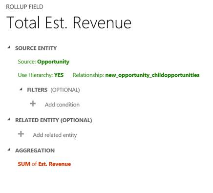

# Define rollup columns that aggregate values

[!INCLUDE[cc-data-platform-banner](../../includes/cc-data-platform-banner.md)]

Rollup columns help users obtain insights into data by monitoring key business metrics. A rollup column contains an aggregate value computed over the rows related to a specified row. This includes regular tables and activity tables such as emails and appointments.

In more complex scenarios, you can aggregate data over the hierarchy of rows. As an administrator or customizer, you can define rollup columns by using the customization tools in Power Apps, without needing to write code.  
  
 
 
## Rollup columns benefits and capabilities  

The benefits and capabilities of rollup columns include the following:  
  
- Visual editing is easy. You can create rollup columns by using the Column Editor, just like you do when you create a regular column.  
- Wide selection of aggregate functions. You can aggregate data by using the following functions: `SUM`, `COUNT`, `MIN`, `MAX` and `AVG`.  
- Full filter support for aggregation. You can set various filters for the source table or related table while setting multiple conditions.  
- Seamless integration with the user interface. You can include the rollup columns in forms, views, charts and reports.  
- Rollup columns are solution components. You can easily transport the rollup columns as components between environments and distribute them in solutions.  
- Rollup columns and the calculated columns are complementary to each other. You can use a rollup column as a part of the calculated column, and vice versa.  
- You can configure rollup columns to use custom controls.  
  
 Some examples of rollup columns include:  
  
- Total estimated revenue of open opportunities of an account  
- Total estimated revenue of open opportunities across all accounts in a hierarchy  
- Total estimated revenue of an opportunity including child opportunities  
- Total estimated value of qualified leads generated by a campaign  
- Number of high priority open cases across all accounts in a hierarchy  
- Earliest created time of all high priority open cases for an account  
  
Each Rollup column creates two accessory columns with *&lt;columnname&gt;*`_date` and *&lt;columnname&gt;*`_state` suffix pattern. The `_date` column contains DateTime data and `_state` column contains Integer data. The `_state` column has the following values:  
  
|Value|State|Description|  
|-|-|-|  
|0|NotCalculated|The column value is yet to be calculated.|  
|1|Calculated|The column value has been calculated per the last update time in _date column.|  
|2|OverflowError|The column value calculation resulted in overflow error.|  
|3|OtherError|The column value calculation failed due to an internal error. The following run of the calculation job will likely fix it.|  
|4|RetryLimitExceeded|The column value calculation failed because the maximum number of retry attempts to calculate the value was exceeded due to high number of concurrency and locking conflicts.|  
|5|HierarchicalRecursionLimitReached|The column value calculation failed because the maximum hierarchy depth limit for the calculation was reached.|  
|6|LoopDetected|The column value calculation failed because a recursive loop was detected in the hierarchy of the row.|  
  
  
 
## Rollup calculations  

The rollups are calculated by scheduled system jobs that run asynchronously in the background. You have to be an administrator to view and manage the rollup jobs. 

### View Rollup jobs

To view rollup jobs:

1. While viewing the **Common Data Services Default Solution** edit the URL, removing everything after `dynamics.com` and refresh the page.
2. In the **Settings** area, select **System** > **System Jobs**. 
1. In the  view selector, choose **Recurring System Jobs**.
2. To quickly find a relevant job, you can filter by the System Job type: **Mass Calculate Rollup Field** or **Calculate Rollup Field**.
 
### Mass Calculate Rollup Field

**Mass Calculate Rollup Field** is a recurring job, created per a rollup column. It runs once, after you created or updated a rollup column. The job recalculates the specified rollup column value in all existing rows that contain this column. By default, the job will run 12 hours after you created or updated a column. After the job completes, it is automatically scheduled to run in the distant future, approximately, in 10 years. If the column is modified, the job resets to run again in 12 hours after the update. The 12-hour delay is needed to assure that the **Mass Calculate Rollup Field** runs during the non-operational hours of the environment. It is recommended that an administrator adjusts the start time of a **Mass Calculate Rollup Field** job after the rollup column is created or modified, in such a way that it runs during non-operational hours. For example, midnight would be a good time to run the job to assure efficient processing of the rollup columns.  

### Calculate Rollup Column 

**Calculate Rollup Field** is a recurring job that does incremental calculations of all rollup columns in the existing rows for a specified table. There is only one **Calculate Rollup Field** job per table. The incremental calculations mean that the **Calculate Rollup Field** job processes the rows that were created, updated, or deleted after the last **Mass Calculate Rollup Field** job finished execution. The default maximum recurrence setting is one hour. The job is automatically created when the first rollup column on a table is created and deleted when the last rollup column is deleted.  

## Online recalculation option
The rollup column on the form displays a calculator image, rollup value, and the time of the last calculation. To recaclulate, select the calculator image, and then select the **Recalculate** button that appears. 

> [!div class="mx-imgBorder"] 
> 
  

There are a few considerations you should keep in mind when using the online recalculation option (manual refresh on the form):  
  
- You must have Write privileges on the table and Write access rights on the source row on which you are requesting the Refresh. For example, if you are calculating the estimated revenue from the open opportunities of an account, you don’t have to have Write privileges on the opportunity table, only on the account table.  
- This option is only available in the online mode. You can’t use it while working offline.  
- The maximum number of rows during the rollup refresh is limited to 50,000 rows. In case of the hierarchical rollup, this applies to the related rows across the hierarchy. If the limit is exceeded, you see an error message: *Calculations can’t be performed online because the calculation limit of 50,000 related rows has been reached.* This limit does not apply when the rollup is automatically recalculated by the system jobs.  
- The maximum hierarchy depth is limited to 10 for the source row. If the limit is exceeded, you see an error message: *Calculations can’t be performed online because the hierarchy depth limit of 10 for the source row has been reached.* This limit does not apply when the rollup is automatically recalculated by the system jobs.  

## Modify rollup job recurrence

As a system administrator, you can modify the rollup job recurrence pattern, postpone, pause, or resume the rollup job. However, you can’t cancel or delete a rollup job. 

To pause, postpone, resume, or modify the recurrence pattern, you must view the system jobs. More information [View Rollup jobs](#view-rollup-jobs) 

On the nav bar, choose **Actions** and select the action you want. 

For the **Mass Calculate Rollup Field** job, the available selections are: **Resume**, **Postpone**, and **Pause**. 

For the **Calculate Rollup Field** job, the available selections are: **Modify Recurrence**, **Resume**, **Postpone**, and **Pause**.  
  
  
 
## Examples 

Let’s take a look at several rollup column examples. We’ll aggregate data for a row from the related rows with and without using a hierarchy. We’ll also aggregate data for a row from related activities and activities indirectly related to a row via the ActivityParty table. In each example, we define the rollup column by using the Column Editor. To open the Column Editor, open solution explorer and expand **Components** > **Tables**. Select the table you want and select **Columns**. Choose **New**. In the editor, provide the required information for the column, including the **Column Type** and **Data Type**. In the **Column Type**, select **Rollup**, after you have selected the data type. The data types include decimal or whole numbers, currency, and date/time. Choose the **Edit** button next to the **Column Type**. This takes you to the rollup column definition editor. The rollup column definition consists of three sections: **Source table**, **Related table** and **Aggregation**.  
  
-   In the **Source table** section, you specify the table for which the rollup column is defined and whether or not you aggregate over a hierarchy. You can add filters with multiple conditions to specify the rows in the hierarchy you want to use for rollup.  
  
-   In the **Related table** section, you specify the table over which you aggregate. This section is optional when you choose to rollup over the hierarchy on the source table. You can add filters with multiple conditions to specify which related rows to use in the calculation. For example, you include the revenue from the open opportunities with an annual revenue greater than $1000.  
  
-   In the **Aggregate** section, you specify the metric you want to compute. You can choose available aggregate functions, such as SUM, COUNT, MIN, MAX or AVG.  
  
### Aggregate data for a row from related rows  

In this example, a hierarchy is not used. The total estimated revenue is calculated for an account, from the related open opportunities.  

  
### Aggregate data for a row from the child rows, over the hierarchy 
 
In this example, we calculate the total estimated revenue of an opportunity including the child opportunities, over the hierarchy.  
  

  
### Aggregate data for a row from the related rows, over the hierarchy

In this example, we calculate the total estimated revenue of open opportunities across all accounts, over the hierarchy.  
  
  
  
### Aggregate data for a row from all related activities
  
In this example, we calculate the total time spent and billed from all activities related to an account. This may include time spent on the phone, at appointments, or on  custom activities.  
  
In earlier releases, you could define a rollup column for an individual activity, such as a phone call, fax, or appointment. But, to achieve the result of the example shown below, you had to total the data by using the calculated columns. Now, you can do it all in one step by defining one rollup column for the Activity table.  
  
  
  
### Aggregate data for a row from all related activities and activities indirectly related via the Activity Party table  

In this example, we count the total number of emails sent to an account, where the account is listed on the email’s “To Recipient” line or “Cc Recipient line. This is done by specifying the **Participation Type** in **FILTERS** for the Activity Party table in the rollup column definition. If you don’t use filtering, then all available participation types for an activity are used in the calculation. 
 
For more information about the Activity Party table and participation types available for a particular activity, see [ActivityParty table](/dynamics365/customer-engagement/developer/activityparty-entity).

  
  
  
### Aggregate data for a row from related rows using the AVG operator

In this example, we calculate an average estimated revenue from all opportunities related to an account.  
  
  
  
The following example shows how to calculate an average estimated revenue from related opportunities over a hierarchy of accounts. An average estimated revenue can be seen at each level in the hierarchy.  
  
  
  
 

## Rollup column considerations 

You should be aware of certain conditions and restrictions when working with rollup columns:  
  
- You can define a maximum of 100 rollup columns for the organization and up to 10 rollup columns per table.  
- A workflow can’t be triggered by the rollup column updates.  
- A workflow wait condition cannot use a rollup column.  
- A rollup over the rollup column is not supported.  
- A rollup can't reference a calculated column that uses another calculated column, even if all the columns of the other calculated column are on the current table.  
- The rollup can only apply filters to the source table or related tables, simple columns or non-complex calculated columns.  
- A rollup can be done only over related tables with the 1:N relationship. A rollup can’t be done over the N:N relationships.  
- A rollup can’t be done over the 1:N relationship for the Activity table or the Activity Party table.  
- The business rules, workflows or calculated columns always use the last calculated value of the rollup column.  
- A rollup column is aggregated under the system user context. All users are able to see the same rollup column value. You can control the rollup column visibility with the column level security (FLS), by restricting who can access the rollup column. More information  [Column level security to control access](/dynamics365/customer-engagement/admin/field-level-security). 

### Precision rounding
 
If the precision of the aggregated column is greater than the precision of the rollup column, the aggregated column precision is rounded down to the precision of the rollup column, before the aggregation is performed. To illustrate this behavior, let’s look at a specific example. Let’s say that the rollup column on the account table, for calculating the total estimated revenue of the related opportunities, has a precision of two decimal points. The Est. Revenue column on the opportunity table is the aggregated column with the precision of four decimal points. In our example, the account has two related opportunities. The aggregated sum of the estimated revenue is calculated as follows:  
  
1. Est. Revenue for the first opportunity: $1000.0041  
1. Est. Revenue for the second opportunity: $2000.0044  
1. Aggregated sum of Est. Revenue: $1000.00 + $2000.00 = $3000.00

As you can see, the precision rounding to two decimal points on the aggregated column is done before the aggregation is performed.  
  
### Different behavior from Associated grids
 
Certain table  forms, such as Account or Contact, out-of-the-box, contain the associated grids. For example, an Account form includes Contacts, Cases, Opportunities and other grids. Some of the rows shown in the Account form grids are directly related to the account row; others, indirectly, through the relationships with other rows. In comparison, the rollup column aggregation uses only direct relationships explicitly defined in the rollup column definition. No other relationships are considered. To illustrate the difference in behavior, let’s look at the following example.  
  
1. The account A1 has a primary contact, P1. The case C1 is associated  with the account  A1 (C1.Customer column  =  A1) and the case C2 is associated with the contact P1 (C2.Customer column = P1).  
1. The **Cases** grid on the **Account** form for the A1 row, shows two cases, C1 and C2.  
1. The rollup column on the account table, called Total Number of Cases, is used to count the cases associated with the account.  
1. In the account rollup column definition, we specify the cases that have the Customer relationship with the account. After aggregation, the Total Number of Cases is equal to 1 (case C1). The case C2 is not included in the total, as it is directly related to the contact, not to the account, and can’t be explicitly defined in the account rollup column definition. As a result, the total number of cases returned by rollup operation doesn’t match the number of cases shown in the **Cases** grid.  
  
### See also  

[Create and edit columns](create-edit-fields.md) 
[Define calculated columns](define-calculated-fields.md) 
[Behavior and format of the Date and Time column](behavior-format-date-time-field.md) 
[Define and query hierarchically related data](define-query-hierarchical-data.md) 
[Video: Rollup and Calculated Fields](https://www.youtube.com/watch?v=RoahCH1p3T8&list=PLC3591A8FE4ADBE07&index=8) 
[Video: Using Power BI](https://www.youtube.com/watch?v=PkQe4BFlBS8&list=PLC3591A8FE4ADBE07&index=3)

[!INCLUDE[footer-include](../../includes/footer-banner.md)]