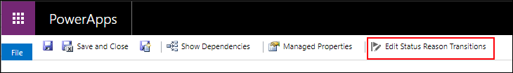

# Define status reason transitions for the Case or custom tables

[!INCLUDE[cc-data-platform-banner](../../includes/cc-data-platform-banner.md)]

You can specify status reason transitions for the Incident (**Case**) table or a custom table.

> [!NOTE]
> Although the Incident (Case) table isn't included in a default Microsoft Dataverse environment, it is used by [Dynamics 365 for Customer Service](https://dynamics.microsoft.com/customer-service/) and defined within the [Common Data Model](https://github.com/Microsoft/CDM/blob/master/schemaDocuments/core/applicationCommon/foundationCommon/crmCommon/service/Incident.cdm.json)
  
Status reason transitions are an optional additional level of filtering to define what the status reason value can be changed to for each status reason. Defining a limited list of valid options can make it easier for people to choose the correct next status reason for a row when you have a large number of combinations for valid status reason values.  
  

## What is the connection between Status and Status Reason columns?  

Tables that can have different status values have two columns that capture this data:  
  
|Display Name|Description|  
|------------------|-----------------|  
|**Status**|Represents the state of the row. Typically **Active** or **Inactive**. You cannot add new status options.|  
|**Status Reason**|Represents a reason that is linked to a specific status. Each status must have at least one possible status reason. You can add additional status reason options.|  
  
The metadata for the column defines what status values are valid for a given state. For example, for the Incident (**Case**) table, the default status and status reason options are:  
  
|Status|Status Reason|  
|------------|-------------------|  
|**Active**|<li>**In Progress**</li><li>**On Hold**</li><li>**Waiting for Details**</li><li>**Researching**</li>| 
|**Resolved**|<li>**Problem Solved**</li><li>**Information Provided**</li>|
|**Canceled**|<li>**Canceled**</li><li>**Merged**</li>|
  
  
   

## Edit status reason transitions
 
You can modify the status reason column options for the Case table and custom tables to define which other status reason options people can choose. The only restriction is that each status reason option for an active status must allow at least one path to an inactive status. Otherwise you could create a condition where it would not be possible to resolve or cancel the case.  

> [!NOTE]
> Editing the status reason transitions requires using solution explorer. See [Create and edit columns for Dataverse using Power Apps solution explorer](create-edit-field-solution-explorer.md) for information about how to edit columns.
  
 When you edit a status reason column the **Edit Status Reason Transitions** button is in the menu. 

When you click this button the **Status Reason Transitions** dialog provides the option to choose **Enable Status Reason Transitions**. When this option is selected you must define which *other* status reason values are allowed for each status reason. To remove the filtering applied, remove the **Enable Status Reason Transitions** selection. The transitions you have defined will be kept but not applied.  
  
The screenshot below provides an example that meets the following requirements: 
 
- A case can be merged at any time. You will not be able to merge cases if a status reason transition does not allow for it.  
- An active case can be canceled at any time.  
- A resolved or canceled case cannot be reactivated.  
- All cases must pass through the following stages: **In Progress** > **On Hold** > **Waiting for Details** > **Researching** before they can be resolved. With this configuration, a case could not be set to an earlier status.  
  > [!NOTE]
  >  This is not a good example for real work, but it demonstrates how stages of status can be enforced through status reason transitions.  
  
   
  
### See Also  

[Create and edit columns for Dataverse using Power Apps solution explorer](create-edit-field-solution-explorer.md) 
[Table metadata > Table states](/powerapps/developer/data-platform/table-metadata#table-states) 
[Define custom state model transitions](/dynamics365/customer-engagement/developer/define-custom-state-model-transitions)

[!INCLUDE[footer-include](../../includes/footer-banner.md)]