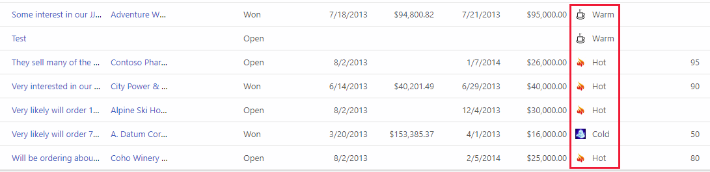
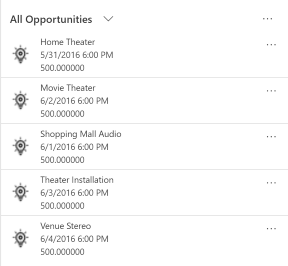
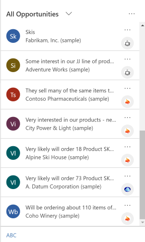
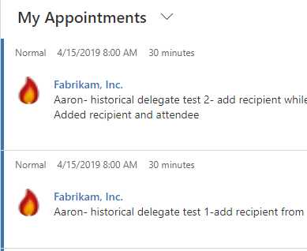

# Display custom icons alongside values in list views

[!INCLUDE[cc-data-platform-banner](../../includes/cc-data-platform-banner.md)]

Power Apps environment administrators and customizers can add graphics to a view and establish the logic used to select a graphic based on the column value using JavaScript. The capability lets you customize list views that display icons alongside text or numerical values. 

This example displays custom icons in a view for the opportunity table, which is available with certain apps, such as Dynamics 365 Sales. You can display custom icons in views with other standard tables, such as the account or contact table, as well as custom tables. 

> [!div class="mx-imgBorder"] 
> 
  
Custom icons in list views can display in Unified Interface, legacy web client, mobile app, and App for Outlook. 
  
## Add custom graphics and JavaScript as web resources  
  
1.  Create the new graphic files needed for your customization. We recommend an icon size of 16x16 pixels (larger images will be scaled down).  
  
2.  Write one or more JavaScript functions that establish which icons to show for which values (you'll typically need one function for each column you want to customize). Each function must accept a row data object and a language (LCID) code as input and return an array containing an image name and tooltip text. For an example function, see [Sample JavaScript function](#sample-javascript-function), later in this article.  
  
3.  Sign into your environment as an administrator and open [solution explorer](../model-driven-apps/advanced-navigation.md#solution-explorer).  
  
4.  The **Default Solution** pop-up window opens. Navigate to **Components** > **Web Resources** here.  
  
5.  Now, you'll upload your custom graphics, one at a time, as web resources. Select the **New** button in the toolbar to create a new web resource. Another pop-up window opens to help you create the resource. Follow these steps:  
  
    1.  Give the new resource a meaningful **Name**. This is the name that you'll use to refer to each graphic from your JavaScript code.  
  
    2.  Set the **Type** to the graphic format you've used to save your graphic file (PNG, JPEG, or GIF).  
  
    3.  Select  **Choose File** to open a file browser window. Use it to find and select your graphic file.  
  
    4.  Add a **Display Name** and/or **Description** if you wish.  
  
    5.  Select **Save** and then close the **Web Resource** window.  
  
6.  Repeat the previous step for each graphic file that you have.  
  
7.  Now, you'll add your JavaScript as the final web resource. Select **New** on the toolbar to create a new web resource. Another pop-up window opens to help you create the resource. Do the following:  
  
    1.  Give the new resource a meaningful **Name**.  
  
    2.  Set the **Type** to **Script (JScript)**.  
  
    3.  Select **Text Editor** (next to the **Type** setting) to open a text-editor window. Paste your Javascript code here and select **OK** to save it.  
  
    4.  Add a **Display Name** and/or **Description** if you wish.  
  
    5.  Select **Save** and then close the **Web Resource** window.  
  
8.  With the **Default Solution** pop-up window still open, expand the **Components** > **Tables** tree and locate the table that you want to customize.  
  
9. Expand your table and select its **Views** icon.  
  
10. You now see a list of views for your selected table. Select a view from the list. Then open the **More Actions** drop-down list in the toolbar and select **Edit**.  
  
11. A pop-up window opens with controls for editing your selected view. It shows each column that is part of the view. Select the target column and then select the **Change Properties** in the **Common Tasks** box. The **Change Column Properties** dialog opens; make the following settings here:  
  
    - **Web Resource**: Specify the name of the web resource that you created to hold your Javascript functions (select **Browse** to choose from a list).  
  
    - **Function Name**: Type the name of the function that you wrote to modify the selected column and view.  
  
12. Select **OK** to close the **Change Column Properties** dialog.  
  
13. Select **Save and Close** to save your view.  
  
14. Repeat these steps for each table, view, and column as needed.  
  
15. When you're ready, select **Publish All Customizations** to publish  your changes. Then, close the **Default Solution** window.  
  
### Sample JavaScript function  
The JavaScript function for displaying custom icons and tooltips expects the following two arguments: the entire row object specified in layoutxml and the calling user’s Locale ID (LCID). The LCID parameter enables you to specify tooltip text in multiple languages. For more information about the languages supported by the environment, see [Enable languages](/dynamics365/customer-engagement/admin/enable-languages) and [Install or upgrade language packs](/dynamics365/customer-engagement/on-premises/install-or-upgrade-language-packs). For a list of locale ID (LCID) values that you can use in your code, see [Locale IDs assigned by Microsoft](/openspecs/windows_protocols/ms-lcid/a9eac961-e77d-41a6-90a5-ce1a8b0cdb9c).

Assuming you will be adding custom icons for an option-set type of attribute, which has a limited set of predefined options, make sure you use the integer value of the options instead of label to avoid localization issues. 

**Note**: If it is necessary to retrieve data to determine the icon, Unified Interface supports returning a JavaScript Promise object which resolves to a boolean (similar to ribbon rules).  Do not use a synchronous XMLHttpRequest (XHR) in your custom function.
  
The following sample code displays icons and tooltips based on one of three values (1: Hot, 2: Warm, 3: Cold) in the opportunityratingcode (Rating) attribute. The sample code also shows how to display localized tooltip text. For this sample to work, you must create three image web resources with 16x16 images with the following names: new_Hot, new_Warm, and new_Cold.  

> [!IMPORTANT]
> This sample requires the opportunity table, which is available with Dynamics 365 Sales app.
  
```javascript
function displayIconTooltip(rowData, userLCID) {      
    var str = JSON.parse(rowData);  
    var coldata = str.opportunityratingcode_Value;  
    var imgName = "";  
    var tooltip = "";  
    switch (parseInt(coldata,10)) { 
        case 1:  
            imgName = "new_Hot";  
            switch (userLCID) {  
                case 1036:  
                    tooltip = "French: Opportunity is Hot";  
                    break;  
                default:  
                    tooltip = "Opportunity is Hot";  
                    break;  
            }  
            break;  
        case 2:  
            imgName = "new_Warm";  
            switch (userLCID) {  
                case 1036:  
                    tooltip = "French: Opportunity is Warm";  
                    break;  
                default:  
                    tooltip = "Opportunity is Warm";  
                    break;  
            }  
            break;  
        case 3:  
            imgName = "new_Cold";  
            switch (userLCID) {  
                case 1036:  
                    tooltip = "French: Opportunity is Cold";  
                    break;  
                default:  
                    tooltip = "Opportunity is Cold";  
                    break;  
            }  
            break;  
        default:  
            imgName = "";  
            tooltip = "";  
            break;  
    }  
    var resultarray = [imgName, tooltip];  
    return resultarray;  
}  
```  
  
 <!-- This results in displaying icons with tooltips in the **Rating** column that depend on the value in each row. The result could look like this:  
  
   --> 

## Custom icon view display behavior
### Primary columns 
In the grid list view, custom icons applied to the table primary column replace the default system-generated icon. 

> [!div class="mx-imgBorder"] 
> 

### Other columns 
In the grid list view, custom icons applied to a column that isn't the table primary column display as a secondary icon in addition to the default system-generated icon. 

> [!div class="mx-imgBorder"] 
> 

### Card forms
Custom icons replace the default system-generated icon when the view is configured to use a card form.

> [!div class="mx-imgBorder"] 
> 

### See also

[Understand model-driven app views](../model-driven-apps/create-edit-views.md)


[!INCLUDE[footer-include](../../includes/footer-banner.md)]