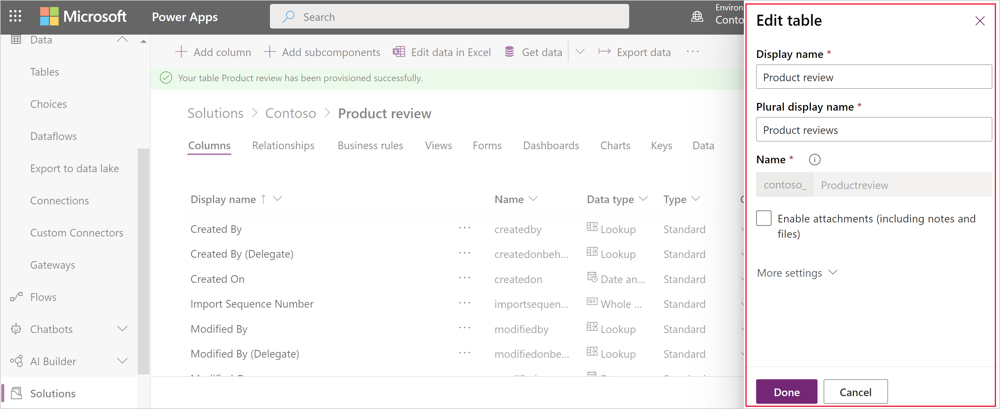

# Edit a table

[!INCLUDE[cc-data-platform-banner](../../includes/cc-data-platform-banner.md)]

You can edit any custom table that you create. Standard tables or managed custom tables may have limitations about changes you can make.  

You can perform the following edits to a table:

- Table properties. More information: [Edit table properties using Power Apps](#edit-table-properties-using-power-apps)

- **Columns**. More information:  [Create and edit columns for Microsoft Dataverse](create-edit-fields.md)
  
- **Relationships**. More information:  [Create and edit relationships between tables](create-edit-entity-relationships.md)

- **Keys**. [Define alternate keys to reference rows](define-alternate-keys-reference-records.md)
  
You can also make changes to rows that support the table:  

- **Business Rules**. More information: [Create business rules and recommendations to apply logic in a form](../model-driven-apps/create-business-rules-recommendations-apply-logic-form.md)

- **Views**. More information:  [Create or edit a view](../model-driven-apps/create-edit-views.md)
  
- **Forms**. More information:  [Create and design forms](../model-driven-apps/create-design-forms.md)

- **Dashboards**. More information: [Create or edit dashboards](../model-driven-apps/create-edit-dashboards.md)

- **Charts**. [Create or edit a system chart](../model-driven-apps/create-edit-system-chart.md)

> [!NOTE]
> **Standard** tables are common tables that are included with your environment that are not **System** or **Custom** tables. *Managed custom tables* are tables that have been added to the system by importing a managed solution. The degree to which you can edit these tables is determined by the managed properties set for each table. Any properties that can’t be edited will be disabled.

## Edit table properties using Power Apps

In [Power Apps](https://make.powerapps.com/?utm_source=padocs&utm_medium=linkinadoc&utm_campaign=referralsfromdoc), select **Solutions**, open the unmanaged solution you want, and then select the table you want to edit. To modify the table properties, select **Settings** on the command bar to view the **Edit table** pane as shown below:

For a description of the properties available to edit see, [Create a table](data-platform-create-entity.md#create-a-table).

> [!NOTE]
> Once enabled, not all table properties can be changed. More information: [Table options that can only be enabled](#table-options-that-can-only-be-enabled)
>
> The name of many standard tables may also be used in other text in the application. To locate and change text where this name was used, see [Edit standard table messages](edit-system-entity-messages.md)

## Edit a table using Solution Explorer

When editing a table using the solution explorer you need to find the unmanaged solution that you want to add it to.

[!INCLUDE [cc_navigate-solution-from-powerapps-portal](../../includes/cc_navigate-solution-from-powerapps-portal.md)]
  
 
  
## Change the name of a table  

Use the **Display Name** and **Plural Name** properties to change the name of the table in the application. 

> [!NOTE]
>  The name of many standard tables may also be used in other text in the application. To locate and change text where this name was used, see [Edit standard table messages](edit-system-entity-messages.md)
  
   

###  Change the icons used for custom tables  

By default, all custom tables in the web application have the same icons. You can create image web resources for the icons you want for your custom tables. More information:  [Change icons for custom tables](../model-driven-apps/change-custom-entity-icons.md).  
  
  
 
###  Table options that can only be enabled  

The following table lists the options that you can enable for a table, but after these items are enabled, they can’t be disabled:  

[!INCLUDE [cc_entity-set-once-options-table](../../includes/cc_entity-set-once-options-table.md)] 
  
  
 
###  Enable or disable table options  

The following table lists the table options that you can enable or disable at any time.  

[!INCLUDE [cc_entity-changeable-options-table](../../includes/cc_entity-changeable-options-table.md)] 

### See also

[Create a table](./data-platform-create-entity.md) 
[Create and edit tables using solution explorer](create-edit-entities-solution-explorer.md)

[!INCLUDE[footer-include](../../includes/footer-banner.md)]