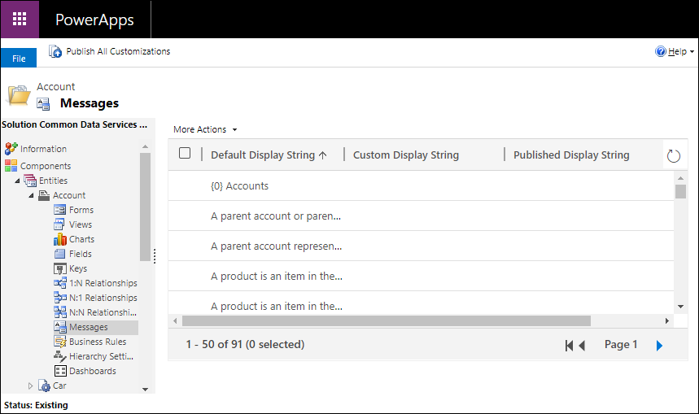

# Edit system table messages

[!INCLUDE[cc-data-platform-banner](../../includes/cc-data-platform-banner.md)]

The default display name of some system tables is used in user interface text and error messages in Microsoft Dataverse. If you change the display name, you should also update any messages that use the default display name. For example, if you change the display name from *Account* to *Company*, you could still see an error message using the old name.  

You cannot edit system messages using the Power Apps portal, you must use solution explorer.

[!INCLUDE [cc_navigate-solution-from-powerapps-portal](../../includes/cc_navigate-solution-from-powerapps-portal.md)]

In the solution explorer, below the table, if you see a **Messages** node you can edit certain text that includes references to the original table display name. 

Editing this text is straightforward. Double-click the message to see a form with three columns:  
  
|Field|Description|  
|-----------|-----------------|  
|**Default Display String**|Shows the original text.|  
|**Custom Display String**|Edit this text to change the display string.|  
|**Comment**|Optional. Include a comment about what you changed and why.|  
  
Some of the message text may have placeholders in them. These placeholders are numbers with brackets on either side. For example: `{0}`. These placeholders allow for text to be inserted  in the message. If you edit messages, make sure that you keep these placeholders. 

Select  to save your changes. Select **Save and Close** to close the form when you save.

> [!NOTE]
> Although the UI exposed to edit system table messages includes many references to table names, it doesn't include all of them. For a more comprehensive approach, see [Updating localizable text in the base language](../model-driven-apps/translate-localizable-text.md#updating-localizable-text-in-the-base-language)

## Programmatically update table display strings

For developers looking for a way to work with these in code, the display strings are stored in the [DisplayString](../../developer/data-platform/reference/entities/displaystring.md) table. 

The `DisplayString` table doesn’t contain the default display strings. The two attributes for this table that contain text are [CustomDisplayString](../../developer/data-platform/reference/entities/displaystring.md#BKMK_CustomDisplayString) and [PublishedDisplayString](../../developer/data-platform/reference/entities/displaystring.md#BKMK_PublishedDisplayString). By default, these attribute values are null unless the display string has been customized and published. The `PublishedDisplayString` value is read-only and reflects the currently published `CustomDisplayString`.
 
## See also
[Edit a table](edit-entities.md) 
[Translate localizable text for model-driven apps](../model-driven-apps/translate-localizable-text.md)

[!INCLUDE[footer-include](../../includes/footer-banner.md)]