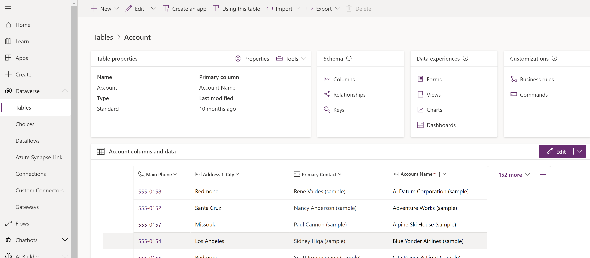

# Tables in Dataverse

[!INCLUDE[cc-data-platform-banner](../../includes/cc-data-platform-banner.md)]

Tables are used to model and manage business data. When you develop an app, you can use standard tables, custom tables, or both. Dataverse provides standard tables by default. These are designed, in accordance with best practices, to capture the most common concepts and scenarios within an organization.

### See also
[Types of tables](types-of-entities.md) 
[Create a custom table](data-platform-create-entity.md)

[!INCLUDE[footer-include](../../includes/footer-banner.md)]