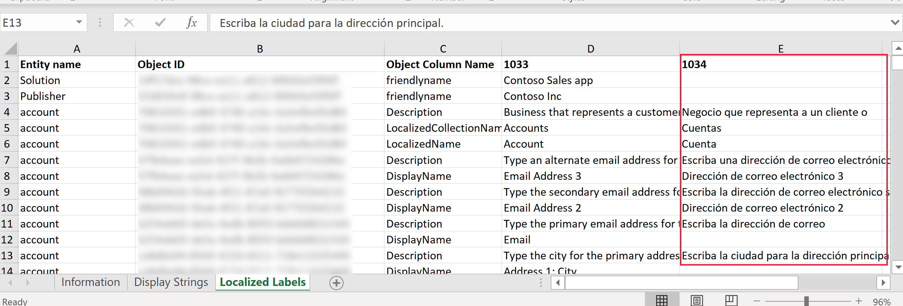

# Translate customized table, form, and column text into other languages
[!INCLUDE[cc-data-platform-banner](../../includes/cc-data-platform-banner.md)]

After you create customized table and column text in your unmanaged solution, you may want to translate it into other languages.  

> [!IMPORTANT]
> When you export translations, the export translations feature exports translations for the table. So, that means even if the solution contains only a single form, labels for all the forms for the table will be exported. Make sure you only modify the form's labels when importing the translations back otherwise another component translation you modify will be added as a dependency to the solution.
  
1. Sign into [Power Apps](https://make.powerapps.com/?utm_source=padocs&utm_medium=linkinadoc&utm_campaign=referralsfromdoc) and select **Solutions** from the left navigation.    
  
2. Select the unmanaged solution you want, on the command bar select **…**, select **Translations**, and then select **Export translations**.  

3. After the export completes the exported translations compressed (zip) file is downloaded to your browser’s default download folder and contains the exported labels.
  
4. Extract the XML file from the compressed (.zip) file.  

5. Open the CrmTranslations.xml file in Excel.

6. Select the sheet named **Localized Labels**.

7. Notice there is already a column with the base language code id, such as 1033 (English U.S.) Add a column with the language code id for every language you want to translate labels. For example, add a column for 1034 (Spanish traditional).

8. Add the translated text in the new column for the object names and object ids that you want.
    > [!div class="mx-imgBorder"]
    > 

9. When you're finished adding your translations, save, and zip up the package so you can [Import translated table and column text](import-translated-entity-field-text.md).

> [!NOTE]
> Not all content can be translated using this tool. This includes labels for sitemap areas, groups, and subareas. To translate these labels, [use the **More Titles** property in the sitemap designer](../model-driven-apps/create-site-map-app.md#add-an-area-to-the-site-map).

## Community tools

[Easy Translator](https://www.xrmtoolbox.com/plugins/MsCrmTools.Translator/) is a tool that XrmToolBox community developed for Power Apps. Use Easy Translator to export and import translations with contextual information. 

> [!NOTE]
> The community tools are not supported by Microsoft. 
> If you have questions about the tool, please contact the publisher. More Information: [XrmToolBox](https://www.xrmtoolbox.com).

## Next steps  
 [Import translated table and column text](import-translated-entity-field-text.md)

[!INCLUDE[footer-include](../../includes/footer-banner.md)]
