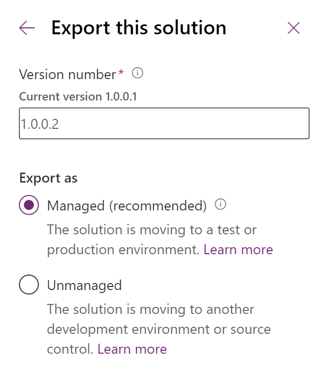

# Export solutions  
[!INCLUDE[cc-data-platform-banner](../../includes/cc-data-platform-banner.md)]

You can manually export solutions using the steps in this article. We recommend that you create an unmanaged solution to use for exporting your customizations, and then export your customizations periodically so that you have a backup in case anything happens. You can't export [managed](/power-platform/alm/solution-concepts-alm#managed-and-unmanaged-solutions) solutions or the [Default Solution](solutions-overview.md#default-solutions). 
 
> [!NOTE]
> To implement healthy application lifecycle management (ALM) in your organization, consider using a source control system to store and collaborate on your solutions, and automate the solution export process. More information: [ALM basics](/power-platform/alm/basics-alm) in the Power Platform ALM guide. 

## Export from Power Apps
  
1.  Sign into [Power Apps](https://make.powerapps.com/?utm_source=padocs&utm_medium=linkinadoc&utm_campaign=referralsfromdoc) and select **Solutions** from the left navigation.   
  
2.  In the list of solutions, select the unmanaged solution you want to export, and then select **Export**. Notice that you can't export managed solutions. 

3. The **Before you export** right pane appears. Choose from the following options, and then select **Next**:  
    - **Publish all changes**. Notice that, when you export an unmanaged solution, only published components are exported. We recommend that you select **Publish all changes** to make sure all components are included in the exported solution. 
    - **Check for issues**. Run the solution checker against the solution to detect performance and stability issues.

4.  The **Export this solution** right pane appears. Enter or select from the following options, and then select **Export**:  
    - **Version number**: Power Apps automatically increments your solution version while displaying the current version. You can accept the default version or enter your own. 
    - **Export as**: Select the package type, either **Managed** or **Unmanaged**. More information: [Managed and unmanaged solutions](/power-platform/alm/solution-concepts-alm#managed-and-unmanaged-solutions)

    > [!div class="mx-imgBorder"]  
    > 

The export can take several minutes to complete. Once finished, the export .zip file is available in the download folder specified by your web browser.

## Export using the classic experience

1.  Sign into [Power Apps](https://make.powerapps.com/?utm_source=padocs&utm_medium=linkinadoc&utm_campaign=referralsfromdoc) and select **Solutions** from the left navigation. Select **Switch to classic**. 
  
2.  In the list select the solution you want to export and then select **Export**. 
  
3.  In the **Publish Customizations** step you will be reminded that only published customizations are exported and you will have the option to **Publish All Customizations** before you select **Next**.  
  
4.  If your solution contains any missing required components you will see the **Missing Required Components** step. You can disregard this warning only if you intend to import this as an unmanaged solution back into the original environment. Otherwise, follow the instructions in the dialog to cancel the export and add the required components.  
  
5.  In the **Export System Settings (Advanced)** step you can choose certain system settings to include in your solution. If your solution depends on any of the groups of system settings, select them and select **Next**.  
  
     See **Settings options for solution export** below for details about the settings that will be included with each option.  
  
6.  In the **Package Type** step, you must choose whether to export the solution as an **Unmanaged** or **Managed** solution.  
  
7.  The next step allows you to choose a target solution for a specific version. This option is typically used by ISVs who may want to export a solution that is compliant with a previous version. Unless you intend to import this solution into an environment that is not upgraded to the same version as the environment version you are using, accept the default.   
  
8.  Select **Export** to download the solution file.  
  
 The exact behavior for downloading files varies between web browsers.  

  
 
### Settings options for solution export  
 If you export the solution from Power Apps, please disregard this section. The following table shows the options available when you export a solution from the classic experience.  
  
|Group|Setting|Description|  
|-----------|-------------|-----------------|  
|Auto-numbering|Campaign Prefix|Prefix used for campaign numbering.|  
|Case Prefix|Prefix to use for all cases throughout the app.|  
|Contract Prefix|Prefix to use for all contracts throughout the app.|  
|Invoice Prefix|Prefix to use for all invoice numbers throughout the app.|  
|Article Prefix|Prefix to use for all articles in the app.|  
|Order Prefix|Prefix to use for all orders throughout the app.|  
|Unique String Length|Number of characters appended to invoice, quote, and order numbers.|  
|Calendar|Calendar Type|Calendar type for the system. Set to Gregorian US by default|  
|Date Format Code|Information about how the date is displayed throughout Microsoft Dataverse|  
|Date Separator|Character used to separate the month, the day, and the year in dates throughout the app.|  
|Max Appointment Duration|Maximum number of days an appointment can last.|  
|Show Week Number|Information that specifies whether to display the week number in calendar displays throughout the app.|  
|Time Format Code|Information that specifies how the time is displayed throughout the app.|  
|Week Start Day Code|Designated first day of the week throughout the app.|  
|Customization|Is Application Mode Enabled|Indicates whether loading of the app in a browser window that does not have address, tool, and menu bars is enabled.|  
|Email-tracking|Allow Unresolved Address Email Send|Indicates whether users are allowed to send email to unresolved parties (parties must still have an email address).|  
|Ignore Internal Email|Indicates whether incoming email sent by app users or queues should be tracked.|  
|Max Tracking Number|Maximum tracking number before recycling takes place.|  
|Render Secure Frame For Email|Flag to render the body of email in the webform in an IFRAME with the security='restricted' attribute set. This is additional security but can cause a credentials prompt.|  
|Tracking Prefix|History list of tracking token prefixes.|  
|Tracking Token Base|Base number used to provide separate tracking token identifiers to users belonging to different deployments.|  
|Tracking Token Digits|Number of digits used to represent a tracking token identifier.|  
|General|Block Attachments|Prevent upload or download of certain attachment types that are considered dangerous.|  
|Currency Format Code|Information about how currency symbols are placed throughout the app.|  
|Currency Symbol|Currency Symbol|  
|Full Name Display Order|Order in which names are to be displayed throughout the app.|  
|Presence Enabled|Information on whether IM presence is enabled.|  
|Negative Format|Information that specifies how negative numbers are displayed throughout the app.|  
|Number Format|Specification of how numbers are displayed throughout the app.|  
|Pricing Decimal Precision|Number of decimal places that can be used for prices.|  
|Share To Previous Owner On Assign|Information that specifies whether to share to previous owner on assign.|  
|Marketing|Allow Automatic Response Creation|Indicates whether automatic response creation is allowed|  
|Allow Automatic Unsubscribe|Indicates whether automatic unsubscribe is allowed.|  
|Allow Automatic Unsubscribe Acknowledgement|Indicates whether automatic unsubscribe acknowledgement email is allowed to send.|  
|Allow Marketing Email Execution|Indicates whether marketing emails execution is allowed.|  
| Outlook Synchronization|Allow Address Book Synchronization|Indicates whether background address book synchronization in Microsoft Office Outlook is allowed.|  
|Allow Offline Scheduled Synchronization|Indicates whether background offline synchronization in Outlook is allowed.|  
|Allow Scheduled Synchronization|Indicates whether scheduled synchronizations to Outlook are allowed.|  
|Email Send Polling Frequency|Normal polling frequency used for sending email in Outlook.|  
|Min Address Synchronization Frequency|Normal polling frequency used for address book synchronization in Outlook.|  
|Min Offline Synchronization Frequency|Normal polling frequency used for background offline synchronization in Outlook.|  
|Min Synchronization Frequency|Minimum allowed time between scheduled Outlook synchronizations.|  
|Auto-Tag Max Cycles|Maximum number of aggressive polling cycles executed for email auto-tagging when a new email is received.|  
|Auto-Tag Interval|Normal polling frequency used for email auto-tagging in Outlook.|  
|ISV Config|Service Calendar Appearance Configuration|You can define visual styles for service calendars.

More information:   [Service Calendar Appearance Configuration](/dynamics365/customer-engagement/developer/customize-dev/service-calendar-appearance-configuration)

### See also
[Import solutions](import-update-export-solutions.md)  
[Update solutions](update-solutions.md)  
[For developers: Create, export, or import an unmanaged solution](/power-platform/alm/solution-api#create-export-or-import-an-unmanaged-solution)

[!INCLUDE[footer-include](../../includes/footer-banner.md)]