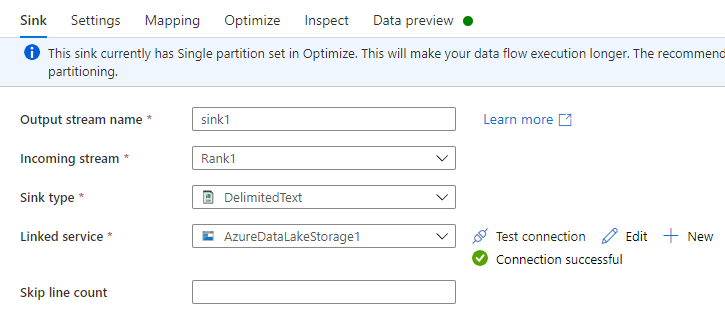

# Ingest exported Microsoft Dataverse data with Azure Data Factory

[!INCLUDE[cc-data-platform-banner](../../includes/cc-data-platform-banner.md)]

After exporting data from Dataverse to Azure Data Lake Storage Gen2 with Azure Synapse Link for Dataverse, you can use Azure Data Factory to create dataflows, transform your data, and run analysis.

> [!NOTE]
> Azure Synapse Link for Dataverse was formerly known as Export to data lake. The service was renamed effective May 2021 and will continue to export data to Azure Data Lake as well as Azure Synapse Analytics.

This article shows you how to perform the following tasks:

1. Set the Data Lake Storage Gen2 storage account with the Dataverse data as a *source* in a Data Factory dataflow.

2. Transform the Dataverse data in Data Factory with a dataflow.

3. Set the Data Lake Storage Gen2 storage account with the Dataverse data as a *sink* in a Data Factory dataflow.

4. Run your dataflow by creating a pipeline.

## Prerequisites

This section describes the prerequisites necessary to ingest exported Dataverse data with Data Factory.

### Azure roles

The user account that's used to sign in to Azure must be a member of the
*contributor* or *owner* role, or an *administrator* of the Azure subscription.
To view the permissions that you have in the subscription, go to the [Azure portal](https://portal.azure.com/), select your username in the upper-right corner, select **...**, and then select **My permissions**. If you have access to multiple subscriptions, select the appropriate one. To create and manage child resources for Data Factory in the Azure portal&mdash;including datasets, linked services, pipelines, triggers, and integration runtimes&mdash;you must belong to the *Data Factory Contributor* role at the resource group level or above.

### Azure Synapse Link for Dataverse
This guide assumes that you've already exported Dataverse data by using [Azure Synapse Link for Dataverse](export-to-data-lake.md).

In this example, the account table data is exported to the data lake.

### Azure Data Factory

This guide assumes that you've already created a data factory under the same subscription and resource group as the storage account containing the exported Dataverse data.

## Set the Data Lake Storage Gen2 storage account as a source

1. Open [Azure Data Factory](https://ms-adf.azure.com/en-us/datafactories) and select the data factory that is on the same subscription and resource group as the storage account containing your exported Dataverse data. Then select **Create data flow** from the home page.

2. Turn on **Data flow debug** mode and select your preferred time to live. This might take up to 10 minutes, but you can proceed with the following steps.

    

3. Select **Add Source.**

    

4. Under **Source settings**, do the following:

    - **Output stream name**: Enter the name you want.
    - **Source type**: Select **Common Data Model**.
    - **Linked Service**: Select the storage account from the drop-down menu, and then link a new service by providing your subscription details and leaving all default configurations.
    - **Sampling**: If you want to use all your data, select **Disable**.

5. Under **Source options**, do the following:

    - **Metadata format**: Select **Model.json**.
    - **Root location**: Enter the container name in the first box (**Container**) or **Browse** for the container name and select **OK**.
    - **Entity**: Enter the table name or **Browse** for the table.

  
  
6. Check the **Projection** tab to ensure that your schema has been imported successfully. If you do not see any columns, select **Schema options** and check the **Infer drifted column types** option. Configure the formatting options to match your data set then select **Apply**.

7. You can view your data in the **Data preview** tab to ensure the Source creation was complete and accurate.

## Transform your Dataverse data

After setting the exported Dataverse data in the Azure Data Lake Storage Gen2 account as a source in the Data Factory dataflow, there are many possibilities for transforming your data. More information: [Azure Data Factory](/azure/data-factory/introduction)

Follow these instructions to create a rank for the each row by the *revenue* field of the account table.

1. Select **+** in the lower-right corner of the previous transformation, and then search for and select **Rank**.

2. On the **Rank settings** tab, do the following:
     - **Output stream name**: Enter the name you want, such as *Rank1*.
     - **Incoming Stream**: Select the source name you want. In this case, the source name from the previous step.
     - **Options**: Leave the options unchecked.
     - **Rank column**: Enter the name of the rank column generated.
     - **Sort conditions**: Select the *revenue* column and sort by *Descending* order.

       

3. You can view your data in the **data preview** tab where you will find the new *revenueRank* column at the right-most position.

## Set the Data Lake Storage Gen2 storage account as a sink

Ultimately, you must set a sink for your dataflow. Follow these instructions to place your transformed data as a delimited text file in the data lake.

1. Select **+** in the lower-right corner of the previous transformation, and then search for and select **Sink**.

2. On the **Sink** tab, do the following:

    - **Output stream name**: Enter the name you want, such as *Sink1*.
    - **Incoming stream**: Select the source name you want. In this case, the source name from the previous step.
    - **Sink type**: Select **DelimitedText**.
    - **Linked service**: Select your Data Lake Storage Gen2 storage container that has the data you exported by using the Azure Synapse Link for Dataverse service.

      

3. On the **Settings** tab, do the following:

    - **Folder path**: Enter the container name in the first box (**File system**) or **Browse** for the container name and select **OK**.
    - **File name option**: Select **output to single file**.
    - **Output to single file**: Enter a file name, such as *ADFOutput*
    - Leave all other default settings.

      

4. On the **Optimize** tab, set the **Partition option** to **Single partition**.

5. You can view your data in the **Data preview** tab.

## Run your dataflow

1. In the left pane under **Factory Resources**, select **+**, and then select **Pipeline**.

     

2. Under **Activities**, select **Move & Transform**, and then drag **Data flow** to the workspace.

3. Select **Use existing data flow**, and then select the dataflow that you
    created in the previous steps.

4. Select **Debug** from the command bar.

5. Let the dataflow run until the bottom view shows that is has been completed. This might take a few minutes.

6. Go to the final destination storage container, and find the transformed table data file.

### See also

[Configure Azure Synapse Link for Dataverse with Azure Data Lake](./azure-synapse-link-data-lake.md)

[Analyze Dataverse data in Azure Data Lake Storage Gen2 with Power BI](export-to-data-lake-data-powerbi.md)

[!INCLUDE[footer-include](../../includes/footer-banner.md)]
