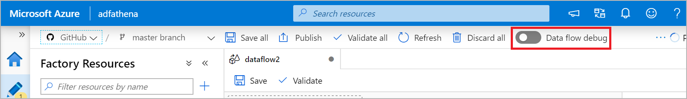
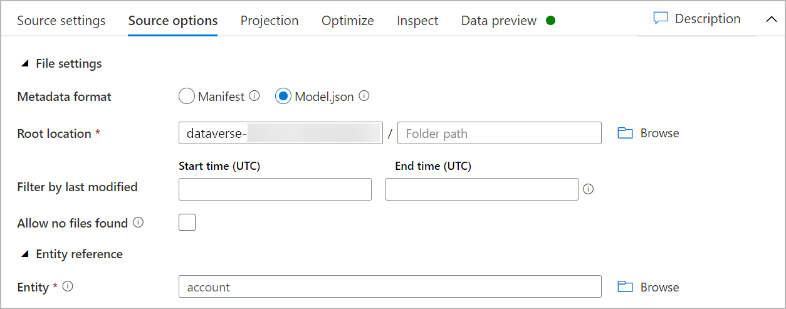
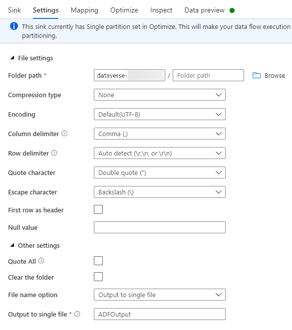

# Ingest exported Microsoft Dataverse data with Azure Data Factory

[!INCLUDE[cc-data-platform-banner](../../includes/cc-data-platform-banner.md)]

After exporting data from Dataverse to Azure Data Lake Storage Gen2 with the Export to Data Lake service, you can use Azure Data Factory to create dataflows, transform your data, and run analysis.

This article shows you how to perform the following tasks: 

1.  Set the Data Lake Storage Gen2 storage account with the Dataverse data as a *source* in a Data Factory dataflow.

2.  Set the Data Lake Storage Gen2 storage account with the Dataverse data as a *sink* in a Data Factory dataflow.

3.  Run your dataflow by creating a pipeline.

## Prerequisites

This section describes the prerequisites necessary to ingest exported Dataverse data with Data Factory.

### Azure roles

The user account that's used to sign in to Azure must be a member of the
*contributor* or *owner* role, or an *administrator* of the Azure subscription.
To view the permissions that you have in the subscription, go to the [Azure portal](https://portal.azure.com/), select your username in the upper-right corner, select **...**, and then select **My permissions**. If you have access to multiple subscriptions, select the appropriate one. To create and manage child resources for Data Factory in the Azure portal&mdash;including datasets, linked services, pipelines, triggers, and integration runtimes&mdash;you must belong to the *Data Factory Contributor* role at the resource group level or above.

### Export to data lake

This guide assumes that you have already exported Dataverse data by using the [Export to Data Lake service](export-to-data-lake.md).

In this example, account table data is exported to the data lake.

### Azure Data Factory

This guide assumes that you have already created a data factory under the same subscription and resource group as the storage account containing the exported Dataverse data.

## Set the Data Lake Storage Gen2 storage account as a source

1.  Open [Azure Data Factory](https://ms-adf.azure.com/en-us/datafactories) and select the data facotry that is on the same subscription and resource group as the storage account containing your exported Dataverse data. Then select **Create data flow** from the home page. 

2.  Turn on **Data flow debug** mode and select your preferred time to live. This may take up to 10 minutes, but you
    can proceed with the following steps.

    

3.  Select **Add Source.**

    

4.  Under **Source settings**, do the following<!--Suggested. It's "configure the following options" here and "select the following options" in the next procedure, but these are a combination of entering and selecting.-->:

    - **Output stream name**: Enter the name you want. 
    - **Source type**: Select **Common Data Model**.
    - **Linked Service**: Select the storage account from the drop-down menu, and then link a new service by providing your subscription details and leaving all default configurations.
    - **Sampling**: If you want to use all your data, select **Disable**.

5.  Under **Source options**, do the following:

    - **Metadata format**: Select **Model.json**. 
    - **Root location**: Enter the container name in the first box (**Container**) or **Browse** for the container name and select **OK**.
    - **Entity**: Enter the table name or **Browse** for the table.

  

## Set the Data Lake Storage Gen2 storage account 

After setting the exported Dataverse data in the Data Lake Storage Gen2 storage account as a source in the Data Factory dataflow, there are many possibilities for transforming your data. More information: [Azure Data Factory](/azure/data-factory/introduction)

Ultimately, you must set a sink for your dataflow. Follow these instructions to set the Data Lake Storage Gen2 storage account with the data exported by the Export to Data Lake service as your sink.

1.  Select **+** in the lower-right corner, and then search for and select **Sink**.

2.  On the **Sink** tab, do the following:

    - **Output stream name**: Enter the name you want, such as *Sink1*.
    - **Incoming stream**: Select the source name you want. 
    - **Sink type**: Select **Common Data Model**. 
    - **Linked service**: Select your Data Lake Storage Gen2 storage container that has the data you exported by using the Export to Data Lake service.

      

3. On the **Settings** tab, do the following:

    - **Schema linked service**: Select the final destination storage container. 
    - **Container**: Enter the container name. 
    - **Corpus folder**: Enter **/** 
    - **table**: Enter text in the format **/*table*Res.cdm.json/*table***, replacing *table* with the table name you want, such as account.

      

    - **Root Location**: In the first box (**Container**), enter the container name. In the second box (**Folder path**), enter **/**. 
    - **Manifest file**: Leave the first box (**table path**) blank, and in the second box (**Manifest name (default)**), enter the first part of the manifest file name, such as *test.manifest.cdm.json / test*.
    - **Format type**: Select your file format preference.

      

## Run your dataflow

1.  In the left pane under **Factory Resources**, select **+**, and then select **Pipeline**.

     

2.  Under **Activities**, select **Move & Transform**, and then drag **Data flow** to the workspace.

3.  Select **Use existing data flow**, and then select the dataflow that you
    created in the previous steps.

4.  Select **Debug** from the command bar.

5.  Let the dataflow run until the bottom view shows that is has been completed. This might take a few minutes.

6.  Go to the final destination storage container, and find the transformed table data file.

### See also

[Analyze Dataverse data in Azure Data Lake Storage Gen2 with Power BI](export-to-data-lake-data-powerbi.md)

[!INCLUDE[footer-include](../../includes/footer-banner.md)]
