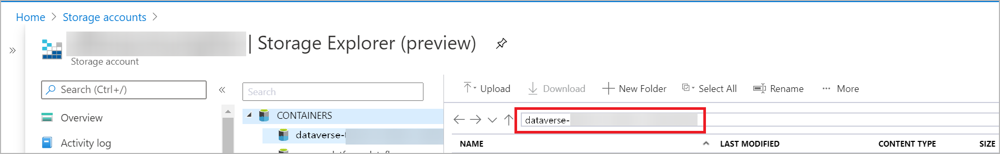
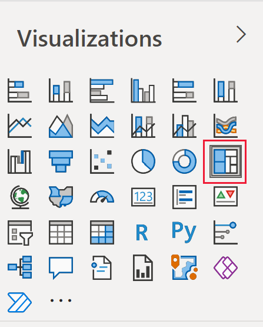
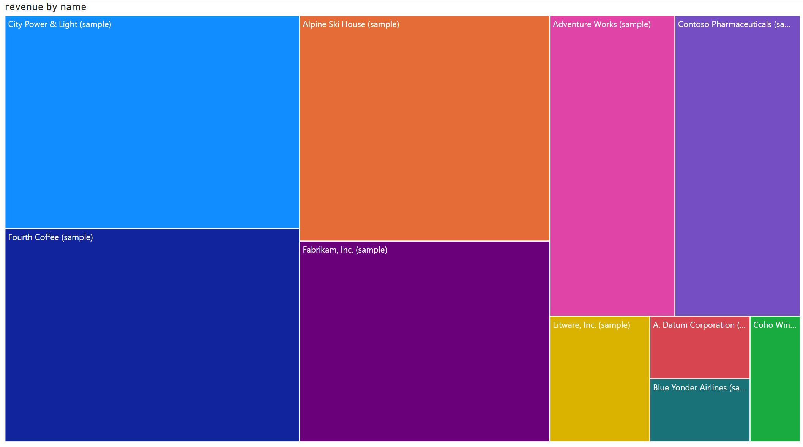

# Analyze Microsoft Dataverse data in Azure Data Lake Storage Gen2 with Power BI

[!INCLUDE[cc-data-platform-banner](../../includes/cc-data-platform-banner.md)]

After exporting data from Microsoft Dataverse to Azure Data Lake Storage Gen2
with Azure Synapse Link for Dataverse, you can use Power BI to create business
reports and analytics. This can be useful for sales managers and sales associates to refine and build additional reports and dashboards in Power BI.

> [!NOTE]
> Azure Synapse Link for Dataverse was formerly known as Export to data lake. The service was renamed effective May 2021 and will continue to export data to Azure Data Lake as well as Azure Synapse Analytics.

This article shows you how to perform the following tasks:

1. Connect the Data Lake Storage Gen2 storage container containing the exported Dataverse data to Power BI.

2. Create a report in Power BI that graphs account owners and their respective total account revenue.

## Prerequisites

This section describes the prerequisites necessary to consume Dataverse data with Power BI by using the Azure Synapse Link for Dataverse service.

- **Power BI Desktop**. [Get it now](https://powerbi.microsoft.com/downloads/)

- **Azure Synapse Link for Dataverse:** This guide assumes that you have already exported data from Dataverse by using the [Azure Synapse Link for Dataverse](export-to-data-lake.md). In this example, the account table data is exported to the data lake and will generate a report by using the account table columns.

- **Storage Account Access.** You must be granted one of the following roles for the storage account: Storage Blob Data Reader, Storage Blob Data Contributor, or Storage Blob Data Owner.

## Connect the Data Lake Storage Gen2 storage to Power BI Desktop

1. Open Power BI Desktop, and sign in.

2. Select **Get data** > **More**.

3. On the **Get Data** page, select **Azure** > **Azure Data Lake Storage Gen2** > **Connect.**

4. Enter the storage container name in the format *https://accountname.dfs.core.windows.net/containername/* and replace **accountname** and **containername** with your storage account's information.

5. Find the storage account name by going to **Azure** > **Storage accounts**, and then select the Data Lake Storage Gen2 account that's populated with the exported Dataverse data.

6. Find the container name by going to **Storage Explorer (preview)** > **Containers** and select the name of the container with the exported Dataverse data.

    

7. Select **CDM Folder View (Beta)**, and then select **OK**.

8. If prompted to sign in, you can sign in with your Azure Active Directory account or with the **Account key**. To sign in with an **Account key**, select the option from the left side bar.

9. Find the account key by going back to the storage account settings and selecting **Access keys** from the left pane. Copy the first key and paste it in Power BI. Select **OK**.

    

10. After successfully connecting to your storage account, expand the **cdm** directory and select the tables that you want to analyze. Then, select **Load**.

    

## Create a Power BI report with account revenue by account owner

1. Under the **Visualizations** menu, select **Pie Chart**.

    

2. On the **Columns** menu, search for and select the columns **ownerid** and **revenue**. The columns will appear on the **Visualizations** menu under **Legend** and **Values**, respectively.

    

   A pie chart appears that separates each account owner by color and displays the total revenue of accounts.

    

### See also

[Configure Azure Synapse Link for Dataverse with Azure Data Lake](./azure-synapse-link-data-lake.md)

[Ingest Dataverse data in Azure Data Lake Storage Gen2 with Azure Data Factory](export-to-data-lake-data-adf.md)

[!INCLUDE[footer-include](../../includes/footer-banner.md)]
