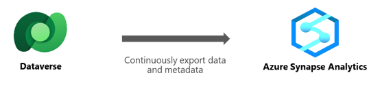
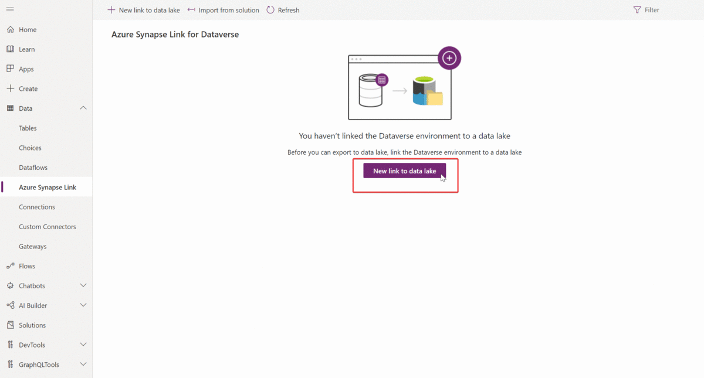

# What is Azure Synapse Link for Dataverse?

[!INCLUDE[cc-data-platform-banner](../../includes/cc-data-platform-banner.md)]

Azure Synapse Link for Dataverse enables you to get near real-time insights over your data in Microsoft Dataverse. With a tight seamless integration between Dataverse and Azure Synapse Analytics, Azure Synapse Link enables you to run analytics, business intelligence and machine learning scenarios on your data.

> [!NOTE]
> Azure Synapse Link for Dataverse was formerly known as Export to data lake. The service was renamed effective May 2021 and will continue to export data to Azure Data Lake as well as Azure Synapse Analytics.

Using Azure Synapse Link, continuously export data from:

- Dataverse to Azure Synapse Analytics
- Dataverse to Azure Data Lake Storage Gen2

The Azure Synapse Link for Dataverse is a service designed for enterprise big data analytics by delivering scalable high availability with disaster recovery capabilities. Data is stored in the Common Data Model format, which provides semantic consistency across apps and deployments.

The Azure Synapse Link for Dataverse provides these features:

- Linking or unlinking the Dataverse environment to Azure Synapse Analytics and/or Azure Data Lake Storage Gen2 in your Azure Subscription.
- Continuous replication of tables to Azure Synapse Analytics and/or Azure Data Lake Storage Gen2 in your Azure Subscription.
- Replication of both standard and custom tables as well as create, update, and delete (CUD) transactions.
- Fewer clicks to process, transform, and visualize your data in Azure Synapse Analytics.
- Serverless data lake exploration, data integration, and big data processing in Azure Synapse Analytics.
- Facilitated metadata discovery and interoperability between data producers and consumers such as Apache Spark, Power BI, Azure Data Factory, Azure Databricks, and Azure Machine Learning.

The Azure Synapse Link for Dataverse service supports initial and incremental writes for table data and metadata. Any data or metadata changes in Dataverse are automatically pushed to the Azure Synapse metastore and Azure Data Lake, depending on the configuration, without any additional action. This is a push, rather than pull, operation. Changes are pushed to the destination without you needing to set up refresh intervals.

Both standard and custom tables can be exported. Notice that the change tracking table attribute in Dataverse is used to keep the data synchronized in an efficient manner by detecting what data has changed since it was initially extracted or last synchronized.

All create, update, and delete operations are exported from Dataverse to the data lake. For example, when a user deletes an Account table row in Dataverse, the transaction is replicated in the destination location.

> [!div class="mx-imgBorder"] 
> 

## Rapidly analyze your Dataverse data in Azure Synapse Analytics

Azure Synapse Analytics is a limitless analytics service that brings together data integration, enterprise data warehousing, and big data analytics. It gives you the freedom to query data on your terms, using either serverless or dedicated resources—at scale. It also allows you to build analytics solutions on top of the Apache Spark engine. With Azure Synapse you can ingest, explore, prepare, manage, and serve data for immediate business intelligence and machine learning needs all from a single service.

## Flexibly analyze your Dataverse data with Azure Data Lake Storage Gen2

Azure Data Lake is a storage solution that allows you to process data on demand, scale instantly, and only pay per job. It provides enterprise-grade security, auditing and support. Azure Data Lake is a great landing page for your Dataverse data before being utilized in another service or application. Each business is different and has different scenarios; Azure Data Lake gives you the flexibility to customize consumption and transition your data to other destinations.

### See also

[Configure Azure Synapse Link for Dataverse with your Azure Synapse Workspace](./azure-synapse-link-synapse.md)

[Configure Azure Synapse Link for Dataverse with Azure Data Lake](./azure-synapse-link-data-lake.md)

[Blog: Announcing Azure Synapse Link for Dataverse](https://aka.ms/synapse-dataverse)

[Blog: Exporting CDS data to Azure Data Lake](https://powerapps.microsoft.com/blog/exporting-cds-data-to-azure-data-lake-preview/)

[!INCLUDE[footer-include](../../includes/footer-banner.md)]
