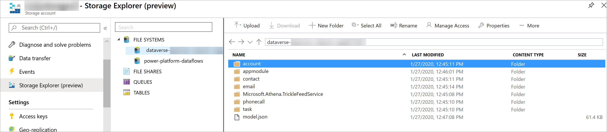
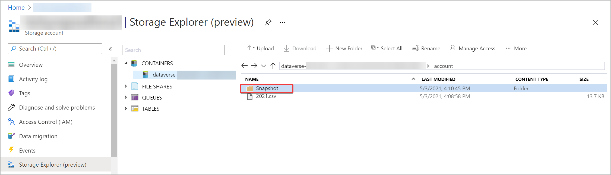
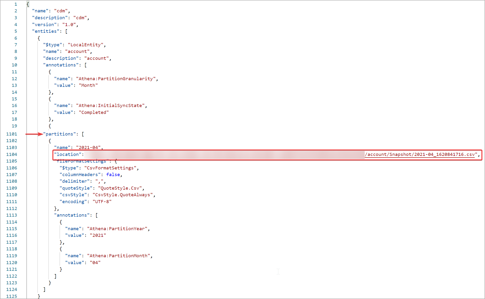

# Export table data to Azure Data Lake Storage Gen2

[!INCLUDE[cc-data-platform-banner](../../includes/cc-data-platform-banner.md)]

The Export to Data Lake service is a pipeline to continuously export data from Microsoft Dataverse to Azure Data Lake Storage Gen2. The Export to Data Lake service is designed for enterprise big data analytics by delivering scalable high availability with disaster recovery capabilities. Data is stored in the Common Data Model format, which provides semantic consistency across apps and deployments. 

Export to Data Lake provides these features: 

- Linking or unlinking the Dataverse environment to Data Lake Storage Gen2 in your Azure subscription. 
- Continuous replication of tables to Data Lake Storage Gen2.
- Initial write, followed by incremental writes for data and metadata. 
- Replication of both standard and custom tables. 
- Replication of create, update, and delete (CUD) transactions. 
- Continuous snapshot updates for large analytics scenarios. 
- Facilitated metadata discovery and interoperability between data producers and consumers such as Power BI, Azure Data Factory, Azure Databricks, and Azure Machine Learning.

## How data and metadata are exported

The Export to Data Lake service supports initial and incremental writes for table data and metadata. Any data or metadata changes in Dataverse are automatically pushed to the data lake without any additional action. This is a push, rather than pull, operation. Changes are pushed to the destination without you needing to set up refresh intervals. 

Both standard and custom tables can be exported. Notice that the change tracking table attribute in Dataverse is used to keep the data synchronized in an efficient manner by detecting what data has changed since it was initially extracted or last synchronized. 

All create, update, and delete operations are exported from Dataverse to the data lake. For example, when a user deletes an Account table row in Dataverse, the transaction is replicated to the destination data lake.

## Prerequisites

Before you can export Dataverse data to a data lake, you must create and configure an Azure Storage v2 (general-purpose v2) storage account. 

Follow the steps in the [Create an Azure Storage account](/azure/storage/blobs/data-lake-storage-quickstart-create-account) article, and note these requirements: 

- You must be granted an owner role on the storage account. 
- Set your storage type as **Storagev2 (general purpose v2)**. 
- The storage account must have the **Hierarchical namespace** feature enabled. 

 We recommend that you set replication to read-access geo-redundant storage (RA-GRS). More information: [Read-access geo-redundant storage](/azure/storage/common/storage-redundancy-grs#read-access-geo-redundant-storage)

>   

> [!NOTE]
> - The storage account must be created in the same Azure Active Directory (Azure AD) tenant as your Power Apps tenant.  
> - The storage account must be created in the same region as the Power Apps environment you'll use the feature in.  
> - To link the Dataverse environment to Azure Data Lake Storage Gen2, you must be a Dataverse administrator. 
> - Only tables that have change tracking enabled can be exported. 

## Select and export Dataverse table data to Azure Data Lake Storage Gen2

1. Sign in to [Power Apps](https://make.powerapps.com/?utm_source=padocs&utm_medium=linkinadoc&utm_campaign=referralsfromdoc), expand **Data**, and then select **Tables**. 
2. On the command bar, select **Export to data lake**, and then on the **Export to data lake** page, select **New link to data lake**. 
3. Select each of the following settings, and then select **Next**: 
   - **Subscription**. Select your Azure subscription. 
   - **Resource group**. Select the resource group that contains the Storage v2 (general-purpose v2) storage account.
   - **Storage account**. Select the Storage v2 (general-purpose v2) storage account to use for the export. 

    > [!NOTE]
    > As part of linking the Dataverse environment to a data lake, you grant the Export to Data Lake service access to your storage account. Ensure that you followed the [prerequisites](#prerequisites) of creating and configuring the Azure data lake storage account, and granting yourself an owner role on the storage account. Additionally, you grant the Power Platform Dataflows service access to your storage account. More information: [Self-service data prep with dataflows](self-service-data-prep-with-dataflows.md).  

4. Select the tables that you want to export to the data lake, and then select **Save**. Only tables with change tracking enabled can be exported. More information: [Enable change tracking](/dynamics365/customer-engagement/admin/enable-change-tracking-control-data-synchronization)

   > [!div class="mx-imgBorder"] 
   > 

Your Dataverse environment is linked to the Azure Data Lake Storage Gen2 account. The file system in the Azure storage account is created with a folder for each table selected to be replicated to the data lake. 

You can follow the steps above to create a link from one Dataverse environment to multiple Azure data lakes in your Azure subscription. Similarly, you could create a link from multiple Dataverse environments to the same Azure Data Lake, all within the same tenant.

> [!NOTE]
> The data exported by Export to data lake service is encrypted at rest in Azure Data Lake Storage Gen2. Additionally, transient data in the blob storage is also encrypted at rest. Encryption in Azure Data Lake Storage Gen2 helps you protect your data, implement enterprise security policies, and meet regulatory compliance requirements. More information: [Azure Data Encryption-at-Rest]( /azure/security/fundamentals/encryption-atrest)  
> Currently, you can't provide public IPs for Export to data lake service that can be used in **Azure Data Lake firewall settings**. Public IP network rules have no effect on requests originating from the same Azure region as the storage account. Services deployed in the same region as the storage account use private Azure IP addresses for communication. Thus, you can't restrict access to specific Azure services based on their public outbound IP address range. 
More information: [Configure Azure Storage firewalls and virtual networks]( /azure/storage/common/storage-network-security)

## Manage table data to the data lake

After you've set up data export to Azure Data Lake Storage Gen2 in your subscription, you can manage the export of table data to the data lake in one of two ways: 

- On the Power Apps maker portal **Export to data lake** area, select **Manage tables** on the command bar to add or remove one or more linked tables.
- On the Power Apps maker portal **Tables** area, select **…** next to a table, and then select the linked data lake where you want to export table data. 

   

To unlink all linked tables, on the Power Apps maker portal **Export to data lake** area, select **Unlink data lake**.

## View your data in Azure Data Lake Storage Gen2

1. Sign in to [Azure](https://portal.azure.com), select the storage account, and then in the leftmost navigation pane, select **Storage Explorer**. 
2. Expand **File Systems**, and then select commondataservice-*environmentName*-org-*Id*. 

The model.json file, along with its name and version, provides a list of tables that have been exported to the data lake. The model.json file also includes the initial sync status and sync completion time. 

A folder that includes snapshot comma-delimited (CSV format) files is displayed for each table exported to the data lake.
   > [!div class="mx-imgBorder"] 
   >  

### Continuous snapshot updates

Dataverse data can continuously change through create, update, and delete transactions. Snapshots provide a read-only copy of data that's updated at regular intervals, in this case every hour. This ensures that at any given point, a data analytics consumer can reliably consume data in the lake.

When tables are added as part of the initial export, the table data is written to the table.csv files under the corresponding folders in the data lake. This is the T1 interval, where a snapshot read-only file named *table*-T1.csv&mdash;for example, Account-T1.csv or Contacts-T1.csv&mdash;is created. Additionally, the model.json file is updated to point to these snapshot files. Opening model.json, you can view the snapshot details. 

Here's an example of an Account.csv partitioned file and snapshot folder in the data lake.

 

Changes in Dataverse are continuously pushed to the corresponding CSV files by using the trickle feed engine. This is the T2 interval, where another snapshot is taken. *table*-T2.csv&mdash;for example, Accounts-T2.csv or Contacts-T2.csv (assuming there are changes for the table) &mdash;and model.json are updated to the new snapshot files. Any new person who views snapshot data from T2 onward is directed to the newer snapshot files. This way, the original snapshot viewer can continue to work on the older snapshot T1 files while newer viewers can read the latest updates. This is useful in scenarios that have longer-running downstream processes. 

Here's an example of the model.json file, which always points to the latest time-stamped account snapshot file. 

 

## How Dataverse table data is written to Azure data lake

While using Export to data lake, all CUD (create, update, delete) changes in data or metadata in Dataverse tables are incrementally pushed to Azure data lake. Depending on your use case, a user can select from one of many options to customize how data is written to the lake. Additionally, a user can also choose a different data partition strategy for each of their tables. While these settings help you control how Dataverse data is written to Azure data lake, it is especially useful in situations when you are trying to decide how you want to consume the data from Azure data lake.

## Writing to data lake

While writing Dataverse table data to the Azure data lake, based on the `createdOn` value, which is the date and time when the record was created, there are two different settings to choose from. They are, **In place update** and **Append only**.

The default setting (for tables where `createdOn` is available) is to do an in place update or upsert (update or insert) of the incremental data in the destination. If the change is new and a corresponding row does not exist in the lake, in the case of a create, the destination files are scanned, and the changes are inserted into the corresponding file partition in the lake. If the change is an update and a row exists in the lake, the corresponding file in the lake is updated, rather than inserted, with the incremental data. In other words, the default setting for all CUD changes in Dataverse tables, where `createdOn` is available, is to do an in place update in the destination, in Azure data lake.

You can switch the default behavior of an in place update by using an optional setting called **Append only**. Rather than an **In place update**, in **Append only** mode, incremental data from Dataverse tables are appended to the corresponding file partition in the lake. This is a per table setting and available as a checkbox under **Advanced\Show advanced configuration settings**. For Dataverse tables with **Append only** turned on, all the CUD changes are incrementally appended to the corresponding destination files in the lake. When you choose this option, the partition strategy defaults to **Year** and when data is written to the data lake, it is partitioned by yearly basis. **Append only** is also the default setting for Dataverse tables that do not have `createdOn` value.

The table below describes how rows are handled in the lake against CUD events for each of the data write options.

|Event  |In place update  |Append only  |
|---------|---------|---------|
|Create     |  The row is inserted in the partition file and is based on the `createdOn` value on the row.       | The row is added to the end of the partition file and is based on the `createdOn` value of the record.    |
|Update     | If the row exists in the partition file, then it is replaced or updated with updated data. If it doesn't exist, it's inserted in the file.    |  The row, along with the updated version, is added to the end of the partition file.   |
|Delete     |  If the row exists in the partition file, it's removed from the file.    | The row is added to the end of the partition file with `isDeleted column = True`.    |

> [!NOTE]
> For Dataverse tables where **Append only** is enabled, deleting a row in the source will not delete or remove the row in the lake. Instead, the deleted row is appended as a as a new row in the lake and the `isDeleted` column is set to True.

Here are some additional details on when to use either of the options.
	
- **In place update**: This is the default setting and recommended only if you want to connect directly to the data in lake and need the current state (not history or incremental changes). The file contains the full data set and can be utilized via Power BI or by copying the entire dataset for ETL (Extract, Transfer, Load) pipelines.
- **Append only**: Select this option if you aren't directly connecting to data in the lake and want to incrementally copy data to another target using ETL pipelines. This option provides a history of changes to enable AI and ML scenarios.

You can toggle the **Show advanced configuration settings** under **Advanced** in export to data lake to customize your data partition strategy and select options to write to the Azure data lake.

:::image type="content" source="media/export-data-lake-show-advanced-config.png" alt-text="Show advanced configuration settings":::

## Data partition strategy

When you export table data from Dataverse to Azure data lake storage using export to data lake, the tables are partitioned (instead of a single file) in the lake based on the `createdOn` value on each row in the source. The default partition strategy is by year and data is partitioned in Azure data lake by yearly basis.

Based on the Dataverse table volume and data distribution, you can choose a more granular partition strategy to partition your data by month. With this option, when Dataverse table data is written to the Azure data lake, it will be partitioned by monthly basis based on the `createdOn` value on each row in the source. This is a per table setting and is available as a checkbox under **Advanced\Show advanced configuration settings**.

Additional details with examples of how data is handled in the lake with yearly or monthly partition strategy:

:::image type="content" source="media/export-data-lake-partition-strategy.png" alt-text="Data partition strategy options":::

## Transporting an Export to Data Lake configuration across environments

In Power Apps, solutions are used to transport apps and components from one environment to another, or to apply a set of customizations to existing apps. To make the export to data lake configurations solution-aware, import the Export to Data Lake Core solution into the environment. This enables basic application lifecycle management (ALM) abilities such as distribution, and backup and restore of the export to data lake configuration.

### Import the Export to Data Lake Core solution

1.	From the Power Apps maker portal, select the environment where you want to distribute the Export to Data Lake configuration.
2.	On the leftmost navigation pane, select **Solutions**, select **Open AppSource**, search for the solution named **Export to Data Lake Core**, and then import the solution.
3.  Repeat above steps in the destination environment. You need the **Export to Data Lake Core** solution in both, the source and destination environments.

### Add an Export to Data Lake configuration to a solution

> [!IMPORTANT]
> Before you can add an Export to Data Lake configuration, you must install the Export to Data Lake Core solution described earlier. 

1.	From the Power Apps maker portal, select the environment where you want to distribute the Export to Data Lake configuration, and then on the leftmost navigation pane, select **Solutions**. 
2.	Select **New solution**, provide a name, select a publisher, and then specify a version number.  
3.	Open the solution you created in the previous step, select **Add existing** > **Other** > **Export to data lake config**. 
4.	Select the linked data lake configurations that you want, and then select **Add**. 
5.	In the **Solutions** area, select the solution, and then on the command bar, select **Export**. 
6.	In the **Before you export** pane, select **Publish** to publish all changes before you export, and then select **Next**. 

### Import the solution that contains the Export to Data Lake configuration

In the environment where you want to import your solution, in the Power Apps maker portal **Solutions** area, import the solution. 

#### Verify the Export to Data Lake configuration

From the Power Apps maker portal in the environment where you imported the Export to Data Lake configuration, verify that you can see your linked data lake in addition to the tables that you transported from your other environment.

> [!div class="mx-imgBorder"] 
>  

### What's next?
After successfully using the Export to Data Lake service, discover how you can analyze and consume your data with **Discover Hub**. To access **Discover Hub**, go to **Power Apps** > **Export to data lake**. Select your linked service and then select the **Discover Hub** tab. Here you can find recommended tools and curated documentation to help you get the most value out of your data.

### See also
[Analyze exported data with Power BI](https://docs.microsoft.com/powerapps/maker/data-platform/export-to-data-lake-data-powerbi)

[Ingest exported data with Azure Data Factory](https://docs.microsoft.com/powerapps/maker/data-platform/export-to-data-lake-data-adf)

[Export to data lake FAQ](export-data-lake-faq.yml)

[Blog: Exporting CDS data to Azure Data Lake](https://powerapps.microsoft.com/blog/exporting-cds-data-to-azure-data-lake-preview/)

[!INCLUDE[footer-include](../../includes/footer-banner.md)]