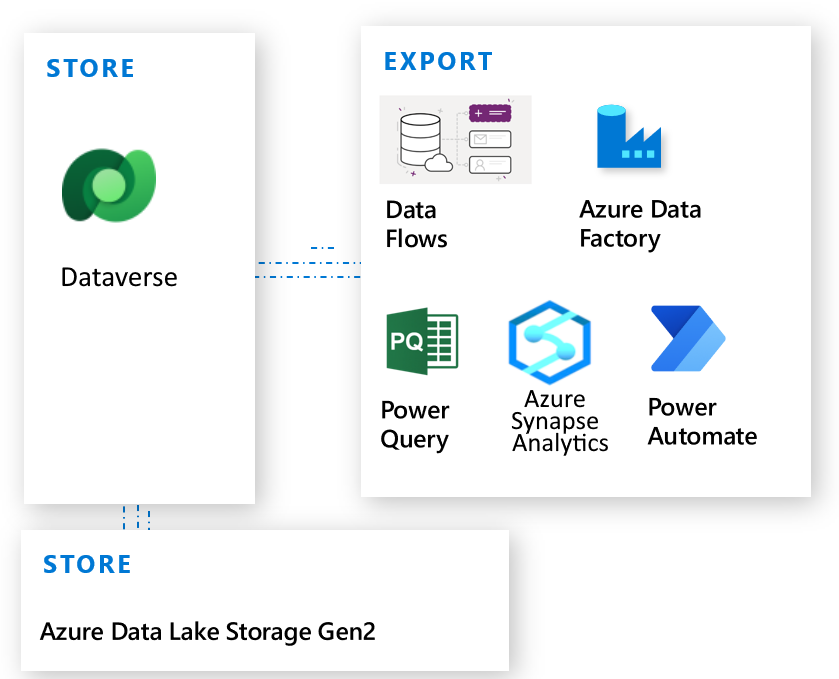

# Importing and exporting data from Dataverse

Microsoft Dataverse is a SaaS data platform that helps you easily create and manage your data, events, and logic and generate analytics** and insights to support interconnected apps built on the Dataverse platform. Apps include first-party apps such as Dynamics 365 Sales, Service, Marketing, Customer Insights, Customer Journey Orchestration, as well as custom third-party apps and processes, all of which operate in a secure and compliant manner. Dataverse, being a hyperscale polyglot storage, can store any type of data (relational, file, observational, and so on) for all your transactional and analytical applications. For this reason, it's the data platform for all Power Platform products and Dynamics 365 applications. Dataverse is a critical element of Microsoft Power Platform, supporting all the data, events, analytics, and related processing, in addition to generating insights for citizen app makers and professional developers to build, store, and manage data for their applications.

Data required by apps and processes doen't often originate from or reside within Dataverse. Mashing up external data with Dataverse is an essential component in building apps, adding data to existing apps, and creating valuable insights. With the proliferation of big data and the ever-multiplying types of data sources, such as AI, ML, IoT, web commerce, web API, services, ERP and line of business apps require Dataverse customers to be agile with using this variety of data.

There are multiple ways to import and export data into Microsoft Dataverse. You can use dataflows, Power Query, Azure Synapse Link, Azure Data Factory, Azure Logic Apps, and Power Automate.

## Where to start?

The first consideration is to start with the external data, which already exists outside of Dataverse that is required for building an app, form, or other component. It isn't necessary to persist that data in Dataverse to start using it. Many times, it's best to continue to let the other system manage the data while using the data as needed in Dataverse. The virtual table feature in Dataverse provides this capability. More information: [Create virtual tables using virtual connectors](/power-apps/maker/data-platform/create-virtual-tables-using-connectors?source=recommendations&tabs=sql).

<!-- This is just the maker home page and not really relevant for virtual tables or necessary  -->

With virtual tables, you can build an app that uses the external data as if it were a Dataverse table. To help you create virtual tables easier, use the [virtual tables creation wizard now in Public Preview \| Microsoft Power Apps](https://powerapps.microsoft.com/en-us/blog/virtual-tables-creation-wizard-now-in-public-preview/)

## Import external data to Dataverse

Your desired outcomes may drive the decision to persist data in Dataverse versus using virtual tables to surface external data in Dataverse. If you want your data to be managed by [security concepts in Dataverse](/power-platform/admin/wp-security-cds) and [application lifecycle management](/power-platform/alm/) features or if you're interested in mashing up external data with native Dataverse data, consider moving data into Dataverse. Additionally, if you’re interested in using Dataverse workflow and business rules, you might consider migrating that data into Dataverse. You should also consider the economic impact of loading data into Dataverse, which may increase storage costs. If the data must continue to be managed by an external system, it can be beneficial to leave it there and interact with it in Dataverse using virtual tables.

## Dataflows and Power Query

Dataflows enable you to connect with business data from various sources, clean the data, transform it, and then load it into Dataverse. Dataflows support dozens of popular on-premises, cloud, and software as a service (SaaS) data sources.

Power Query is a data connection technology you can use to discover, connect, combine, and refine data sources to meet your analysis needs. Features in Power Query are available in Excel and Power BI Desktop.

During the project envisioning phase, you should weigh out all the options and decide whether external data needs to be part of your transactional data. Once the approach is finalized, changing it during implementation and post go-live might cause disruption for the end users experience. Once the decision has been made to load external data into Dataverse, a great tool is [dataflows](/power-query/dataflows/create-use). Dataflows are a great choice when you need to transform and prepare the data while you move it. The dataflow design environment, Power Query, has robust out-of-the-box functionality to help with intuitive transformation and data prep.

More information: [Create and use dataflows in Power Apps](./create-and-use-dataflows.md) and [Add data to a table in Dataverse by using Power Query](/power-query/dataflows/add-data-power-query)

Note that loading data via dataflows is subject to the Dataverse service protection limits. [Learn more](/power-apps/developer/data-platform/api-limits?tabs=sdk)

Power Query supports a multitude of available connectors as outlined here: [List of all Power Query connectors](/power-query/connectors/)

If your data originates in Excel, like that of many Dataverse customers, then use the existing [Excel connector](/power-query/connectors/excel), for example, among multitude of other available connectors, to build a data pipeline into Dataverse. In addition to one-off data loads, [sync your Excel data source with Dataverse using a dataflow](/power-query/dataflows/sync-excel-cds-dataflow). Consider Excel file size limitations with this guidance [reduce the size of an Excel workbook to view it in Power BI](/power-bi/connect-data/reduce-the-size-of-an-excel-workbook)

Moreover, if you have multiple Excel files in a folder that you’d like to load into Dataverse, you can use [Power Query folder connector](/power-query/connectors/folder) to combine, transform and load data.

IT professionals can also free up business users from the complexities of building data pipelines by creating Power Platform dataflow templates. Build a complex query combining data from multiple sources, save it and share with business users. This file can be then used from the **New dataflow** > **Import template** feature in Dataverse. All the user needs to do is verify credentials for data access to start loading data into Dataverse tables. Learn more [Create Power Platform dataflows from queries in Microsoft Excel](/power-query/new-dataflow-from-template). 

## Azure Data Factory

Data Factory is a data integration service that provides a low-code or no-code approach to construct extract, transform, and load (ETL) processes within a visual environment or by writing your own code.

Depending on your data needs, at some point you may require more involved data engineering to bring the data from external sources into Dataverse. It isn't just about the data volume, but also about the amount and complexity of data transformations required for the source data to meet your data requirements in Dataverse. An additional consideration is the IT resources are available to assist with the effort. These more complex data scenarios can be addressed with [Power Platform dataflows](/power-query/dataflows/create-use), [Azure Data Factory](/azure/data-factory/connector-dynamics-crm-office-365?tabs=data-factory), and [Web API](/power-apps/developer/data-platform/webapi/perform-operations-web-api). >Data Factory and Web API integration patterns shine at building pipelines that require involved workflow and algorithm rich transformations. Conversely, dataflows are faster to start with and easier to use.

With Data Factory, you can visually integrate Dataverse and other data sources by using more than 90 natively built and maintenance-free connectors.

In addition to bringing data into Dataverse, Data Factory can also be used to prepare, transform, and enrich data with Azure Databricks and move data into Azure Synapse Analytics.

## Exporting data from Dataverse

Exporting data, either to another data technology or to another environment, can use any of the same technologies mentioned for importing data, such as dataflows, Data Factory, Power Query, and Power Automate.

Dynamics customers who are targeting SQL Server or Azure SQL Database can use Azure Synapse Link. Azure Synapse Link for Dataverse connects with Azure Synapse Analytics to enable you to get near real-time insights over your data from Microsoft Dataverse. With a tight seamless integration between Dataverse and Azure Synapse Analytics, Azure Synapse Link enables you to run analytics, business intelligence and machine learning scenarios on your data. More information: [What is Azure Synapse Link for Dataverse](export-to-data-lake.md)

### See also

[Work with any type of app](work-with-any-type-app.md)

[!INCLUDE[footer-include](../../includes/footer-banner.md)]