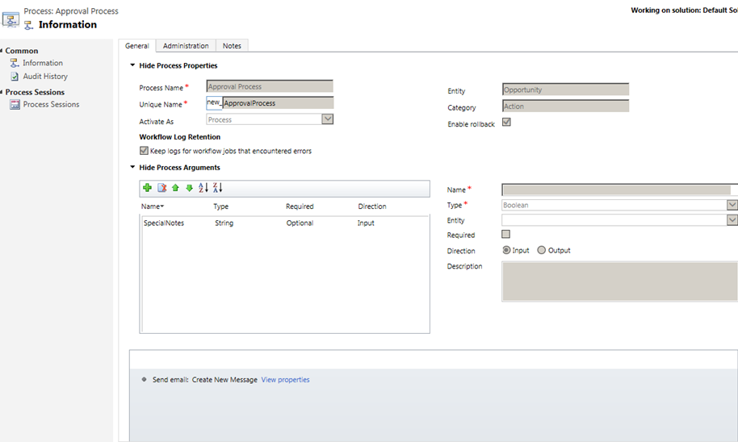

<!-- Be sure to update publication date. -->

# Invoke custom process actions from a workflow

Workflows have numerous capabilities supporting business scenarios. Calling basic data operation actions for a row, such as create, update, and delete, from within a workflow solves quite a few business scenarios. However, if you couple the capabilities of the workflows with the power of the custom processs actions invoked directly from within a workflow, you add a whole new range of business scenarios to your application without needing to write code.  
  
Let’s look at the scenario in which a custom process action is invoked from a workflow. We’ll invoke a custom process action to request the manager’s approval when a discount for a particular opportunity exceeds 20 percent.  
  

## Example: Create a custom process action using the opportunity table
  
1. In [solution explorer](../model-driven-apps/advanced-navigation.md#solution-explorer), select **Processes**.  
  
2.  On the Nav bar, choose **New**. Give the process a name and choose the **Action** category.  
  
To request an approval for the discount, we’re using a custom action called **Approval Process**. We added an input parameter, **SpecialNotes**, and a **Send email** step to create a new message and send a request for the manager’s approval, as shown here.  
  
  
  
To configure the email message, choose **Set Properties**. When the form opens, use the **Form Assistant** to add special notes and other information to the email, as highlighted on the screenshot. To add the special notes, place the cursor where you want the notes to appear in the message, and then, in the **Form Assistant**, under **Look for**, choose **Arguments** in the first drop-down list and choose **SpecialNotes** in the second drop-down list, and then choose **OK**.  
  
  
  
Before you can invoke the custom process action from a workflow, you have to activate it. After you have activated the action, you can view its properties by choosing **View properties**.  
  
  
  

## Invoke a custom process action from a workflow  
  
1. In [solution explorer](../model-driven-apps/advanced-navigation.md#solution-explorer), select **Processes**.   
  
2.  On the Nav bar, choose **New**. Give the process a name and choose the **Workflow** category.  
  
We created a workflow that invokes the **Approval Process** custom action whenever the manager’s approval for a discount of more than 20 percent for an opportunity is required.  
  
  
  
You can set the custom process action’s input properties by choosing **Set Properties**. We added a name of the account related to the opportunity in the special notes. In the **Form Assistant**, under **Look for**, choose **Account** in the first drop-down list, choose **Account Name** in the second drop-down list, and then choose **OK**. The **Target** property is required and it is populated by the system. The **{Opportunity(Opportunity)}** in the **Target** property is the same opportunity that the calling workflow is running on. Alternatively, you can choose a specific opportunity for the target property by using lookup.  
  
  
  

[!INCLUDE[footer-include](../../includes/footer-banner.md)]