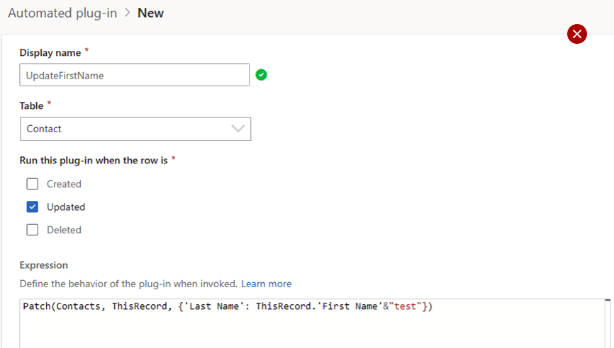
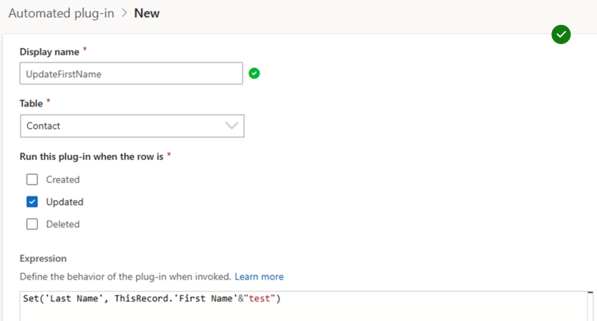

# Example Dataverse low-code plug-ins (preview)

[!INCLUDE [cc-beta-prerelease-disclaimer](../../includes/cc-beta-prerelease-disclaimer.md)]

The goal of these example plug-ins is to help you get started by integrating them into your apps. You'll understand the authoring experience includes authoring Microsoft Dataverse custom APIs backed by Power Fx expressions, which can trigger actions internal or external to Dataverse.

> [!IMPORTANT]
>
> - Instant low-code plug-ins are deprioritized and aren't being delivered as a feature. Instant low-code plug-ins are replaced with functions. More information: [Functions in Microsoft Dataverse (preview)](functions-overview.md)
> - This is a preview feature.
> - Preview features aren’t meant for production use and may have restricted functionality. These features are available before an official release so that customers can get early access and provide feedback.

## Prerequisite

To use one of the example plug-ins for the data event the Dataverse accelerator app must be installed in the environment. More information: [Prerequisites for creating a low-code plug-in](low-code-plug-ins.md#prerequisites-for-creating-a-low-code-plug-in)

> [!NOTE]
> Email templates are only available for certain tables. More information: [Create templates for email](/power-platform/admin/create-templates-email)

## Return a non-negative value

This example uses the [Abs() function](/power-platform/power-fx/reference/function-numericals) to return the non-negative value of its argument. If a number is negative, `Abs` returns the positive equivalent.

1. Play the Dataverse Accelerator app, on the command bar select **New action** > **Instant plugin**. 
1. Provide a display name, such as the formula name, and description.
1. Create an `Out` parameter to validate expected behavior that makes sense, such as a string Optionally use input parameters to make testing easier, that makes sense with the formula. 
1. In the formula editor, wrap the `Out` parameter in curly brackets: 

   ```power-fx
   {Out: "" }
   ```

1. Enter an expression that tests the formula: 
   - Validate that intellisense accepts the formula (text turns light blue).
   - Implement an expression that provides an output to help validate the result, for example.

   ```power-fx
   {Out: "Abs(-5) = 5: " & Text( Abs(-5) = 5 )  }
   ```

1. Select **Next**, and then select **Save**.
1. Select **Test** to test the formula. Use the output parameter to validate the result.

## Input validation and custom errors

### Duplicate detection

Implement server-side input validation, such as duplicate error detection that throws a custom error message.

1. Play the Dataverse Accelerator app, on the command bar select **New action** > **Automated plugin**.
1. In the Name box, enter *Duplicate check*.
1. For **Table**, select **Contact**.
1. For **Run this plugin when the row is**, select **Created**.
1. In the **Formula** box, enter this formula:
  ```power-fx
   If( !IsBlank(LookUp([@Contacts],'Last Name'=ThisRecord.'Last Name' && 'First Name'=ThisRecord.'First Name')),
  	  Error("You have existing contacts with the same first name and last name")
  )
  ```
6. Select **Save**.

### Test the plug-in

1. To test the plug-in, create a canvas app using the contacts table by following the steps here: [Specify a table](../canvas-apps/data-platform-create-app-scratch.md#add-a-dataverse-table-in-a-blank-app).
1. Create a contact row.
1. Create another contact with the same name as in the previous step.
1. A message is displayed indicating duplicate records found. Select **Ignore and save** on the error message prompt.

This custom error message is displayed: **You have two contacts with the same first and last name**.

### Data validation

Display specific types of errors using the _ErrorKind_ enumeration.

1. Create a new automated plug-in.
1. Provide the following values:
   - **Name**: *Input validation*
   - **Description**: *Checks for valid date and throws an error if invalid*
   - **Table**:  **Appointment**
   - **Run this plugin when the row is**: **Updated**
1. Enter the formula below:

   ```power-fx
   If(ThisRecord.'Due Date' < Now(), 
   	Error({ Kind: ErrorKind.Validation , Message: "The due date cannot be in the past" })
   );
   ```
1. Under **Advanced options**, set **When should this run** to **Pre-operation**; you want to run this rule before data is saved to prevent invalid data.
1. Select **Save**.

Go to the [Error() function](/power-platform/power-fx/reference/function-iferror#error) to learn more about custom errors.

## Send email based on a data event

Prerequisites:
> [!div class="checklist"]
> * Server-side synchronization is set up for your environment. More information: [Set up server-side synchronization of email, appointments, contacts, and tasks](/power-platform/admin/set-up-server-side-synchronization-of-email-appointments-contacts-and-tasks)
> * An email template.

### Example email template

Here's an email template example that you can create for the SenMail based data event:
- **Template type**: **Global**
- **Name**: *Order Thank You*
- **Description**: *Use this template to thank a customer for placing an order with you.*
- **Subject**: `Thank you for your order <orderconfirmation-{!salesorder:Order Number;  }>`
- **Body**: Use this code.

```
   Hello {!Sales Order:First Name;},
   Order Type: {! Sales Order: Order Type;},
   Location Type: {! Sales Order: Location Type;},
   Address1: {! Sales Order: Address 1;},
   Address2: {! Sales Order: Address 2;},
   Preferred Service Start Date 1: {! Sales Order: Preferred Service Start Date;},
   Next Step- We take upto 48 hrs to schedule an in-person and will notify you as soon as we have a In-person Technician allocated at your site. For any questions, please contact us at 1-800-CON-SOLAR
   Yours Sincerely, 
   Contoso Sales 

```

### Create the automated plug-in

1. Play the Dataverse Accelerator app, and then select **+New plugin** under **Automated plugins**.
1. Enter the following information: 
   - **Name**: *SendEmailUponCreate*
   - **Table**: Select the logical table name of the sales orders, which is **SalesOrder**. This event is based off of Sales Orders table.
   - **Run this plugin with the row is**: **Created**
   - **Formula**: Paste the code below into the **Formula** box. For more information abut the SendEmailFromTemplate function, to [SendEmailFromTemplate Action](/power-apps/developer/data-platform/webapi/reference/sendemailfromtemplate?view=dataverse-latest&preserve-view=true ).
   
     ```power-fx
     XSendEmailFromTemplate(
         LookUp('Email Templates',StartsWith(title,"Order Thank You")).'Email Template',
	 ThisRecord,
	 LookUp(Users,'Primary Email'="sampleemail@sample.com"),[ThisRecord.Email]
     )
     ```
1. Select **Advanced** > **Post-operation**.
1. Select **Save**. 

The confirmation message **Plugin successfully saved** appears.

## Send in-app notifications based on an instant action

In-app notifications enable makers to configure contextual, actionable notifications for users in model-driven apps.

### Create the low-code plugin that sends an in-app notification

1. Play the Dataverse accelerator app, and then select  **+New plugin** under **Instant plugins**.
1. Enter the following information, select **Next**: 
   - **Name**: *NotifyTechnican1*
   - **Description**: *This instant plug-in notifies the app user.*
1. On the **Definitions** page, create input parameters with these data types:
   - **OrderID**: **String**
   - **TechnicianEmail**: **String**
1. **Formula**. Paste the following code in the **Formula** box. For more information about this function, go to [SendAppNotification Action](/power-apps/developer/data-platform/webapi/reference/sendappnotification?view=dataverse-latest&preserve-view=true ).
   ```power-fx
    XSendAppNotification(
    	"New service",
    	LookUp(Users,'Primary Email'=TechnicianEmail),
    	"You have a new solar panel installation scheduled on "& LookUp('Scheduling Results','OrderId'=OrderID).'ServiceDate'&" in "& LookUp('Service Orders','Order Number'=OrderID).City &". Contact the coordinator with any questions.",
	[
		XCreateSidePaneActionForEntity(
        		"View order",
			OrderID,
			"Sales Order",
			"cr8b8_serviceorder1",
			LookUp('Service Orders','Order Number'=OrderID).'Service Order'
        	)
    	]
    )
    ```
1. Select **Next**.
1. On the **Summary** page, select **Save**.

### Invoke the in-app notification instant action

1. Select a canvas app and then select **Edit** on the command bar (or [create a new one](/power-apps/maker/canvas-apps/create-blank-app)).
1. Select screen on the left navigation pane, or create a new one.
1. On the **Insert** menu, add a **Button** to the page using the **Text** *Notify technician*.
1. Select the button, and enter the following in the **fx** formula bar, where *DataCardValue17* is the column that contains the Order ID, and *DataCardValue15* is the column that contains the technician’s email address. In this example, a canvas app named **Service Order App** is used.
	```power-fx
	Environment.cr8b8_Notifytechnician1({
           OrderID: DataCardValue17.Text,
	   TechnicianEmail: DataCardValue15.Text 
	});

       	Notify("The technician was notified!", NotificationType.Success, 2000);

	 ```
   :::image type="content" source="media/low-code-plugin-ex-notify-inapp.png" alt-text="Add a button with Power Fx formula to send notification to technician" lightbox="media/low-code-plugin-ex-notify-inapp.png":::
1. **Save** and **Publish** your changes.

When the notify technician action is selected in the app, an in-app notification is sent to the technician who has been assigned to the service order. An action on the notification opens the service order details in a side pane.

:::image type="content" source="media/low-code-plugin-ex-notification-sent.png" alt-text="Notification sent to technician who receives in app":::

## Sample instant plug-in with MSN Weather connector

This plugin returns the current weather for a specific location using [MSN Weather connector](/connectors/msnweather/).

Prerequisites:
> [!div class="checklist"]
> * [Prerequisites for creating a low-code plug-in](low-code-plug-ins.md#prerequisites-for-creating-a-low-code-plug-in)
> * MSN Weather connector is allowed in the environment

1. Create a connection reference for MSN Weather if not available yet in the environment:
:::image type="content" source="media/low-code-plugin-msn-createconnectionref.png" alt-text="Create a connection reference in the app from the connection references pane on the right":::

1. Copy snippet:
:::image type="content" source="media/low-code-plugin-msn-action.png" alt-text="Copy the action snippet from the connections pane":::

1. Finish editing the formula using intellisense and consume the connector response properties as needed:
:::image type="content" source="media/low-code-plugin-msn-definition.png" alt-text="Complete the plug-in definition in the editor":::
1. Save
1. [Test the plug-in](low-code-plug-ins.md#test-a-low-code-plug-in)

> [!TIP]
> Use the [With()](/power-platform/power-fx/reference/function-with) function to capture the entire response from one action if you want to access different properties the response might have. In the example below, there's an input parameter `Location` (string) and an output parameter `Out` (string).
>

```power-fx
With({ /* Capture current weather response from connector */
c: new_MsnWeather.CurrentWeather( Location, "Imperial" ).responses.weather.current
},{	/* Return concatenated weather details */
Out: "Current temp: " & c.temp & " degrees. Feels like " & c.feels & " degrees. Wind speed is " & c.windSpd & " mph."
})
```

## Best practices

### Handling infinite loop errors in automated low-code plugins

Don't write a patch statement on an automated plugin upon 'Update' event, where the patch is happening on the same table as the plugin. This leads to infinite loops and plugin execution failures.

Problematic pattern: Using `Patch()` formula triggers another update.


Recommended pattern: Use the `Set()` formula instead to avoid this issue.


## See also

[Low-code plug-ins Power Fx (preview)](low-code-plug-ins-powerfx.md)
