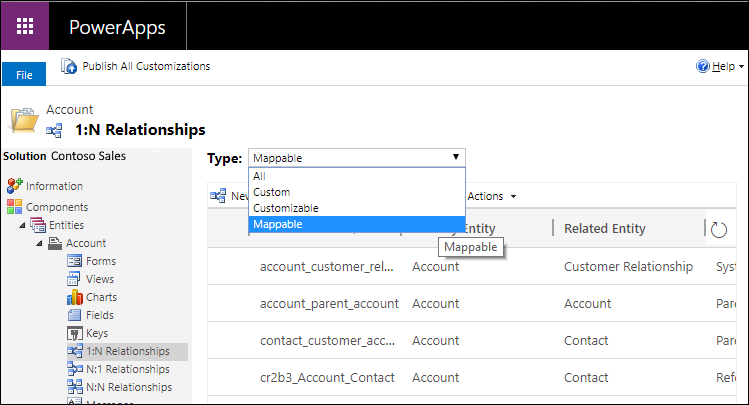
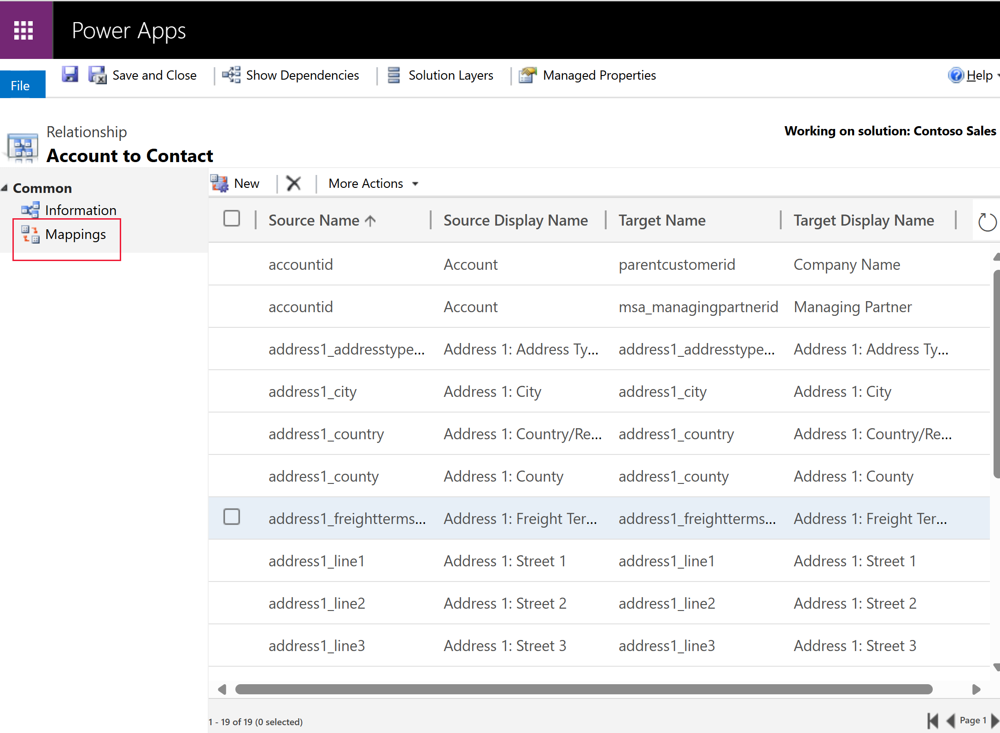
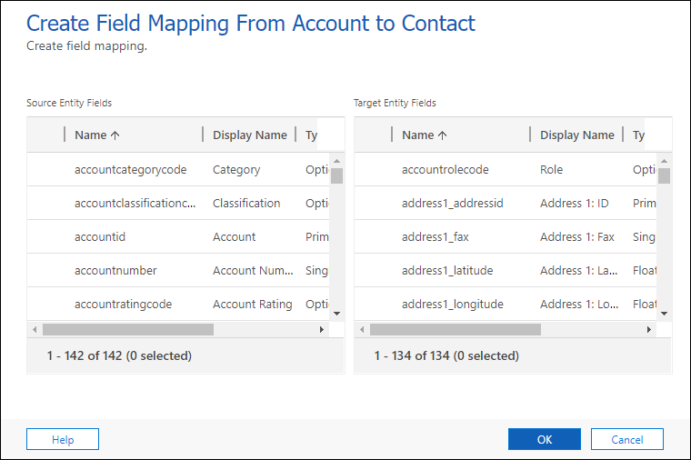
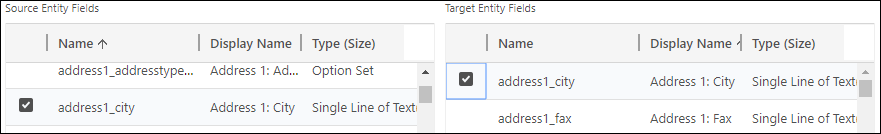

# Map table columns
 
[!INCLUDE[cc-data-platform-banner](../../includes/cc-data-platform-banner.md)]

You can map attributes between tables that have a table relationship. This lets you set default values for a row that is created in the context of another row. 

## Easier way to create new rows in model-driven apps

Let’s say that people want to add a new contact row for a person who is an employee for a specific account. They can do this in two different ways:  
  
### The hard way

People could just navigate in the app to create a new contact row from scratch. But then they need to set the parent account and enter several items of information (such as address and phone information) which are probably the same as the parent account. This can be time consuming and introduces opportunities for errors.  
  
### The easier way

The easier way is to start with the account table and, using the **Contacts** subgrid on the form, select **+** to add a contact. It will first guide people to look up any existing related contacts so they don’t accidentally create a duplicate row. If they don’t find an existing row, they can select **New** and create a new contact row. 

The new contact row form will include any of the mapped attribute values from the account (such as address and phone information) as the default values. People can edit these values before they save the row.

## How this works

When you map table columns for a 1:N table relationship certain items of data from the primary table row will be copied into the new related table form to set default values that people can edit before saving.
 
  
> [!NOTE]
> These mappings only set default values to a row before it is saved. People can edit the values before saving. The data that is transferred is the data at that point in time. It isn’t synchronized if the source data later changes.
>   
> These mappings aren’t applied to related rows created using a workflow or dialog process. They aren’t automatically applied to new rows created using code, although developers can use a special message called `InitializeFrom` ([InitializeFrom Function](/dynamics365/customer-engagement/web-api/initializefrom?view=dynamics-ce-odata-9) or [InitializeFromRequest Class](/dotnet/api/microsoft.crm.sdk.messages.initializefromrequest?view=dynamics-general-ce-9)) to create a new row using available mappings. 
> 
> These mappings aren't applied for new related table forms that are opened when an app does not have an active network connection to Dataverse, except for parent lookup fields. 

## Open solution explorer

The only way to map table columns is to use solution explorer.

[!INCLUDE [cc_navigate-solution-from-powerapps-portal](../../includes/cc_navigate-solution-from-powerapps-portal.md)]
  
Mapping columns is done in the context of a 1:N or N:1 table relationship, so first you need to [view 1:N or N:1 table relationships](create-edit-1n-relationships-solution-explorer.md#view-table-relationships).

## View mappable columns

Column mappings aren’t actually defined within the table relationships, but they are exposed in the relationship user interface. Not every 1:N table relationship has them. When you view a list of 1:N (or N:1) table relationships for a table, you can filter the relationships shown by type. You can select either **All**, **Custom**, **Customizable**, or **Mappable**. Mappable table relationships provide access to allow mapping table columns. 

 

When you open a mappable table relationship, select **Mappings** in the left navigation.

## Delete mappings

If there are any mappings that you do not want to apply, you can select them and click the  icon.

## Add new mappings

To create a new mapping click **New** in the toolbar. This will open the **Create Column Mapping** dialog.

Select one source table column and one target table columns with values you want to map. 

Then select **OK** to close the dialog.

The following rules show what kinds of data can be mapped.  
  
- Both columns must be of the same type and the same format.  
- The length of the target column must be equal to or greater than the length of the source column.  
- The target column can’t be mapped to another column already.  
- The source column must be visible on the form.  
- The target column must be a column that a user can enter data into.  
- Address ID values can’t be mapped.
- If you map to or from a column that isn’t displayed on a form, the mapping won't be done until the column is added to a form.
- If the columns are choices, the integer values for each option should be identical.  
  
> [!NOTE]
>  If you need to map choice  columns, we recommend you configure both columns to use the same global choice . Otherwise, it can be difficult to keep two separate sets of options synchronized manually. If the integer values for each option aren’t mapped correctly you can introduce problems in your data. More information: [Create and edit global choices for Microsoft Dataverse (picklists)](create-edit-global-option-sets.md)  
  
## Automatically generate column mappings  

You can also generate mappings automatically by selecting **Generate Mappings** from the **More Actions** menu.

You should use care when doing this with system tables. Use this when you create custom tables and want to leverage mapping. 

> [!WARNING]
> This removes any existing mappings and replaces them with suggested mappings that are based only on the columns that have similar names and data types. If you use this on a system table, you could lose some expected mappings. For custom tables, it helps save time because you can more easily delete any mappings you don’t want and add any others that the generate mappings action didn’t create.  

## Publish customizations 

Because column mappings are not metadata, you must publish them before changes take effect. 
<!-- TODO Need a general topic about publishing to link to in situations like this -->

### See also
[Create and edit 1:N (one-to-many) or N:1 (many-to-one) table relationships using solution explorer](create-edit-1n-relationships-solution-explorer.md) 
[Developer Documentation: Customize table and attribute mappings](/dynamics365/customer-engagement/developer/customize-entity-attribute-mappings) 
[Developer Documentation: Web API Create a new table from another table](/dynamics365/customer-engagement/developer/webapi/create-entity-web-api#create-a-new-table-from-another-table)

[!INCLUDE[footer-include](../../includes/footer-banner.md)]
