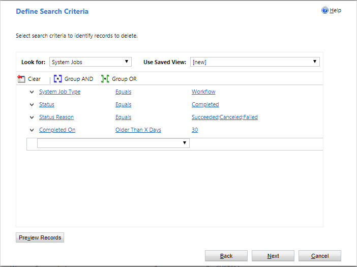
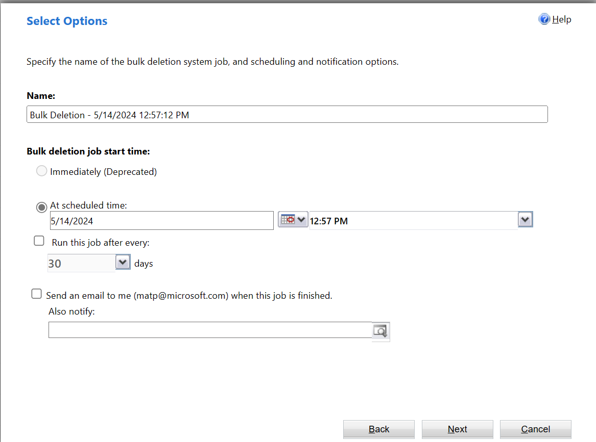

# Monitor and manage real-time workflow processes

[!INCLUDE[cc-data-platform-banner](../../includes/cc-data-platform-banner.md)]

To monitor and manage processes, you must locate the process, evaluate the status, and perform any actions necessary to address problems.  
  
   
## Monitoring real-time workflows and actions  
Real-time workflows and actions do not use System Job rows because they occur immediately. Any errors that occur will be displayed to the user in the application with the heading **Business Process Error**.  
  
There is no log for successful operations. You can enable logging for errors by checking the **Keep Logs for workflow jobs that encountered errors** option in the **Workflow Log Retention** area at the bottom of the **Administration** tab for the process.  
  
To view the log of errors for a specific process, open the real-time workflow or action definition and go to the **Process Session** tab. This will only show any errors logged for this process.  
  
If you want a view of all the errors for any process, go to **Advanced Find** and create a view showing errors on the process session table.  
  
   
## Status of real-time workflow processes  
When you view a list of real-time workflow processes, any individual process can have one of the following **State** and **Status Reason** values:  
  
|State|Status Reason|  
|-----------|-------------------|  
|Ready|Waiting for Resources|  
|Suspended|Waiting|  
|Locked|In Progress   Pausing   Canceling|  
|Completed|Succeeded   Failed   Canceled|  

## Deleting process log rows

If your organization uses background workflows or business process flows that run frequently, the amount of process log rows can become large enough to cause performance issues as well as consume significant amounts of storage. To delete process log rows not removed sufficiently by one of the standard bulk row deletion jobs, you can use the bulk delete system jobs feature to create a custom bulk row deletion job.

1. Go to **Settings** > **Data Management** > **Bulk Row Deletion**.

2. From the **Bulk Row Deletion** area, select **New**. 

3. On the **Bulk Deletion Wizard** start page, select **Next**.

4. In the **Look for** list, select **System Jobs**.

5. The following conditions are used to create a bulk row deletion job to delete process log rows: 

   - **System Job Type Equals Workflow**: This targets real-time workflow rows. 
   
   - **Status Equals Completed**: Only completed workflows are valid to run the job against.
   
   - **Status Reason Equals Succeeded**: Delete successful, canceled, and failed jobs.
   
   - **Completed On Older than X Days 30**: Use the Completed On column to only delete real-time workflow process log rows that are older than 30 days.
   
   
   
6. Select **Next**.

7. Set the frequency that your bulk delete job will run. You can schedule your job to run at set intervals or create a one-time bulk deletion job [using the Immediately option](#using-the-immediately-option). In this example, a recurring job is set to run on May 21, 2018, and every 30 days thereafter. 

   

### Using the Immediately option

Notice that you have the option of performing an immediate synchronous bulk delete of the rows by selecting the **Immediately** option. This delete is performed with direct SQL Server execution rather than passing each row through the delete event pipeline, which can reduce the impact to system performance. This is a good option if you want to quickly clean up the extra real-time workflow rows instead of the bulk delete job waiting in the asynchronous queue for processing. 

The **Immediately** option is enabled when the following conditions are true: 
- Bulk delete job is for the System Jobs table.
- The search criteria has the condition system job type equals workflow. 
- The user creating the bulk delete job has global depth for the delete privilege on the AsyncOperation table. The system administrator security role has this privilege.  

The synchronous bulk delete will only delete AsyncOperation rows in the completed state. A maximum of 1 million rows are processed for each invocation. You will need to execute the job multiple times if your environment has more than 1 million rows to remove.  
  
## Next steps   
[Best practices for real-time workflow processes](best-practices-workflow-processes.md)  

[!INCLUDE[footer-include](../../includes/footer-banner.md)]