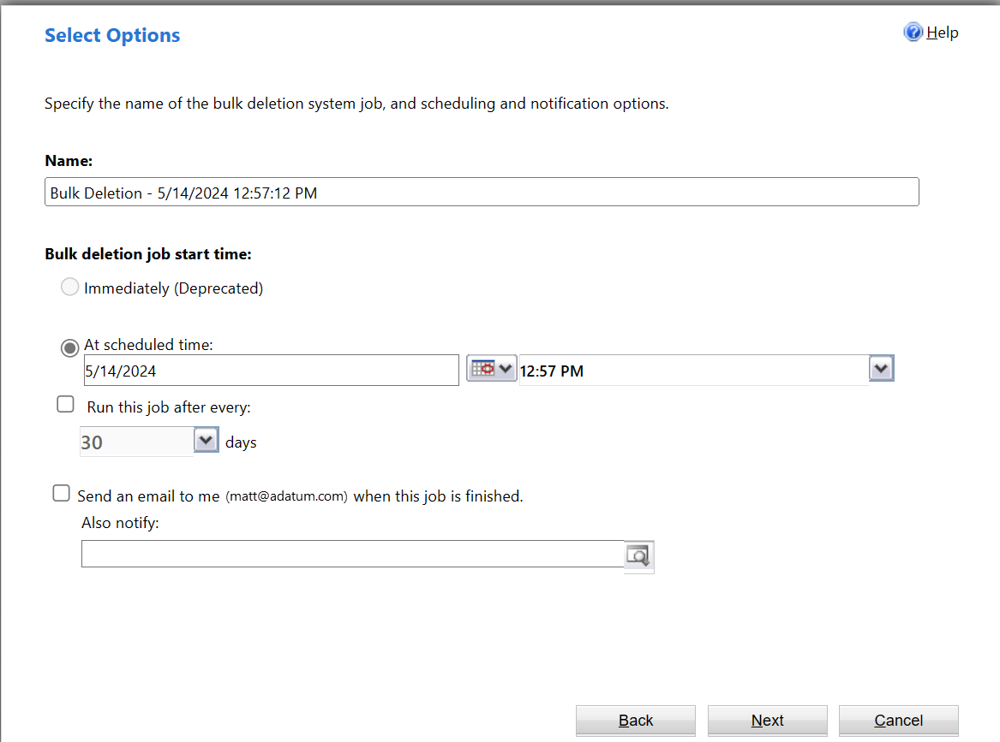

# Monitor and manage real-time workflow processes

To monitor and manage processes, you must locate the process, evaluate the status, and perform any actions necessary to address problems.  
  
   
## Monitoring real-time workflows and actions  
Real-time workflows and actions don't use System Job rows because are displayed to the user in the application with the heading **Business Process Error**.  
  
There's no log for successful operations. You can enable logging for errors by checking the **Keep Logs for workflow jobs that encountered errors** option in the **Workflow Log Retention** area at the bottom of the **Administration** tab for the process.  
  
To view the log of errors for a specific process, open the real-time workflow or action definition and go to the **Process Session** tab. This log only shows errors logged for this process.  
  
If you want a view of all the errors for any process, go to **Advanced Find** and create a view showing errors on the process session table.  
  
   
## Status of real-time workflow processes  
When you view a list of real-time workflow processes, any individual process can have one of the following **State** and **Status Reason** values:  
  
|State|Status Reason|  
|-----------|-------------------|  
|Ready|Waiting for Resources|  
|Suspended|Waiting|  
|Locked|In Progress   Pausing   Canceling|  
|Completed|Succeeded   Failed   Canceled|  

## Deleting process log rows

If your organization uses background workflows or business process flows that run frequently, the amount of process log rows can become large enough to cause performance issues as well as consume significant amounts of storage. To delete process log rows not removed sufficiently by one of the standard bulk row deletion jobs, you can use the bulk delete system jobs feature to create a custom bulk row deletion job.

1. Go to the [Power Platform admin center](https://admin.powerplatform.microsoft.com/), and open the environment you want.
1. Go to **Settings** > **Data Management** > **Bulk deletion**.
1. From the **Bulk Record Deletion** area, select **New**.
1. On the **Bulk Deletion Wizard** start page, select **Next**.
1. In the **Look for** list, select **System Jobs**.
1. The following conditions are used to create a bulk row deletion job to delete process log rows: 

   - **System Job Type Equals Workflow**: This targets real-time workflow rows.
   
   - **Status Equals Completed**: Only completed workflows are valid to run the job against.
   
   - **Status Reason Equals Succeeded**: Delete successful, canceled, and failed jobs.
   
   - **Completed On Older than X Days 30**: Use the Completed On column to only delete real-time workflow process log rows that are older than 30 days.
   
   
   
7. Select **Next**.

8. Set the frequency that your bulk delete job runs. In this example, a recurring job is set to run on May 14, 2024, and every 30 days thereafter.

   
   > [!NOTE]
   > Performing an immediate synchronous bulk delete of the rows by selecting the **Immediately** option is deprecated and no longer available for use.

9. Select **Next**, and then select **Submit**.

## Next steps

[Best practices for real-time workflow processes](best-practices-workflow-processes.md)  

[!INCLUDE[footer-include](../../includes/footer-banner.md)]
