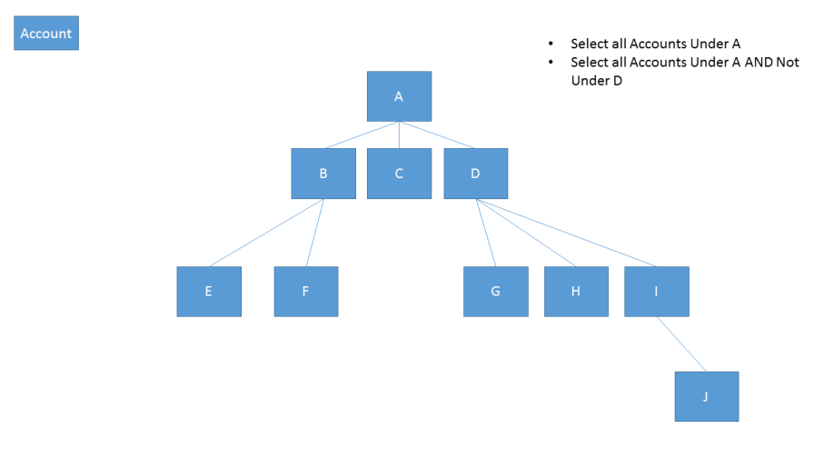
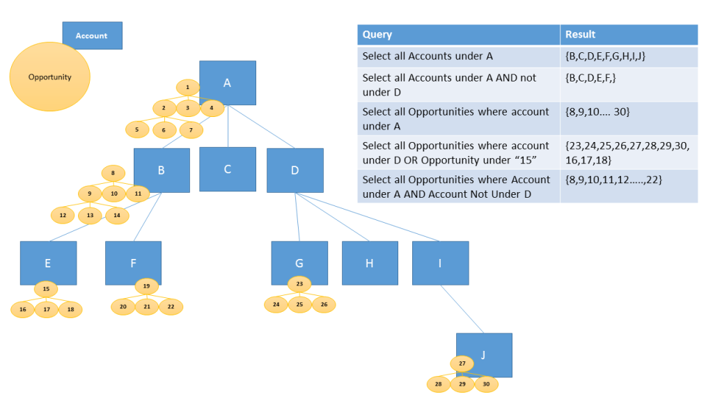
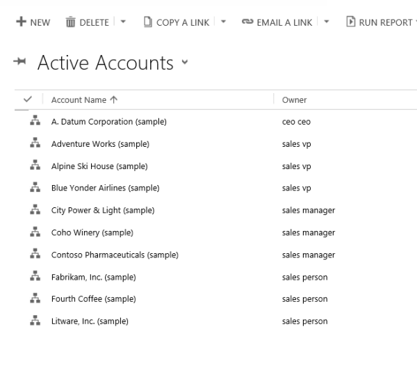
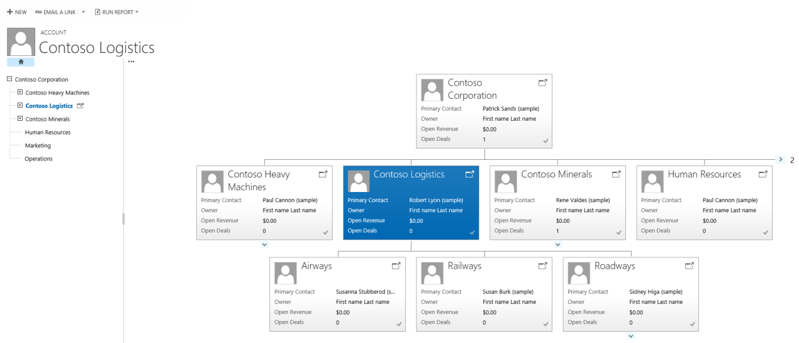
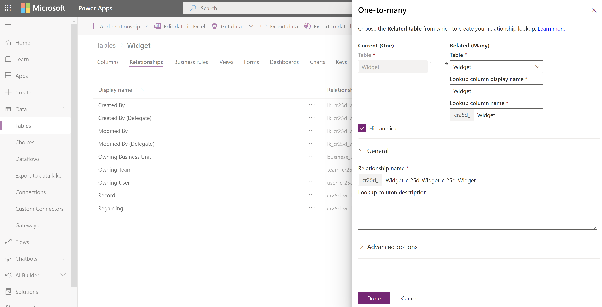
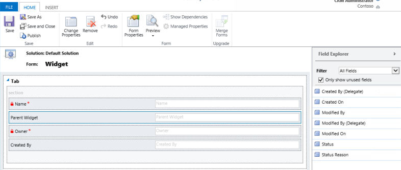
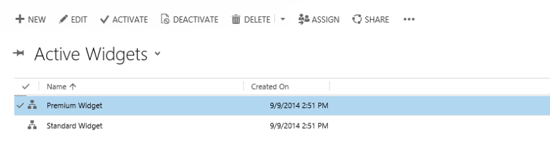
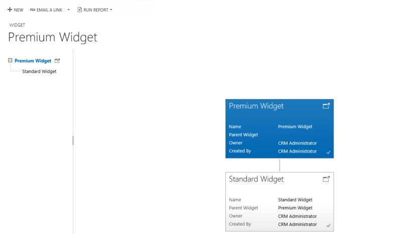

# Query and visualize hierarchically related data

[!INCLUDE[cc-data-platform-banner](../../includes/cc-data-platform-banner.md)]

You can get valuable business insights by visualizing hierarchically related data. The hierarchical modelling and visualization capabilities give you a number of benefits:  
  
-   View and explore complex hierarchical information.  
  
-   View key performance indicators (KPIs) in the contextual view of a hierarchy.  
  
-   Visually analyze key information across the web and the tablets.  
  
For some tables, such as account and user, the visualizations are provided out-of-the-box. Other tables, including custom tables, can be enabled for a hierarchy and you can create the visualizations for them. Based on your needs, you can choose between using a tree view, which shows the entire hierarchy, or a tile view, which depicts a smaller portion of the hierarchy. Both views are shown side by side. You can explore a hierarchy by expanding and contracting a hierarchy tree. The same hierarchical settings for visualization are set once, but apply to both web and mobile clients. In tablets, the visuals render in a modified format suitable for the smaller form factor. The customizable components required for hierarchical visualization are solution aware, therefore, they can be transported between organizations like any other customization. You can configure the attributes shown in the visualization by customizing a Quick Form using the form editor. There is no requirement to write code.  
  
   
## Query hierarchical data  
 With Microsoft Dataverse, hierarchical data structures are supported by self-referential relationships of the related rows. In the past, to view hierarchical data, you had to iteratively query for the related rows. Presently, you can query the related data as a hierarchy, in one step. You’ll be able to query rows using the **Under** and **Not Under** logic. The **Under** and **Not Under** hierarchical operators are exposed in Advanced Find and the workflow editor. For more information about how to use these operators, see [Configure workflow steps](/flow/configure-workflow-steps). For more information about Advanced Find, see [Create, edit, or save an Advanced Find search](/dynamics365/customer-engagement/basics/save-advanced-find-search)  
  
 The following examples illustrate various scenarios for querying hierarchies:  
  
 Query account hierarchy  
  
   
  
 Query account hierarchy, including related activities  
  
   
  
 Query account hierarchy, including related opportunities  
  
   
  
 To query the data as a hierarchy, you must set one of the table’s one-to-many or many-to-one self-referential relationships as hierarchical. To turn the hierarchy on:  
  

1. On [powerapps.com](https://make.powerapps.com/?utm_source=padocs&utm_medium=linkinadoc&utm_campaign=referralsfromdoc), expand the **Dataverse** section and select **Tables** in the left navigation pane.

2. Select an existing table, or [Create a new table](data-platform-create-entity.md)

3. Select **Relationships**

4.  Select a self-referential relationship.

5.  In the relationship details panel, check **Hierarchical**.  
  
> [!NOTE]
> - Some of the out-of the-box relationships can’t be customized. This will prevent you from setting those relationships as hierarchical.  
> - You can specify a hierarchical relationship for the system self-referential relationships. This includes self-referential relationships of system type,  such as the "contact_master_contact" relationship.  
  
   
## Visualize hierarchical data  
 The system tables that have visualizations available out-of-the-box include `Account`, `Position`, `Product`, and `User`. In the grid view of these tables, you can see the icon depicting the hierarchy chart, to the left of the row name. The hierarchy icon isn’t present for all rows by default. The icon is shown for the rows that have a parent row, a child row, or both.  
 
 > [!div class="mx-imgBorder"] 
 >   
  
 If you select the hierarchy icon, you can view the hierarchy, with the tree view on the left and the tile view on the right, as shown below:  
  
> [!div class="mx-imgBorder"] 
>   
  
 A few other out-of the-box system tables can be enabled for a hierarchy. These tables include `Case`, `Contact`, `Opportunity`, `Order`, `Quote`, `Campaign`, and `Team`. All custom tables can be enabled for a hierarchy.  
  
> [!TIP]
>  If a table can be enabled for a hierarchy:  
>  In solution explorer, expand the table that you want. You will see the table component called **Hierarchy Settings**. The tables that can’t be enabled for a hierarchy don’t have this component, with the exception of the Dynamics 365 Sales Territory table. Although **Hierarchy Settings** appears for the Sales Territory table, the table can’t be enabled for a hierarchy.  
  
 Important things to remember when you create visualizations:  
  
-   Only one (1: N) self-referential relationship per table can be set as hierarchical. In this relationship the primary table and the related table must be of the same type, such as account_parent_account or Widget_new_Widget_new_Widget.  
  
-   Presently, a hierarchy or visualization is based on one table only. You can depict the account hierarchy showing accounts at multiple levels, but you can’t show accounts and contacts in the same hierarchy visualization.  
  
-   Maximum number of columns that can be displayed in a tile is four. If you add more columns to the Quick Form that is used for the tile view, only the first four columns will be displayed.  
  
### Visualization example  
 Let’s look at an example of creating the visualization for a custom table. We created a custom table called new_Widget, created a self-referential relationship and marked it as hierarchical, as shown here.  
 
> [!div class="mx-imgBorder"] 
>   
   
 Next, in the **Hierarchy Settings** grid view, we selected the **Widget_new_Widget_new_Widget** hierarchical relationship. In the form, we filled in the required columns. If you haven’t yet marked the relationship as hierarchical, the link on the form will take you to the classic table editor, where you can also mark the relationship as hierarchical.  
  
 For the **Quick View Form**, we created a Quick Form called **Widget Hierarchy Tile Form**. In this form, we added four columns to display in each tile.  
  
> [!div class="mx-imgBorder"] 
>   
  
 After we completed the setup, we created two rows: Standard Widget and Premium Widget. After making the Premium Widget a parent of the Standard Widget by using the lookup column, the new_Widget grid view depicted the hierarchy icons, as shown below:  
  
> [!div class="mx-imgBorder"] 
>   
  
> [!TIP]
>  The hierarchy icons don’t appear in the row grid view until the rows are paired in the parent – child relationship.  
  
 Choosing the hierarchy icon displays the new_Widget hierarchy with the tree view on the left and the tile view on the right, showing two rows. Each tile contains four columns that we provided in the **Widget Hierarchy Tile Form**.  
 
 > [!div class="mx-imgBorder"] 
 >   
  

[!INCLUDE[footer-include](../../includes/footer-banner.md)]