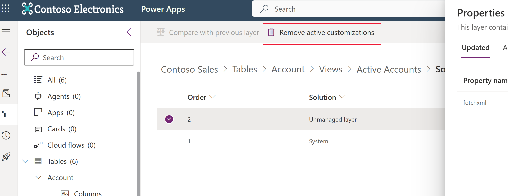

# Solution layers

Managed and unmanaged solutions exist at different levels within a Microsoft Power Platform environment. In Microsoft Dataverse, there are two distinct layer levels:  

- Unmanaged layer. All imported unmanaged solutions and unmanaged customizations exist at this layer. The unmanaged layer is a single layer.  
- Managed layers. All imported managed solutions and the system solution exist at this level. When multiple managed solutions are installed, the last one installed is above the managed solution installed previously. This means that the second solution installed can customize the one installed before it. When two managed solutions have conflicting definitions, the runtime behavior is either “Last one wins” or a merge logic is implemented.  If you uninstall a managed solution, the managed solution below it takes effect. If you uninstall all managed solutions, the default behavior defined within the system solution is applied. At the base of the managed layers level is the system layer. The system layer contains the tables and components that are required for the platform to function.

## Solution merge behavior

When you prepare your managed solution for distribution, remember that an environment might have multiple solutions installed or that other solutions might be installed in the future. Construct a solution that follows best practices so that your solution doesn't interfere with other solutions.

The processes that Dataverse uses to merge customizations emphasize maintaining the functionality of the solution. While every effort is made to preserve the presentation, some incompatibilities between customizations might require that the computed resolution will change some presentation details in favor of maintaining the customization functionality. More information: [Understand how managed solutions are merged](/power-platform/alm/how-managed-solutions-merged)

## View the solution layers for a component

The see solution layers feature allows you to view all component changes that occur due to solution changes over time. Within a solution layer, you can drill down to view specific changed and unchanged property details for a component. You can access solution layers from the **Solutions** area in Power Apps (make.powerapps.com).

The see solution layers feature:

- Lets you see the order in which a solution changed a component.
- Lets you view all properties of a component within a specific solution, including the changes to the component.
- Can be used to troubleshoot dependency or solution-layering issues by displaying change details for a component that was introduced by a solution change.

1. Sign in to Power Apps, select **Solutions**, open the solution you want, select a component, such as the **Account** table, and then on the command bar select **Advanced** > **See solution layers**.
1. The solution layer page appears. It displays each layer for the component, such as the Active Accounts view for the **Account** table used as an example here, with the most recent layer at the top, which is typically indicated as the **Active** layer. The active layer determines the runtime behavior of the component.
1. To view the details for a solution layer, select it. The **Properties** pane is displayed. The **Updated** tab displays only those properties that were modified as part of the specific solution layer. Select the **All Properties** tab to view all properties, including changed and unchanged properties, for the solution layer.

   :::image type="content" source="media/solution-layers-change-prop.png" alt-text="Solution layer updated properties for the Active Accounts view solution component" lightbox="media/solution-layers-change-prop.png":::
1. If the component includes translations that have been imported, select the **Localized Labels** tab to display information for components that have label columns in the solution layer. The base language and any imported translation text are displayed as indicated in the **languageid** column. Note that if no labels exist the tab isn't displayed.  
   > [!div class="mx-imgBorder"] 
   > 

    Select a label to see its full layering.

There are other tabs available for specific component solution layers.

|Tab name  |Description  |Possible value  |
|---------|---------|---------|
|RolePrivileges     | Displays the privileges for a security role.   | Added, Updated, Removed, Unchanged   |
|AttributePicklistValues (optionset)  | When selected for a global choice , displays the possible values for a choice .   | Added, Updated, Removed, Unchanged        |
|AttributePicklistValues (optionset attribute)   |  When selected for a choice  attribute, displays the values for the attribute.        | Added, Updated, Removed, Unchanged        |

## Remove an unmanaged layer

Unmanaged customizations reside at the top layer for a component and subsequently define the runtime behavior of the component. In most situations you don't want unmanaged customizations determining the behavior of your components in your test and production environments.

> [!IMPORTANT]
>
> - By design, your dev and maker environments where you're working with unmanaged components typically have unmanaged layers.
> - If the unmanaged layer you want to remove is the only layer and as such the base layer for the component, you can’t remove it with the remove active customizations command. To remove the layer, you have to delete the unmanaged component. More information: [Remove objects from a solution](create-solution.md#remove-objects-from-a-solution).

To remove the unmanaged layer for a component, follow these steps:

> [!WARNING]
> Removing active unmanaged customizations can't be reversed or undone. All data associated with the unmanaged customization can be lost.

1. Open the solution you want, select **...** next to a component, such as **Account**, and then select **See solution layers**.
1. If an unmanaged layer exists, **Unmanaged layer** is displayed in the **Solution** column for the layer.
1. Select the layer, and then on the command bar, select **Remove active customizations**.
    > [!div class="mx-imgBorder"] 
    > 

### See also

[Translate localizable text for model-driven apps](../model-driven-apps/translate-localizable-text.md)  
[Solutions overview](solutions-overview.md)

[!INCLUDE[footer-include](../../includes/footer-banner.md)]
