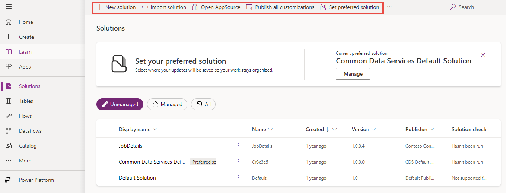
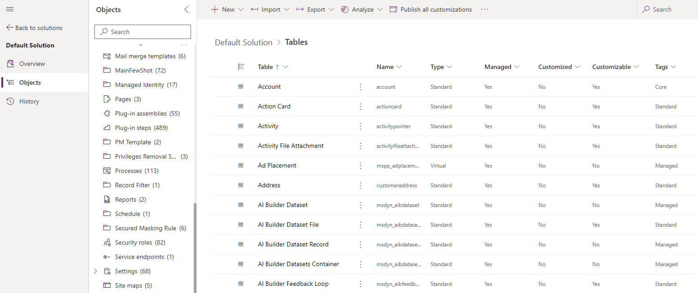
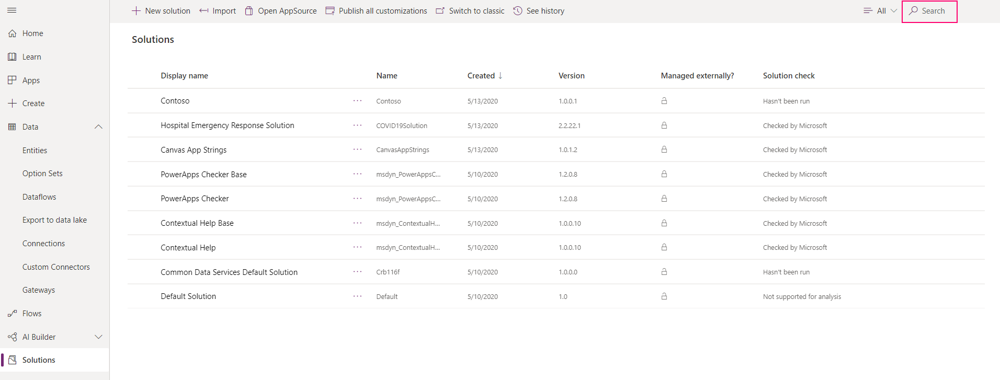
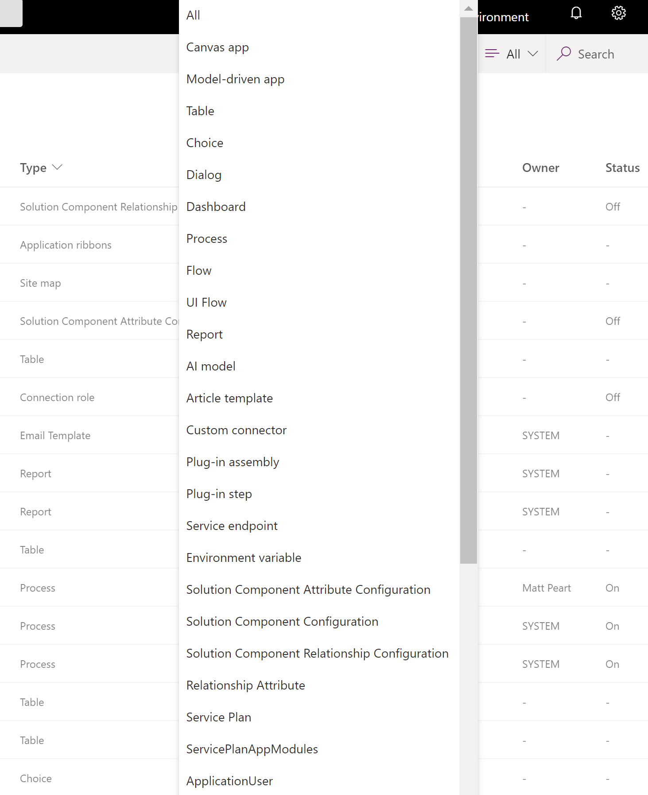
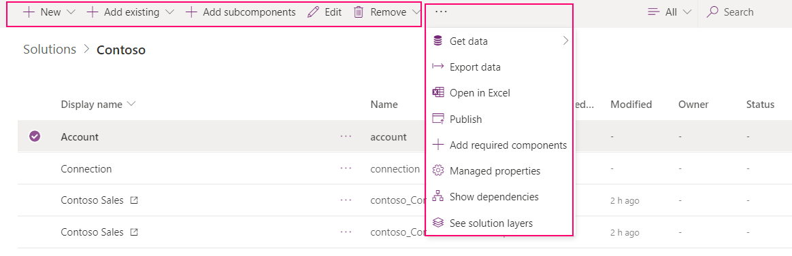

   
# Solutions overview  

[!INCLUDE[cc-data-platform-banner](../../includes/cc-data-platform-banner.md)]

Solutions are used to transport apps and components from one environment to another or to apply a set of customizations to existing apps. A solution can contain one or more apps as well as other components such as site maps, tables, processes, web resources, choices, flows, and more.

Solutions are the mechanism for implementing application lifecycle management (ALM) in Power Apps and other Power Platform products, such as Power Automate. For detailed information about the solution concepts and how solutions are used for application lifecycle management, see [Overview of ALM with Microsoft Power Platform](/power-platform/alm/overview-alm) in the Power Platform ALM guide.

This section will focus on the **manual** tasks that app makers need to perform while working with solutions in Power Apps.

## Get started: solution concepts

Before you work with solutions, it's important that you get acquainted with the following solution concepts:
- Two types of solutions (managed and unmanaged)
- Solution components
- Lifecycle of a solution (create, update, upgrade, and patch a solution)
- Solution publisher
- Solution and solution component dependencies

For detailed information, see [Solution concepts](/power-platform/alm/solution-concepts-alm) in the Power Platform ALM guide.

## Default solutions

Power Apps provides you the following default [unmanaged](/power-platform/alm/solution-concepts-alm) solutions:

- **Common Data Service Default Solution**. This solution is available for makers to use by default for their customizations in an environment. The Common Data Service Default Solution is useful when you want to evaluate or learn Power Apps. However, we recommend that app makers work in their own unmanaged solutions. 
- **Default Solution**. This is a special solution that contains all components in the system. The default solution is useful for discovering all the components and configurations in your system.

However, we recommend that you create a solution to manage your customizations. More information: [Use a solution to customize](/power-platform/alm/use-solutions-for-your-customizations) in the Power Platform ALM guide.

## Managed properties

You can control which of your managed solution components are customizable by using managed properties. We recommend that you set managed properties so that your managed components can’t be modified. This helps protect your solution from modifications that may cause it to break after it's imported into another environment, such as test or production. 

More information: [Managed properties in the Power Platform](/power-platform/alm/managed-properties-alm)

## Work with solutions in Power Apps

 Within Power Apps, you can view a list of solutions by selecting **Solutions** in the left navigation. You can perform these solution tasks: 
- **New solution**: To locate and work with just the components you’ve customized, create a solution and do all your customization there. Then, you can easily distribute your solution to other environments. More information: [Create a solution](create-solution.md) 
- **Import**: Import a solution into your environment. More information: [Import solutions](import-update-export-solutions.md) 
- **Open AppSource**: [Microsoft AppSource](https://appsource.microsoft.com/) is where you can go to get solutions tailored to your industry that work with the products you already use. 
- **Publish all customizations**: Publish all active customizations in your environment. 
- **Switch to classic**: Open the classic solution explorer. 
- **See history**: View details about solution operations over time, such as import, export, and uninstall. More information: [View the history of a solution](solution-history.md)

    > [!div class="mx-imgBorder"]
    > 

From the **Solutions** area, select a solution to view all of its components. 
 
> [!div class="mx-imgBorder"]  
>    
 
 You can browse through all the components in a solution by scrolling through the items. If there are more then 100 items in the list you can select **Load the next 100 items** to see more. 
 
> [!div class="mx-imgBorder"]  
>   

 ## Search and filter in a solution
  You can also search for a specific component by its name. 
 
> [!div class="mx-imgBorder"]  
>   
 
 Or filter all items in the list by the component type.
  
> [!div class="mx-imgBorder"]  
>   
 

 ## Contextual commands
 As you select each component, the actions available in the command bar will change depending on the type of the component you have selected and if the solution is the default or a managed one. 
 
> [!div class="mx-imgBorder"]  
>   
 
 When you don't select any component, the command bar will show actions applied to the solution itself. 
 
> [!div class="mx-imgBorder"]  
>   
 
With solutions that are unmanaged or the default one, you can use the **New** or **Add Existing** command to create or add different types of components. More information: [Add solution components](create-solution.md#add-solution-components)
 
> [!NOTE]
> You can't add components to a managed solution. When you try to, you’ll see the following message: 
`"You cannot directly edit the components within a managed solution. You’ll need to add it to another unmanaged solution that you’ve created to customize the component. The component might not be customizable."`

## Additional privileges required

Some components may require certain Dataverse privileges for users to run the component when the component is imported into the environment from a  solution.

### Flows

To use or run a flow from a canvas app that is included in a solution, you must be assigned a Dataverse security role with the following minimum permissions:

- Read privilege on the **Solution** table.
- Read privilege on the **Process** table.

More information: [Security roles and privileges](/power-platform/admin/security-roles-privileges)

## Known limitations

The following limitations apply to the use of canvas apps, flows, and custom connectors in solutions. 

- Canvas app instant flows must be created from an app already in a solution. Adding this type of flow from outside solutions is blocked.
-	Canvas apps won't display in the classic solution explorer. Use the modern experience. There are no plans for them to be added to classic solution explorer. 
- Flows created from solutions will not be displayed in the "Team Flows" list. They must be accessed through a solution. 
- The [Power Automate mobile app](/power-automate/mobile-manage-flows) does not currently support flows created in a solution. 
- The Flow action menu in [Power Apps Mobile](/powerapps/mobile/run-powerapps-on-mobile) and [Dynamics 365 for phones and tablets](/dynamics365/mobile-app/overview) does not currently support flows created in a solution. 
- You can’t add an instant flow into a solution when the following are true:
   - The flow was created outside of a solution.
   - The flow trigger is set to manual.
- Flows triggered from Microsoft 365 applications such as Excel are not available in solutions.
- Flows in solutions don't support delegated authentication. For example, access to a flow is not automatically granted based on having access to the SharePoint list the flow was created from.
- Custom connectors created outside solutions cannot be added to solutions at this time.
- [Copy and paste of flow actions](/business-applications-release-notes/april19/microsoft-flow/copy-paste-actions) is currently not supported when creating flows in a solution.
- Canvas apps shared with 'Everyone' that go through an environment backup and environment restore operations aren't shared with 'Everyone' in the restored environment. Alternatively, the canvas app can be shared with a security group and the app in the restored environment would be shared with that security group.  

For details about customizing the individual components in a solution, see the following topics:  
  
-   For table, table relationships, column and message customizations, see [Metadata](create-edit-metadata.md).  
  
-   For table forms, see [Forms](../model-driven-apps/create-design-forms.md).  
  
-   For processes, see [Processes](../model-driven-apps/guide-staff-through-common-tasks-processes.md).  
  
-   For business rules, see [Business Rules](../model-driven-apps/create-business-rules-recommendations-apply-logic-form.md).
 
 
### Next steps  
[Create a solution](create-solution.md)

[!INCLUDE[footer-include](../../includes/footer-banner.md)]
