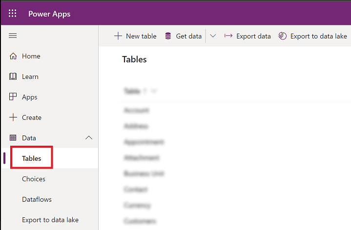
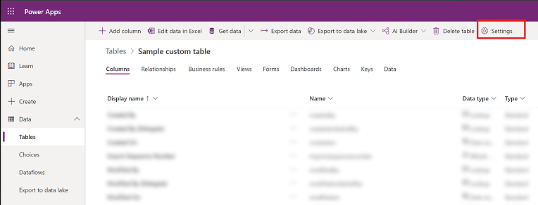
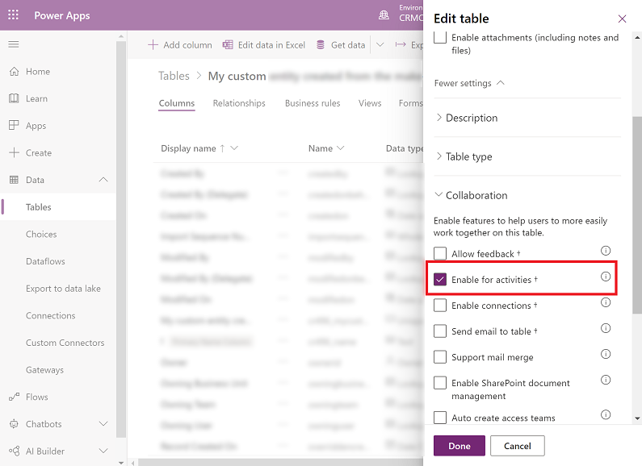

# Types of tables

[!INCLUDE[cc-data-platform-banner](../../includes/cc-data-platform-banner.md)]

A table defines information that you want to track in the form of records, which typically include properties such as company name, location, products, email, and phone.

Tables appear in Power Apps as one of three different types, which indicate how the table came into the environment, whether the table is managed or unmanaged, and whether it can be customized.  
- Standard: Several standard tables, also known as out-of-box tables, are included with a Dataverse environment. Account, business unit, contact, task, and user tables are examples of standard tables in Dataverse. Most of the standard tables included with Dataverse can be customized. Tables that are imported as part of a managed solution and set as customizable also appear as standard tables. Any user with appropriate privileges can customize these tables where the table property has customizable set to true.
- Managed: Are tables that aren’t customizable and have been imported into the environment as part of a managed solution.
- Custom: Custom tables are unmanaged tables that are either imported from an unmanaged solution or are new tables created directly in the Dataverse environment. Any user with appropriate privileges can fully customize these tables.

For more information about how components are customizable, see [Managed properties](solutions-overview.md#managed-properties).

For more information about managed and unmanaged customizations, see [Managed and unmanaged solutions](/power-platform/alm/solution-concepts-alm#managed-and-unmanaged-solutions).

### Activity tables

An activity can be thought of as any action for which an entry can be made on a calendar. An activity has time dimensions (start time, stop time, due date, and duration) that help determine when the action occurred or will occur. Activities also contain data that helps determine what action the activity represents, for example, subject and description. An activity can be opened, canceled, or completed. The completed status of an activity will have several sub-status values associated with it to clarify the way that the activity was completed.  
  
Activity tables are a special kind of table that can only be owned by a user or team, but can’t be owned by an organization. When you create a table, you can specify it as a standard or activity table.
  
The following table lists activity tables that are available in a default Dataverse environment.
  
|Name|Description|Display in activity menus|Reference|
|----------|-----------------|----------------|---------------|  
|**Appointment**|Commitment representing a time interval with start/end times and duration.|Yes|[Appointment](../../developer/data-platform/reference/entities/appointment.md) |
|**Email**|Activity that is delivered using email protocols.|Yes|[Email](../../developer/data-platform/reference/entities/email.md)|
|**Fax**|Activity that tracks call outcome and number of pages for a fax and optionally stores an electronic copy of the document.|Yes|[Fax](../../developer/data-platform/reference/entities/fax.md)|
|**Letter**|Activity that tracks the delivery of a letter. The activity can contain the electronic copy of the letter.|Yes|[Letter](../../developer/data-platform/reference/entities/letter.md)|
|**Phone Call**|Activity to track a telephone call.|Yes|[PhoneCall](../../developer/data-platform/reference/entities/phonecall.md)|
|**Recurring Appointment**|The master appointment of a recurring appointment series.|Yes|[RecurringAppointmentMaster](../../developer/data-platform/reference/entities/recurringappointmentmaster.md)|
|**Task**|Generic activity representing work needed to be done.|Yes|[Task](../../developer/data-platform/reference/entities/task.md)|
  
When you can create a new custom activity table, you might create it to read instant message communications. Creating an activity table is different from creating a non-activity table because you don’t specify a primary column. All activity tables have a **Primary Field** set to **Subject** and other common columns that are defined by the Activity table. This allows all types of activities to be shown in a view where just the common columns are displayed.  

To create a custom activity table, open the **More settings** section in the **New table** panel, select **Activity table** option from the **Choose table type** drop-down list. After you select this, you’ll see that **Display in Activity Menus** is selected. This setting allows people to create this type of activity in the activity menus. This isn’t selected for activities that are typically associated with specific events and created behind using code or by a workflow. After you save the table, you can’t change these settings.  

#### Enable activities for a table

Enable activities to add activities to a table and use the Regarding lookup for the table.

1. To enable activities, Sign in to [Power Apps](https://make.powerapps.com).

  
2. On the left nav, select **Data** to expand it and then select **Tables**.  

   > [!div class="mx-imgBorder"]
   >
   
  
3. Select a table.

4. On the command bar, select **Settings**. 

   > [!div class="mx-imgBorder"]
   >

5. Expand **Collaboration**, and select **Enable for activities** and then choose **Done**. 

   > [!div class="mx-imgBorder"]
   >
   
   > [!IMPORTANT]
   > Once enabled this setting can't be disabled. If prompted, select **Okay** to confirm.
   
6.  Select **Save Table** and then publish the table.

## Table ownership

There are two different types of standard and custom table ownership. When you create a custom table the ownership options are **User or team** or **Organization** owned. Once a table is created, the ownership type can't be changed.
  
|Ownership|Description|  
|---------------|-----------------|  
|**Organization**|Data belongs to the organization. Access to the data is controlled at the organization level.|  
|**User or team**|Data belongs to a user or a team. Actions that can be performed on these rows can be controlled on a user level.|  

Notice that there are a few Dataverse  system tables that are similar to standard tables but have a different type of ownership from organization and user or team ownership:
- **None**. Some system tables don’t have an owner, such as the Privilege table.
- **Business Unit**. A few system tables are business-owned. These include Business Unit, Calendar, Team, and Security Role tables.

> [!IMPORTANT]
>  After a custom table is created, you can’t change the ownership. Before you create a table, make sure that you choose the correct type of ownership. If you later determine that your custom table must be of a different type, you have to delete it and create a new one.

## Virtual tables

A virtual table is a custom table in Dataverse that has columns containing data from an external data source. Virtual tables appear in your app to users as regular table rows, but contain data that is sourced from an external database dynamically at runtime, such as an  Azure SQL Database. Rows based on virtual tables are available in all clients including custom clients developed using the Dataverse web services.  More information: [Create and edit virtual tables that contain data from an external data source](create-edit-virtual-entities.md)

### See also
[Create or edit tables](./data-platform-create-entity.md)

[!INCLUDE[footer-include](../../includes/footer-banner.md)]
