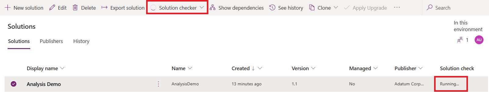

# Use solution checker to validate your model-driven apps in Power Apps

[!INCLUDE[cc-data-platform-banner](../../includes/cc-data-platform-banner.md)]

To deliver on complex business requirements, model-driven app makers often can end up with highly advanced solutions that customize and extend the Microsoft Dataverse platform. With advanced implementations comes an increased risk where performance, stability, and reliability issues become introduced, which can negatively impact the user experience. Identifying and understanding how to resolve these issues can be complicated and time consuming. With the solution checker feature, you can perform a rich static analysis check on your solutions against a set of best practice rules and quickly identify these problematic patterns. After the check completes, you receive a detailed report that lists the issues identified, the components and code affected, and links to documentation that describes how to resolve each issue.

The solution checker analyzes these solution components: 
- Dataverse plug-ins
- Dataverse custom workflow activities 
- Dataverse web resources (HTML and JavaScript)
- Dataverse configurations, such as SDK message steps 

Solution checker works with unmanaged solutions that can be exported from an environment. 

> [!NOTE]
> - This topic explains how to run solution checker from the Power Apps maker portal. A PowerShell module is also available that you can use to interact directly with the service. The Microsoft.PowerApps.Checker.PowerShell module can be used for analysis of managed and unmanaged solutions for supported versions of on-premises and online environments, or to automate and integrate the service into your build and release pipelines. More information: [Microsoft.PowerApps.Checker.PowerShell Overview]( /powershell/powerapps/overview?view=pa-ps-latest#get-started-using-the-microsoftpowerappscheckerpowershell-module&preserve-view=true) 
> - Solution checker supports global variables for ECMAScript 2015 (ES6) and up to ECMAScript 2018 (ES9) syntax. When JavaScript is detected using global variables later than ES6 or syntax later than ES9, a web-unsupported-syntax issue for the web resource is reported.
> - Use of solution checker does not guarantee that a solution import will be successful. The static analysis checks performed against the solution do not know the configured state of the destination environment and import success may be dependent on other solutions or configurations in the environment. 
<!-- 
## Enable the solution checker
The Solution checker is enabled by default in every Dataverse environment. A **Solution checker** menu item is available when you select an unmanaged solution in the **Solutions** area of Power Apps. If the **Run** option is not available in the **Solution checker** menu,  you can enable it by installing the Power Apps checker solution. To install it, follow these steps:   

1. Sign in to [Power Apps](https://make.powerapps.com/?utm_source=padocs&utm_medium=linkinadoc&utm_campaign=referralsfromdoc) and select the Dataverse environment where you want to enable the solution checker. 
2. On the left navigation pane, select **Solutions**.
3. On the toolbar, select **Solution checker** and then select **Install** – this opens the Microsoft AppSource page. You need to allow pop-up windows if your browser blocks the page from opening. 

   > [!div class="mx-imgBorder"]
   > 

4. Select **Free Trial** on the AppSource page. 

5. If you agree, accept the terms and conditions and select the environment to install the Power Apps checker solution. 
6. When the installation is complete, refresh the **Solution** list on the Power Apps site to verify that the solution checker is available.  
7. To check a solution, [Run the solution checker](#run-the-solution-checker). -->

## Run the solution checker

1. Sign in to [Power Apps](https://make.powerapps.com/?utm_source=padocs&utm_medium=linkinadoc&utm_campaign=referralsfromdoc). 
2. In the left pane, select **Solutions**. 
3. Next to the unmanaged solution that you want to analyze, select **...**, point to **Solution checker**, and then select **Run**. 

   > [!div class="mx-imgBorder"]
   > 

4.	The status pane located on the upper right of the **Solutions** page displays **Solution checker running**. 

    > [!div class="mx-imgBorder"]
    > 
   
    Note the following:
    - The solution checker can take a few minutes to complete the analysis. 
    
    - During this time you will notice a **Running…** state in the **Solution check** column of the **Solution** list. 
    
    - You'll receive an email notification and a notification in the **Notifications** area of the Power Apps site when the check is completed.  

5.	[View the report](#review-the-solution-checker-report) when the check is completed.

## Cancel a check

After you submit a solutions check in your environment, the check can be canceled through the status pane on the upper right area of the **Solutions** page. 

When you cancel a check, the solution check stops running and the solution check status returns to the previous state. 

## Solution checker states
When you install the solution checker in your environment, the **Solution check** column becomes available in the **Solutions** list. This column displays the solution analysis states for a solution. 

|State  |Description  |
|---------|---------|
|Hasn’t been run    | The solution has never been analyzed.        |
|Running     | The solution is being analyzed.       |
|Couldn’t be completed     |  Solution analysis was requested but the analysis did not complete successfully.       |
|Results as of *date and time*   | Solution analysis completed and results are available for download.      |
|Couldn’t be completed. Result as of *date and time*     | The latest analysis request did not complete successfully. The last successful results can be downloaded.         |
|Checked by Microsoft     | This is a Microsoft-managed solution. Solution analysis is not permitted on these solutions.         |
|Checked by Publisher     | This is a third-party-managed solution. Currently, solution analysis is not available for these solutions.        |

## Review the solution checker report
When a solution check is completed, you can view the analysis report in the portal or you can download the report from your web browser. In the portal, you have options to filter, group results by **Issue**, **Location** or by **Severity** and view detailed information for issues detected in your solution. 

1. In the left pane, select **Solutions**.
2. Next to the unmanaged solution where you want to view the solution checker report, select **...**, point to **Solution checker**, and then select **View results**.  
3. Select an Issue to view the details and guidance on how to resolve.

    > [!div class="mx-imgBorder"] 
    > 

The solution check results are also available for download. The solution checker zip file is downloaded to the folder specified by your web browser.The download report is in [!INCLUDE [pn-excel-short](../../includes/pn-excel-short.md)] format and contains several visualizations and columns that assist you in identifying the impact, type, and location of each issue detected in your solution. A link to detailed guidance about how to resolve the issue is also provided. 

1. In the left pane, select **Solutions**.
2. Next to the unmanaged solution where you want to download the solution checker report, select **...**, point to **Solution checker**, and then select **Download results**.  
3. The solution checker zip file is downloaded to the folder specified by your web browser.

Here's a summary of each column in the report.

|Report column |Description  |Applies-to component   |
|---------|---------|---------|
|Issue     |   The title of the issue identified in the solution.      | All        |
|Category     | The categorization of the issue identified, such as **Performance**, **Usage**, or **Supportability**.      |  All     |
|Severity     | Represents the potential impact of the issue identified. Available impact types are **High**, **Medium**, **Low**, and **Informational**.         |  All       |
|Guidance     |  Link to article detailing the issue, impact, and recommended action.       |  All       |
|Component     |  The solution component where the issue was identified.        |   All      |
|Location     |  The location and/or source file of the component where the issue that was identified occurred, such as the assembly or JavaScript file name.        |  All       |
|Line  #     |  The line number reference of the issue in the impacted web resource component.       |  Web resources       |
|Module     | Module name where the issue identified in the assembly was detected.     |   Plug-in or custom workflow activity      |
|Type     | Type of the issue identified in the assembly.        | Plug-in or custom workflow activity        |
|Member     |  Member of the issue identified in the assembly.      | Plug-in or custom workflow activity        |
|Statement     | The code statement or configuration that resulted in the issue.        |  All       |
|Comments     | Details about the issue that include high-level resolution steps.         |  All       |

## Best practice rules used by solution checker

|Solution component  |Rule name  |Rule description  |
|---------|---------|---------|
|Plug-in or workflow activity   | [il-specify-column](../../developer/data-platform/best-practices/work-with-metadata/retrieve-specific-columns-entity-via-query-apis.md?client=PAChecker&error=il-specify-column&source=featuredocs)  | Avoid selecting all columns via Dataverse query APIs.     |
|Plug-in or workflow activity   | [meta-remove-dup-reg](../../developer/data-platform/best-practices/business-logic/do-not-duplicate-plugin-step-registration.md?client=PAChecker&error=meta-remove-dup-reg&source=featuredocs)     | Avoid duplicate Dataverse plug-in registrations.     |
|Plug-in or workflow activity   | [il-turn-off-keepalive](../../developer/data-platform/best-practices/business-logic/set-keepalive-false-interacting-external-hosts-plugin.md?client=PAChecker&error=il-turn-off-keepalive&source=featuredocs)   | Set KeepAlive to false when interacting with external hosts in a Dataverse plug-in.     |
|Plug-in or workflow activity   | [il-avoid-unpub-metadata](../../developer/data-platform/best-practices/work-with-metadata/retrieve-published-metadata.md?client=PAChecker&error=il-avoid-unpub-metadata&source=featuredocs)   | Avoid retrieving unpublished Dataverse metadata.     |
|Plug-in or workflow activity   | [il-avoid-batch-plugin](../../developer/data-platform/best-practices/business-logic/avoid-batch-requests-plugin.md?client=PAChecker&error=il-avoid-batch-plugin&source=featuredocs)   | Avoid using batch request types in Dataverse plug-ins and workflow activities.    |
|Plug-in or workflow activity   | [meta-avoid-reg-no-attribute](../../developer/data-platform/best-practices/business-logic/include-filtering-attributes-plugin-registration.md?client=PAChecker&error=meta-avoid-reg-no-attribute&source=featuredocs)  | Include filtering attributes with Dataverse plug-in registrations.    |
|Plug-in or workflow activity   | [meta-avoid-reg-retrieve](../../developer/data-platform/best-practices/business-logic/limit-registration-plugins-retrieve-retrievemultiple.md?client=PAChecker&error=meta-avoid-reg-retrieve&source=featuredocs)  | Use caution with Dataverse plug-ins registered for Retrieve and RetrieveMultiple messages.    |
|Plug-in or workflow activity   | [meta-remove-inactive](../../developer/model-driven-apps/best-practices/business-logic/remove-deactivated-disabled-configurations.md?client=PAChecker&error=meta-remove-inactive&source=featuredocs)    | Remove inactive configurations in Dataverse.    |
|Plug-in or workflow activity   | [il-meta-avoid-crm2011-depr-message](/previous-versions/dynamics-crm2011/developers-guide/gg509038(v=crm.5)?client=PAChecker&error=il-avoid-crm2011-depr-message&source=featuredocs)  | Don't use Microsoft Dynamics CRM 2011 deprecated messages.     |
|Plug-in or workflow activity   | [meta-avoid-crm4-event](../../developer/model-driven-apps/best-practices/index.md?client=PAChecker&error=meta-avoid-crm4-event&source=featuredocs) | Don't use Microsoft Dynamics CRM 4.0 plug-in registration stage.    |
|Plug-in or workflow activity   | [il-avoid-specialized-update-ops](/previous-versions/dynamicscrm-2016/developers-guide/dn932124(v=crm.8)?client=PAChecker&error=il-avoid-specialized-update-ops&source=featuredocs)  | Don't use specialized update operation requests in Dataverse.    | 
| Plug-in or workflow activity |  [il-use-autonumber-feature](../../developer/data-platform/best-practices/index.md?client=PAChecker&error=il-use-autonumber-feature)  |Use the auto number feature instead of a custom auto numbering solution. | 
| Plug-in or workflow activity  | [il-avoid-parallel-plugin](../../developer/data-platform/best-practices/business-logic/do-not-use-parallel-execution-in-plug-ins.md?client=PAChecker&error=il-avoid-parallel-plugin)  | The usage of parallel patterns should be avoided within plug-ins.  |
| Plug-in or workflow activity  | [il-avoid-lock-plugin](../../developer/data-platform/best-practices/index.md?client=PAChecker&error=il-avoid-lock-plugin)  | Avoid lock of static members in plug-ins.  |
| Plug-in or workflow activity  | [meta-avoid-retrievemultiple-annotation](../../developer/data-platform/best-practices/index.md?client=PAChecker&error=meta-avoid-retrievemultiple-annotation)  | Avoid registering a plugin on RetrieveMultiple of annotation.  |
|Web Resources  | [web-use-async](../../developer/model-driven-apps/best-practices/business-logic/interact-http-https-resources-asynchronously.md?client=PAChecker&error=web-use-async&source=featuredocs)  |  Interact with HTTP and HTTPS resources asynchronously.   |
|Web Resources  | [web-avoid-modals](../../developer/model-driven-apps/clientapi/reference/xrm-navigation.md?client=PAChecker&error=web-avoid-modals&source=featuredocs)  | Avoid using modal dialogs.   |
|Web Resources  | [web-avoid-crm2011-service-odata](../../developer/data-platform/org-service/overview.md?client=PAChecker&error=web-avoid-crm2011-service-odata&source=featuredocs)   | Don't target the Microsoft Dynamics CRM 2011 OData 2.0 endpoint.     |
|Web Resources  | [web-avoid-crm2011-service-soap](../../developer/data-platform/org-service/overview.md?client=PAChecker&error=web-avoid-crm2011-service-soap&source=featuredocs)  | Don't target the Microsoft Dynamics CRM 2011 SOAP services.   |
|Web Resources  | [web-avoid-browser-specific-api](../../developer/model-driven-apps/best-practices/index.md?client=PAChecker&error=web-avoid-browser-specific-api&source=featuredocs) | Don't use Internet Explorer legacy APIs or browser plug-ins.   |
|Web Resources  | [web-avoid-2011-api](../../developer/data-platform/webapi/overview.md?client=PAChecker&error=web-avoid-2011-api&source=featuredocs)  | Don't use the deprecated Microsoft Dynamics CRM 2011 object model.  |
|Web Resources  | [web-use-relative-uri](../../developer/model-driven-apps/best-practices/index.md?client=PAChecker&error=web-use-relative-uri&source=featuredocs)   | Don't use absolute Dataverse endpoint URLs.    |
|Web Resources  | [web-use-client-context](/power-platform/important-changes-coming?client=PAChecker&error=web-use-client-context&source=featuredocs)  | Use client contexts.   |
|Web Resources  | [web-use-navigation-api](/power-platform/important-changes-coming?client=PAChecker&error=web-use-navigation-api&source=featuredocs)   | Use navigation API parameters.   |
|Web Resources  | [web-use-org-setting](/power-platform/important-changes-coming?client=PAChecker&error=web-use-org-setting&source=featuredocs)   | Use organization settings.   |
|Web Resources  | [web-use-grid-api](/power-platform/important-changes-coming?client=PAChecker&error=web-use-grid-api&source=featuredocs)   | Use the grid APIs.    |
|Web Resources  | [web-avoid-isActivityType](../../developer/model-driven-apps/clientapi/reference/xrm-utility/getentitymetadata.md?client=PAChecker&error=web-avoid-isActivityType&source=featuredocs)   | Replace Xrm.Utility.isActivityType method with new Xrm.Utility.gettableMetadata and don't use in ribbon rules.    |
|Web Resources  | [meta-avoid-silverlight](/power-platform/important-changes-coming?client=PAChecker&error=meta-avoid-silverlight&source=featuredocs)   | Silverlight web resource usage is deprecated.   |
| Web Resources  | [web-remove-debug-script](../../developer/model-driven-apps/best-practices/index.md?client=PAChecker&error=web-remove-debug-script)  | Avoid including debug script in non-development environments.  | 
| Web Resources  | [web-use-strict-mode](https://go.microsoft.com/fwlink/?LinkID=398563&error=web-use-strict-mode&client=PAChecker)  | Use strict mode when possible.  | 
| Web Resources  | [web-use-strict-equality-operators](https://go.microsoft.com/fwlink/?LinkID=398563&error=web-use-strict-equality-operators&client=PAChecker)  | Use strict equality operators.  | 
| Web Resources  | [web-avoid-eval](https://go.microsoft.com/fwlink/?LinkID=398563&error=web-avoid-eval&client=PAChecker)  | Don't use the 'eval' function or its functional equivalents.  | 
| Web Resources  | [web-remove-alert](https://go.microsoft.com/fwlink/?LinkID=398563&error=web-remove-alert&client=PAChecker)  | Don't use the 'alert' function or its functional equivalents.  | 
| Web Resources  | [web-remove-console](https://go.microsoft.com/fwlink/?LinkID=398563&error=web-remove-console&client=PAChecker)  | Avoid using methods on console.  | 
| Web Resources  | [web-avoid-ui-refreshribbon](https://go.microsoft.com/fwlink/?linkid=2157641&error=web-remove-console&client=PAChecker)  | Avoid using refreshRibbon in form onload and EnableRule. | 
| Canvas App  | [app-formula-issues-high](https://go.microsoft.com/fwlink/?LinkID=398563&error=app-formula-issues-high&client=PAChecker)  | Refer to Power Apps formula references for additional details.  | 
| Canvas App  | [app-formula-issues-medium](https://go.microsoft.com/fwlink/?LinkID=398563&error=app-formula-issues-medium&client=PAChecker)  | Refer to Power Apps formula references for additional details.  | 
| Canvas App  | [app-formula-issues-low](https://go.microsoft.com/fwlink/?LinkID=398563&error=app-formula-issues-low&client=PAChecker)  | Refer to Power Apps formula references for additional details. | 
| Canvas App  | [app-use-delayoutput-text-input](https://go.microsoft.com/fwlink/?LinkID=398563&error=app-use-delayoutput-text-input&client=PAChecker)  | Use delayed load in some scenarios to improve performance. | 
| Canvas App  | [app-reduce-screen-controls](https://go.microsoft.com/fwlink/?LinkID=398563&error=app-reduce-screen-controls&client=PAChecker)  | Limit the number of app controls for improved performance.  | 
| Canvas App  | [app-include-accessible-label](https://go.microsoft.com/fwlink/?LinkID=398563&error=app-include-accessible-label&client=PAChecker)  | Use explicit labels to improve app accessibility. | 
| Canvas App  | [app-include-alternative-input](https://go.microsoft.com/fwlink/?LinkID=398563&error=app-include-alternative-input&client=PAChecker)  | Ensure all interactive elements are accessible to alternative inputs.  | 
| Canvas App  | [app-avoid-autostart](https://go.microsoft.com/fwlink/?LinkID=398563&error=app-avoid-autostart&client=PAChecker)  | Avoid using autostart on players within an app.  | 

### See also

[Best practices and guidance for the Dataverse](../../developer/data-platform/best-practices/index.md) 
[Best practices and guidance for model-driven apps](../../developer/model-driven-apps/best-practices/index.md) 
[Common issues and resolutions for Solution Checker](common-issues-resolutions-solution-checker.md) 

[!INCLUDE[footer-include](../../includes/footer-banner.md)]