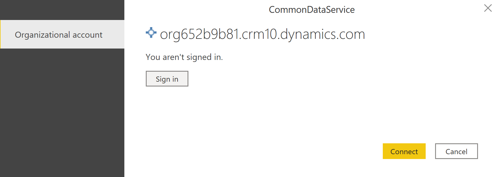

# View table data in Power BI Desktop

Use Power BI Desktop to view tables in Microsoft Dataverse. The table row data that you can access from your environment is read-only. Data access uses the Dataverse security model that is the same used to access table row data using a Power Apps app.

## Prerequisites

* Enable the Tabular Data Stream (TDS) endpoint (on by default). More information: [Manage feature settings](/power-platform/admin/settings-features).
* Power BI Desktop. [Get it now](https://powerbi.microsoft.com/downloads/)

## View table data

1. Sign into [Power Apps](https://make.powerapps.com/), and then select the
    appropriate environment from the top-right corner.
1. On the left navigation pane select **Tables**. [!INCLUDE [left-navigation-pane](../../includes/left-navigation-pane.md)]
1. Select **Analyze** > **Analyze in Power BI** on the command bar.

    The pbids file for your environment is downloaded to your browser’s default download folder.

   > [!NOTE]
   > To be able to download the file, you must have read access to the analysis component (msdyn_analysiscomponent) custom table privilege in Dataverse. Users with the environment maker security role have full access to this privilege.

1. Open the .pbids file to access it in Power BI Desktop.

1. The pbids file is loaded in Power BI Desktop. In the dialog box, select **Organizational account**, select **Sign in**, and then in the browser window that appears select or enter your credentials.

    > [!div class="mx-imgBorder"] 
    > 

1. In the dialog box in Power BI Desktop, select **Connect**.

    The environment appears in the Power BI Desktop **Navigator** window. Expand
    it to view the tables available to analyze. Select a table to preview
    its data.

    > [!div class="mx-imgBorder"] 
    > 

1. After you're finished selecting the tables you want to analyze, select **Load** to build a report.

For more information about Power BI Desktop, see [Get started with Power BI Desktop](/power-bi/desktop-getting-started).

> [!NOTE]
> SQL options, such as a T-SQL queries aren’t supported.

> [!TIP]
> The [Power BI modeling guidance for Power Platform](/power-bi/guidance/powerbi-modeling-guidance-for-power-platform) article provides implementation guidance and best practices on how to create a Power BI data model that connects to Dataverse:
>
> - Performance and security considerations when connecting Power BI to Dataverse.
> - Dataverse connector best practices.
> - Working with large datasets using Azure Synapse Link for Dataverse.
> - Considerations for DirectQuery.

### See also

[Use SQL to query data](../../developer/data-platform/dataverse-sql-query.md) 
[Dataverse SQL](/powerapps/developer/data-platform/how-dataverse-sql-differs-from-transact-sql) 
[Power Query Dataverse connector](/power-query/connectors/dataverse) 

[!INCLUDE[footer-include](../../includes/footer-banner.md)]
