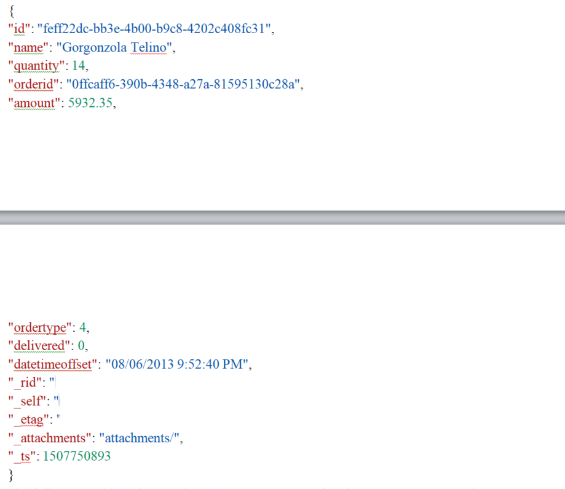
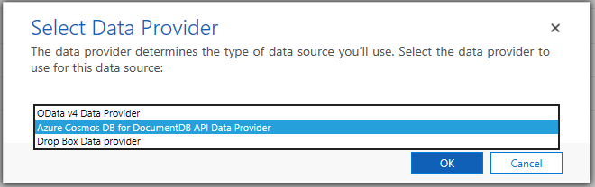
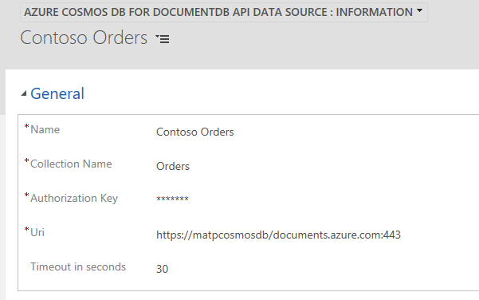

# Preview feature: Azure Cosmos DB SQL API Data Provider requirements

[!INCLUDE[cc-data-platform-banner](../../includes/cc-data-platform-banner.md)]

This topic describes the requirements for the Azure Cosmos DB for SQL API data provider as well as how to configure and recommended best practices when you use the Azure Cosmos DB for SQL API data provider with virtual tables. 

> [!IMPORTANT]
> - [!INCLUDE [cc-preview-features-definition](../../includes/cc-preview-features-definition.md)]
> - [!INCLUDE [cc-preview-features-definition](../../includes/cc-preview-features-expect-changes.md)]
> - [!INCLUDE [cc-preview-features-definition](../../includes/cc-preview-features-no-ms-support.md)]

## What is Azure Cosmos DB?

Azure Cosmos DB is Microsoft's globally distributed multi-model database service for mission-critical applications. It provides rich and familiar SQL query capabilities with consistent low latencies over schema-less JSON data. More information: [Introduction to Azure Cosmos DB: SQL API](/azure/cosmos-db/sql-api-introduction)

## Requirements

- Azure subscription that includes Azure Cosmos DB.
- An Azure Cosmos DB SQL API collection.
- The Azure Cosmos DB database type should be SQL. 

## Data type mapping

Suppose you have an Azure Cosmos DB document in a collection named *Orders* that has the following JSON structure.

This table indicates the data type mappings for the SQL API document in the *Orders* collection with Microsoft Dataverse.

|SQL API Data|Dataverse|
|--|--|
|`id`|Primary Key|
|`name`|Single Line of Text|
|`quantity`|Whole Number|
|`orderid`|Single line of text|
|`ordertype`|Choice|
|`amount`|Decimal Number or Currency|
|`delivered`|Yes/No|
|`datetimeoffset`|Date and Time|

> [!NOTE]
> - Attributes with an underscore (_) prefix are generated by the SQL API.
> - Attributes that are configured as optional in the SQL API document and are mapped in Dataverse as **Business Required** will cause a runtime error.
> - id attribute values must be guids.
> - For more information about using dates in SQL API, see [Working with Dates in Azure Cosmos DB](https://azure.microsoft.com/blog/working-with-dates-in-azure-documentdb-4/).

## Supported SQL query filtering

SQL query filtering supports the following operators. 

- Comparison operators:`<`,`>`,`<=`, `>=`,`!=`
- Logical operators: `and`, `or` 
- Set operators: `in`, `not in`
- String operators: `like`, `contains`, `begins with`, `ends with`

> [!NOTE]
> Usage of the like operator is translated to the equivalent `contains`/`begins with`/`ends with` operators. The  SQL API does not support pattern arguments as described in the topic [Like (Transact-SQL)](/sql/t-sql/language-elements/like-transact-sql). The Azure Cosmos DB for SQL API Data Provider can translate the single special case `Like('[aA]%')` to `BeginsWith('a')` OR `BeginsWith('A')`. Notice that string comparison in the SQL API is case sensitive.

## Add a data source using the Azure Cosmos DB for SQL API Data Provider

1. Go to [AppSource](https://appsource.microsoft.com/product/dynamics-365/mscrm.documentdb_data_provider?tab=Overview), select **GET IT NOW**, and follow the instructions to add the application to your environment using v9x or later.
2. After the solution is installed, sign in to the environment and go to **Settings** > **Administration** > **Virtual Entity Data Sources**.
3. On the Actions toolbar select **NEW**, and in the **Select Data Provider** dialog box select **Azure Cosmos DB for SQL API Data Provider**, and then select **OK**.

1. Enter the following information, and then select **SAVE & CLOSE**.

    |Column|Description|
    |--|--|
    |**Name**|Type a name that describes the data source.|
    |**Collection Name**|The name of the Azure Cosmos DB *database* containing the collection you want to surface in a virtual table.  |
    |**Authorization Key**|The primary or secondary key for the Azure Cosmos DB account. You can find the key from the Azure admin portal under the **Keys** setting under your Azure Cosmos DB account.|
    |**Uri**|The URI of the resource group where the Azure Cosmos DB collection is located. The URI is formed similar to `https://contoso/documents.azure.com:443`. You can find the URI from the Azure admin portal under the **Keys** setting for the Azure Cosmos DB account. |
    |**Timeout in seconds**|Enter the number of seconds to wait for a response from the Azure Cosmos DB service before a data request time-out. For example, enter 30 to wait a maximum of thirty seconds before a time-out occurs. The default timeout is 120 seconds.|

    > [!div class="mx-imgBorder"] 
    > 

## Best practices and limitations

- Notice the following when you use Azure Cosmos DB as a Data Source:
   - Each Azure Cosmos DB Data Source can only be associated with a single virtual table.
   - You can connect multiple Data Sources to the same Collection in the Azure Cosmos DB.
- You can’t segment the data in a collection by table.
- Azure Cosmos DB databases do not require a schema, however the data within the Azure Cosmos DB must be structured using a predictable schema. 
- Although the Azure Cosmos DB for SQL API Data Provider implements query translation of projection, filtering, and sorting operators, it does not support join operations.
- You can only filter by a single column with SQL API.

## See also

[Create and edit virtual tables that contain data from an external data source](create-edit-virtual-entities.md)

[!INCLUDE[footer-include](../../includes/footer-banner.md)]