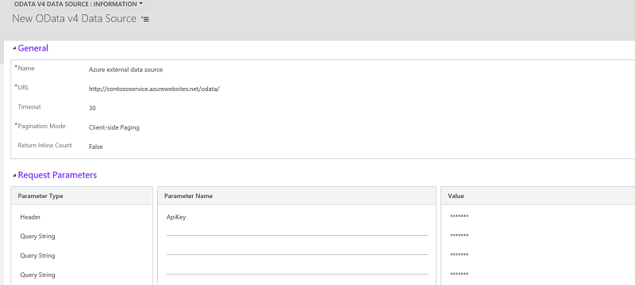

# OData v4 Data Provider configuration, requirements, and best practices

[!INCLUDE[cc-data-platform-banner](../../includes/cc-data-platform-banner.md)]

This topic describes how to configure the OData v4 Data Provider as well as the requirements and recommended best practices for using the OData v4 data provider to connect with an OData v4 web service. 

## OData v4 data provider best practices

- Microsoft Dataverse requires that all tables have an ID attribute, this ID is known as a unique identifier and the value must be a guid.  You can only map ID columns to external columns with the `Edm.Guid` data type.  You can’t map an `Edm.Int32` data type to a Unique Identifier data type column in Dataverse.
-  OData tables with nullable properties must be set to match the mapped column in the virtual table. For example, an OData table property with Nullable=False must have the mapped column in Dataverse **Field Requirement** attribute set to **Business Required**. 
- For retrieve multiple queries, such as when you load data in to a grid, control the size of the dataset returned from the external data source by using the select and filter query parameters.
- If not already enabled, system administrators should enable plug-in tracing. Once enabled, all errors from the OData endpoint are captured in the plug-in trace log. More information:  [Administrator Guide: System Settings dialog box - Customization tab](/dynamics365/customer-engagement/admin/system-settings-dialog-box-customization-tab) 

## Data type mapping

The following table lists the OData table Data Model (EDM) data type mappings with Dataverse data types. 

|OData Data Type|Dataverse Data Type  |
|---------|---------|
|`Edm.Boolean`|Two Options|
|`Edm.DateTime`|Date and Time|
|`Edm.DateTimeOffset`|Date and Time|
|`Edm.Decimal`|Decimal Number or Currency|
|`Edm.Double`|Floating Point Number|
|`Edm.Guid`|Unique Identifier|
|`Edm.Int32`|Whole Number|
|`Edm.Int64`|Whole Number|
|`Edm.String`|Single Line of Text or Multiple Lines of Text|

### OData EDM data types that are not supported for mapping with virtual tables 

- `Edm.Binary`
- `Edm.Time` 
- `Edm.Float`
- `Edm.Single` 
- `Edm.Int16` 
- `Edm.Byte` 
- `Edm.SByte`

 
## Add a data source using the OData v4 Data Provider

This procedure shows you how to use the out-of-box OData Data Provider to use as the virtual table data source.   
  
1. Go to **[Settings](../model-driven-apps/advanced-navigation.md#settings)** > **Administration** > **Virtual Entity Data Sources**.  
1. On the actions toolbar, click **New**.  
1. On the **Select Data Provider** dialog box, select from the following data sources, and then click **OK**.  
  
    - **OData v4 Data Provider**. Dataverse includes an Odata v4 data provider that can be used to connect to data sources that support the OData v4 open standard.  
    - *Custom data provider*. If you've imported a data  provider plug-in, the data provider will appear here. More information:  [Developer Documentation: Get started with virtual tables](/powerapps/developer/data-platform/virtual-entities/get-started-ve)  
    
1. On the **New Data Source** properties page, complete the following columns, and then save the row.  
  
    - **Name**. Type a name that describes the data source.  
    - **Uri**. If you are using the OData Data Provider, enter the uri for the OData web service. For example, if you are using the OData provider to connect to a web service hosted in Azure, the URI can look similar to *`https://contosodataservice.azurewebsites.net/odata/`*.  
    - **Timeout in seconds**. Enter the number of seconds to wait for a response from the web service before a data request time-out. For example, enter 30 to wait a maximum of thirty seconds before a time-out occurs.  
    - **Pagination mode**. Select whether to use client-side or server-side paging to control how query results are paged. The default value is client-side paging. With server-side paging, the server controls how results are paged by using the $skiptoken parameter, which is added to the query string. More information:  [Skip Token System Query Option ($skiptoken)](/openspecs/windows_protocols/ms-odata/4dda9434-c2c5-4577-8e01-7bf9e822d90a)  
        -  **Return inline count**. Returns the total number rows in the result set. This setting is used to enable next page functionality when you return data to a grid. Use a value of false if your OData endpoint doesn't support the OData $inlinecount parameter. The default value is false.
    - **Request Parameters**. Optionally, you can add custom header or query string parameters used to connect to the OData web service, such as authentication parameters to the external service. Click **Query String** to toggle between header and query string parameter and value. Up to 10 header or query strings can be added. 
        > [!div class="mx-imgBorder"] 
        >  

### See also  

[Create and edit virtual tables that contain data from an external data source](create-edit-virtual-entities.md) 

[!INCLUDE[footer-include](../../includes/footer-banner.md)]
