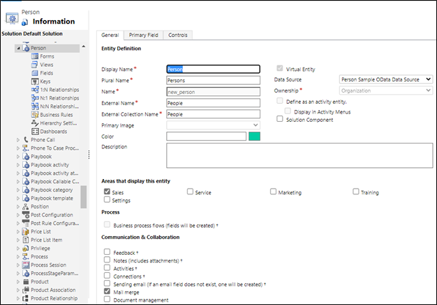
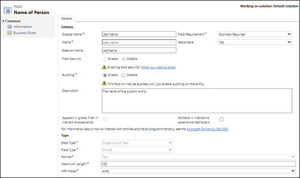
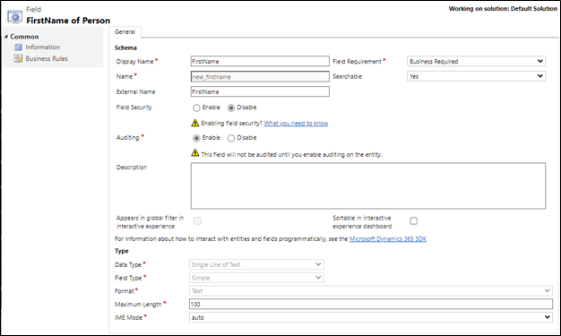

# Virtual table walkthrough using the OData v4 Data Provider

[!INCLUDE[cc-data-platform-banner](../../includes/cc-data-platform-banner.md)]

Imagine that you want to access ticket information from an external data source within your model-driven app. In this simple walkthrough, you'll model a virtual table with columns mapped to the external schema that retrieves ticket data at runtime from an OData web service.

## Data source details

Because the data source used for this walkthrough has an OData v4 web service, we can use the OData v4 Data Provider included with your environment.

Web service url: `https://contosowebservice.azurewebsites.net/odata/` 

> [!IMPORTANT]
> The web service url used for this walkthrough isn't a functioning web service.

For this walkthrough, a single virtual table that contains the following three columns is needed.

|External column name |External data type |Virtual table data type |Purpose |
|---------|---------|---------|---------|
|TicketID |`Edm.Guid` |Primary key |Primary key for the table |
|Title  |`Edm.String` |Single Line of Text |Title of the ticket |
|Severity |`Edm.Int32`| Whole Number |Number value of 0-4 indicating the severity of the ticket |

The OData metadata of the external data source Ticket table:

```xml
<tableType Name="Ticket">
  <Key>
    <PropertyRef Name="TicketID" />
  </Key>
  <Property Name="TicketID" Nullable="false" Type="Edm.Guid" />
  <Property Name="Title" Type="Edm.String" />
  <Property Name="Severity" Nullable="false" Type="Edm.Int32" />
</tableType>
```

## Create the Data Source

Create the data source for the OData v4 data provider that uses the OASIS Open Data Protocol (OData) sample web service.

1. Go to **Settings** > **Administration** > **Virtual Entity Data Sources**.
1. Select **NEW**, select **OData v4 Data Provider**, and then select **OK**.
1. Enter or select the following information.

    |Field|Value|
    |--|--|
    |**Name**|Contoso Sample Data Source|
    |**URL**|`https://contosowebservice.azurewebsites.net/odata` |
    |**Timeout**|30|
    |**Return Inline Count**|True|

Leave the other columns as-is, and select **SAVE & CLOSE**.

> [!TIP]
> When using your own web service, verify that the URL is valid by pasting it in to your web browser. 

## Open solution explorer

Part of the name of any custom table you create is the customization prefix. This is set based on the solution publisher for the solution you’re working in. If you care about the customization prefix, make sure that you are working in an unmanaged solution where the customization prefix is the one you want for this table. More information: [Change the solution publisher prefix](create-solution.md#solution-publisher) 

[!INCLUDE [cc_navigate-solution-from-powerapps-portal](../../includes/cc_navigate-solution-from-powerapps-portal.md)]


## Create the virtual table

1. In the left navigation pane of solution explorer, select **Entities**, and then select **New** from the main pane.
2. On the **table: New** form, select the **Virtual table** option, and then enter the following information: 

    |Field|Value|
    |--|--|
    |**Data Source**|Contoso Sample Data Source|
    |**Display Name**|Ticket|
    |**Plural Name**|Tickets|
    |**Name**|new_ticket|
    |**External Name**|Ticket|
    |**External Collection Name**|Tickets|
    |**Notes (includes attachments)**|selected|
    |**Activities**|selected|

1. Next to **Areas that display this entity**, select **Service**, and then select **Save** (but don’t close the table form).
    

## Create the columns for the virtual table

On the left navigation pane of the **Entity: Ticket** page, select **Columns**. As part of this walkthrough you will edit two existing columns and add a third column.

> [!IMPORTANT]
> External names are case sensitive. Refer to your web service metadata to make sure you use the correct name.
> A Nullable value of false indicates that the attribute is required. Notice that primary key columns are always system required.

1. Open the **new_ticketid** column, and change the following attribute with the value indicated here:
    **External Name**: TicketID
    
1. Select **Save and Close**.
1. Open the **new_name** column, and change the following attributes to have the values indicated here:
    - **Display Name**: Title
    - **External Name**: Title
    
1. Select **Save and Close**.
1. Select **New**, and on the **Field: New for Ticket** page enter the following information:

    |Field|Value|
    |--|--|
    |**Display Name**|Severity|
    |**Name**|new_severity|
    |**External Name**|Severity|
    |**Field Requirement**|Business Required|
    |**Data Type**|Whole Number|
    |**Minimum Value**|0|
    |**Maximum Value**|4|

  
1. Select **Save and Close**.

## Add the columns to the Main form

1. On the Ticket table window, select **Forms**.
1. Open the main form, drag and drop the **Severity** column from the right pane onto the form in the **General** section under the **Title** column. 
    
1. On the Ticket table window select **Save and Close**.

## Configure the default view

1. On the left pane of the solution explorer, under the **Ticket entity**, select **Views**.
1. Open the **All Tickets** view.
1. In the **Common Tasks** pane select **Add Columns**.
    
1. Select **Severity**, and then select **OK**.
1. On the **View: All Tickets** window select **Save and Close**.
1. On the Solution Explorer window select **Publish All Customizations**.
    
1. After all customizations are published, close the Solution Explorer window.

## View the virtual table in action with Dynamics 365

1. Go to **Service** > **Extensions** > **Tickets**.
    
    

    The **All Tickets** view displays. Notice that you may need to refresh your browser to view the table from the **Service** area.

    
1. Open a **Ticket** row to view the form that includes the **Title** and **Severity** columns for the given row.
    

### See also

[OData v4 Data Provider configuration, requirements, and best practices](virtual-entity-odata-provider-requirements.md)<br />
[Create and edit virtual tables that contain data from an external data source](create-edit-virtual-entities.md)


[!INCLUDE[footer-include](../../includes/footer-banner.md)]