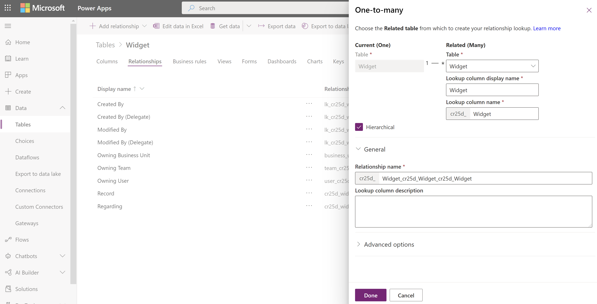
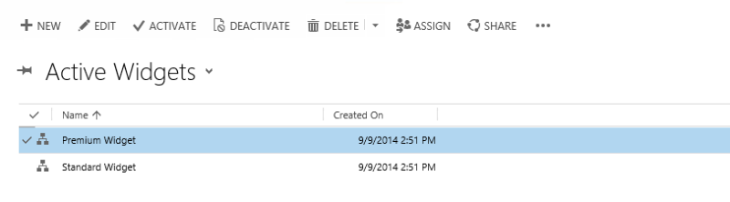
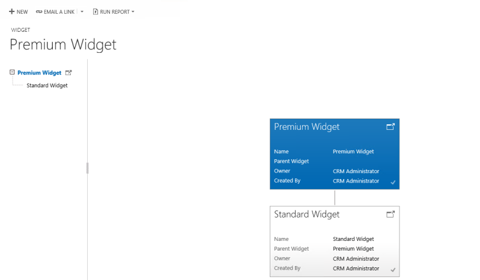

# Visualize hierarchical data with model-driven apps

[!INCLUDE[cc-data-platform-banner](../../includes/cc-data-platform-banner.md)]

When a table is configured to have a hierarchical self-referential relationship you can configure visualizations using that hierarchy. More information: [Define and query hierarchically related data](../data-platform/define-query-hierarchical-data.md)

The  tables that have visualizations available by default include [Account](/powerapps/developer/data-platform/reference/tables/account), [Position](/powerapps/developer/data-platform/reference/tables/position), and [User](/powerapps/developer/data-platform/reference/tables/systemuser). In the grid view of these tables, you can see the icon depicting the hierarchy chart, to the left of the row name. The hierarchy icon isn’t present for all rows by default. The icon is shown for the rows that are related using the hierarchical relationship.  
> [!div class="mx-imgBorder"] 
>   
  
 If you select the hierarchy icon, you can view the hierarchy, with the tree view on the left and the tile view on the right, as shown below:  
  
> [!div class="mx-imgBorder"] 
>   
  
 A few other tables can be enabled for a hierarchy. These tables include [Contact](/powerapps/developer/data-platform/reference/tables/contact) and [Team](/powerapps/developer/data-platform/reference/tables/team). All custom tables can be enabled for a hierarchy.  
  
## Important things to remember 
  
- Only one (1:N) self-referential relationship per table can be set as hierarchical. In a self-referential relationship the primary table and the related table must be of the same type.  
- A hierarchy or visualization is based on one table only. You can depict the account hierarchy showing accounts at multiple levels, but you can’t show accounts and contacts in the same hierarchy visualization. 
- The maximum number of columns that can be displayed in a tile is three with Unified Interface and four with the legacy web client. If you add more columns to the Quick Form that is used for the tile view, only the first three columns will be displayed. 

## Hierarchy settings

To enable visualizations for a hierarchy you must connect the hierarchy to a quick view form. This can only be done using solution explorer.

[!INCLUDE [cc_navigate-solution-from-powerapps-portal](../../includes/cc_navigate-solution-from-powerapps-portal.md)]

The hierarchy settings are associated to a table in the solution explorer. 

1. While [viewing tables](../data-platform/create-edit-entities-solution-explorer.md#view-tables), select **Hierarchy Settings**.
2. If an existing hierarchy setting exists you can edit it. Otherwise click **New** to create a new one.
    
    > [!NOTE]
    > If the hierarchy settings do not exist the table is not eligible to have a hierarchy configured.
    >There can be only one hierarchy setting 

1. Set the data in the following columns:

|Column|Description|
|--|--|
|**Name**|*Required.* Add a unique name for the hierarchy settings. This is typically just the name of the table. This value will include the solution publisher's customization prefix.|
|**Default Quick View Form**|*Required.* Choose from an existing Quick View form or choose **Create New** to open the Quick View form editor to create a new one.|
|**Hierarchical Relationship**|*Required.* If a hierarchical relationship is already defined for the table the value will be set here. If there is no value, select **Mark a relationship as enabled for hierarchies** to open a dialog to choose one of the available self-referential relationships.|
|**Description**|Include a description of the purpose for this hierarchy so that future people customizing the system can understand why this was done.|
    

The same hierarchical settings for visualization are set once, but apply to both web and mobile clients. In tablets, the visuals render in a modified format suitable for the smaller form factor. The customizable components required for hierarchical visualization are solution aware, therefore, they can be transported between organizations like any other customization. You can configure the attributes shown in the visualization by customizing a Quick Form using the form editor.
  
## Visualization walk through

Let’s look at an example of creating the visualization for a custom table. We created a custom table called `new_Widget`, created a (1:N) self-referential relationship `new_new_widget_new_widget` and marked it as hierarchical, as shown here.  
  
  
  
Next, in the **Hierarchy Settings** grid view, we selected the `new_new_widget_new_widget` hierarchical relationship. In the form, we filled in the required columns. If you haven’t yet marked the (1:N) relationship as hierarchical, the link on the form will take you back to the relationship definition form, where you can mark the relationship as hierarchical.  

> [!IMPORTANT]
> Each table can have only one hierarchical relationship at a time. Changing this to a different self-referential relationship can have consequences. More information: [Define hierarchical data](../data-platform/define-query-hierarchical-data.md#define-hierarchical-data)

> [!div class="mx-imgBorder"] 
>   
  
For the **Quick View Form**, we created a Quick Form called **Widget Hierarchy Tile Form**. In this form that will be used in a legacy web client app, we added four columns to display in each tile. More information: [Important things to remember](#important-things-to-remember) 

> [!div class="mx-imgBorder"] 
>   
  
After we completed the setup, we created two rows: *Standard Widget* and *Premium Widget*. After making the Premium Widget a parent of the Standard Widget by using the lookup column, the `new_Widget` grid view depicted the hierarchy icons, as shown below:  

> [!div class="mx-imgBorder"] 
>   
  
> [!NOTE]
>  The hierarchy icons don’t appear in the row grid view until the rows are related using the hierarchical relationship.  
  
Choosing the hierarchy icon displays the `new_Widget` hierarchy with the tree view on the left and the tile view on the right, showing two rows. Each tile contains four columns that we provided in the **Widget Hierarchy Tile Form**.  

> [!div class="mx-imgBorder"] 
>   

Based on your needs, you can choose between using a tree view, which shows the entire hierarchy, or a tile view, which depicts a smaller portion of the hierarchy. Both views are shown side by side. You can explore a hierarchy by expanding and contracting a hierarchy tree. 

### See also 

[Define and query hierarchically related data](../data-platform/define-query-hierarchical-data.md) 

[!INCLUDE[footer-include](../../includes/footer-banner.md)]