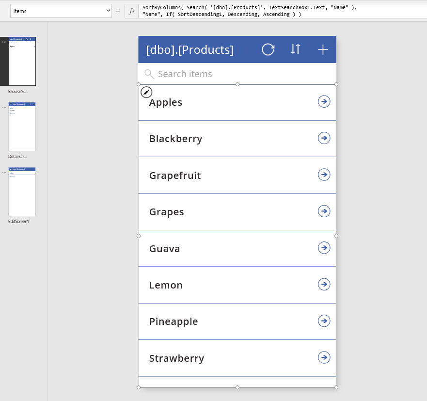

# Understand delegation
PowerApps includes a powerful set of functions for filtering, sorting, and shaping tables of data:  **[Filter](functions/function-filter-lookup.md)**, **[Sort](../functions/function-sort.md)**, and **[AddColumns](../functions/function-table-shaping.md)** functions to name just a few.  With these functions, you can provide your users with focused access to the information they need.  For those with a database background, using these functions is the equivalent of writing a database query.  

The key to building efficient apps is to minimize the amount of data that needs to be brought to your device.  Perhaps only a handful of records from a sea of millions are needed, or a single aggregate value can represent thousands of records.  Or perhaps only the first set of records can be retrieved, and the rest brought in as the user gestures that they want more.  Being focused can dramatically reduce the processing power, memory, and network bandwidth needed by your app, resulting in snappier response times for your users, even on phones connected via a cellular network.  

*Delegation* is where the expressiveness of PowerApps formulas meets the need to minimize data moving over the network.  In short, it means that PowerApps will delegate the processing of data to the data source, rather than moving the data to the app for processing locally.  

Where this becomes complicated, and the reason this article exists, is because not everything that can be expressed in a PowerApps formula can be delegated to every data source.  The PowerApps language mimics Excel's formula language, designed with complete and instant access to a full workbook in memory, with a wide variety of numerical and text manipulation functions.  As a result, the PowerApps language is far richer than most data sources can support, including powerful database engines such as SQL Server.

**Working with large data sets requires using data sources and formulas that can be delegated.**  It is the only way to keep your app performing well and ensure users can access all the information they need. Take heed of [blue-dot suggestions](delegation-overview.md#blue-dot-suggestions) that flag places where delegation is not possible.  If you're working with small data sets (less than 500 records), you can use any data source and formula as processing can be done locally if the formula cannot be delegated.  

## Delegable data sources
See the [delegation list](delegation-list.md) for the full list of which data sources support delegation and to what extent.

We are continuing to add delegation support to existing data sources, as well as add more data sources.

Imported Excel workbooks (using the "Add static data to your app" data source), collections, and tables stored in context variables don't require delegation. All of this data is already in memory, and the full PowerApps language can be applied.

## Delegable functions
The next step is to use only those formulas that can be delegated. Included here are the formula elements that could be delegated.  However, every data source is different, and not all of them support all of these elements. Check for blue-dot suggestions in your particular formula.

These lists will change over time. We're working to support more functions and operators with delegation.

### Filter functions
**[Filter](functions/function-filter-lookup.md)**, **[Search](functions/function-filter-lookup.md)**, and **[LookUp](functions/function-filter-lookup.md)** can be delegated.  

Within the **Filter** and **LookUp** functions, the following can be used with columns of the table to select the appropriate records:

* **[And](../functions/function-logicals.md)** (including **[&&](../functions/operators.md)**), **[Or](../functions/function-logicals.md)** (including **[||](../functions/operators.md)**), **[Not](../functions/function-logicals.md)** (including **[!](../functions/operators.md)**)
* **[In](../functions/operators.md)**
* **[=](../functions/operators.md)**, **[<>](../functions/operators.md)**, **[>=](../functions/operators.md)**, **[<=](../functions/operators.md)**, **[>](../functions/operators.md)**, **[<](../functions/operators.md)**
* **[+](../functions/operators.md)**, **[-](../functions/operators.md)**
* **[TrimEnds](../functions/function-trim.md)**
* **[IsBlank](../functions/function-isblank-isempty.md)**
* **[StartsWith](../functions/function-startswith.md)**
* Constant values that are the same across all records, such as control properties and [global and context variables](working-with-variables.md).

Portions of your formula that evaluate to a constant value for all records can also be used.  For example, **Left( Language(), 2 )** does not depend on any columns of the record and therefore returns the same value for all records.  It is effectively a constant.  Use of context variables, collections, and signals may not be constant and therefore will prevent **Filter** and **LookUp** from being delegated.  

Some notable items missing from the above list:

* **[If](functions/function-if.md)**
* **[*](../functions/operators.md)**, **[/](../functions/operators.md)**, **[Mod](../functions/function-mod.md)**
* **[Concatenate](functions/function-concatenate.md)** (including **[&](../functions/operators.md)**)
* **[ExactIn](../functions/operators.md)**
* String manipulation functions: **[Lower](../functions/function-lower-upper-proper.md)**, **[Upper](../functions/function-lower-upper-proper.md)**, **[Left](../functions/function-left-mid-right.md)**, **[Mid](../functions/function-left-mid-right.md)**, **[Len](../functions/function-left-mid-right.md)**, ...
* Signals: **[Location](../functions/signals.md)**, **[Acceleration](../functions/signals.md)**, **[Compass](../functions/signals.md)**, ...
* Volatiles: **[Now](../functions/function-now-today-istoday.md)**, **[Today](../functions/function-now-today-istoday.md)**, **[Rand](../functions/function-rand.md)**, ...
* [Collections](working-with-variables.md)

### Sorting functions
**[Sort](../functions/function-sort.md)** and **[SortByColumns](../functions/function-sort.md)** can be delegated.  

In **Sort**, the formula can only be the name of a single column and can't include other operators or functions.

### Aggregate functions
**[Sum](functions/function-aggregates.md)**, **[Average](functions/function-aggregates.md)**, **[Min](functions/function-aggregates.md)**, and **[Max](functions/function-aggregates.md)** can be delegated.  Only a limited number of data sources support this delegation at this time, check the [delegation list](delegation-list.md) for more details.

Counting functions such as **[CountRows](../functions/function-table-counts.md)**, **[CountA](../functions/function-table-counts.md)**, and **[Count](../functions/function-table-counts.md)** cannot be delegated.

Other aggregate functions such as **[StdevP](functions/function-aggregates.md)** and **[VarP](functions/function-aggregates.md)** cannot be delegated.

### Other functions
All other functions do not support delegation, including these notable functions:

* Table shaping: **[AddColumns](../functions/function-table-shaping.md)**, **[DropColumns](../functions/function-table-shaping.md)**, **[ShowColumns](../functions/function-table-shaping.md)**, ...
* **[First](functions/function-first-last.md)**, **[FirstN](functions/function-first-last.md)**, **[Last](functions/function-first-last.md)**, **[LastN](functions/function-first-last.md)**
* **[Concat](functions/function-concatenate.md)**
* **[Collect](functions/function-clear-collect-clearcollect.md)**, **[ClearCollect](functions/function-clear-collect-clearcollect.md)**
* **[CountIf](../functions/function-table-counts.md)**, **[RemoveIf](../functions/function-remove-removeif.md)**, **[UpdateIf](../functions/function-update-updateif.md)**
* **[GroupBy](functions/function-groupby.md)**, **[Ungroup](functions/function-groupby.md)**

A common pattern is to use **AddColumns** and **LookUp** to merge information from one table into another, commonly referred to as a Join in database parlance.  For example:

**AddColumns( Products, "Supplier Name", LookUp( Suppliers, Suppliers.ID = Product.SupplierID ).Name )**

Even though **Products** and **Suppliers** may be delegable data sources and **LookUp** is a delegable function, the **AddColumns** function is not delegable.  The result of the entire formula will be limited to the first portion of the **Products** data source.  

Since the **LookUp** and its data source are delegable, a match for **Suppliers** can be found anywhere in the data source, even if it is large.  A potential downside is that **LookUp** will made separate calls to the data source for each of those first records in **Products**, causing a lot of chatter on the network.  If **Suppliers** is small enough and does not change often, you could cache the data source in your app with a **Collect** call when the app starts (using [**OnVisible**](controls/control-screen.md) on the opening screen) and do the **LookUp** to it instead.  

## Non-delegable limits
Formulas that cannot be delegated will be processed locally.  This allows for the full breadth of the PowerApps formula language to be used.  But at a price: all the data must be brought to the device first, which could involve retrieving a large amount of data over the network.  That can take time, giving the impression that your app is slow or possibly hung.

To avoid this, PowerApps imposes a limit on the amount of data that can be processed locally: 500 records.  We chose this number so that you would still have complete access to small data sets and you would be able to refine your use of large data sets by seeing partial results.

Obviously care must be taken when using this facility as it can be confusing for users.  For example, consider a **Filter** function with a selection formula that cannot be delegated, over a million record data source.  Since the filtering will be done locally, only the first 500 records of the million records will be scanned.  If the desired record is record 501, or 500,001, it will not be considered or returned by **Filter**.

Another place where this can be confusing is aggregate functions.  Take **Average** over a column of that same million record data source.  Since **Average** cannot yet be delegated, only the first 500 records will be averaged.  Care must be taken or a partial answer could be misconstrued as a complete answer by a user of your app.

## Blue dot suggestions
To make it easier to know what is and is not being delegated, the authoring experience provides blue dot suggestions when a formula contains something that cannot be delegated.

Blue dots are only shown on formulas that operate on delegable data sources.  If you don't see a blue dot and you believe your formula is not being properly delegated, check the type of data source against the list of <a href="#delegable-data-sources">delegable data sources</a> above.

## Examples
In this example, we will use a SQL Server table that contains products, in particular fruits, names **[dbo].[Products]**.  On the New screen, PowerApps can create a basic three screen app connected to this data source:

Note the formula for the Gallery's **Items** property.  It is using **SortByColumns** and **Search** functions, both of which can be delegated.

Let's type **"Apple"** into the search text-input control.  If we are very observant, we will momentarily see marching dots on the top of the screen while the new entry in the new search is processed.  The marching dots indicate that we are communicating with the SQL Server:

Because this is all delegable, even if the **[dbo].[Products]** table contains millions of records, we will still find them all, paging through them in the gallery as the user scrolls through the results.

You will notice that we are seeing a match for both "Apple" and "Pineapple".  The **Search** function will find a search term anywhere in a text column.  If instead, let's say we wanted to only find the search term at the beginning of the fruit's name.  We can use another delegable function, **Filter**, with a more complicated search term (for simplicity we'll remove the **SortByColumns** call):

This appears to be working, only **"Apples"** is correctly showing now and **"Pineapple"** is not.  However, there is a blue dot showing next to the gallery and there is a blue wavy line under a portion of the formula.  There is even a blue dot showing in the screen thumbnail.  If we hover over the blue dot next to the gallery, we see the following:

Although we are using **Filter** which is a delegable function, with SQL Server which is a delegable data source, the formula we used within **Filter** is not delegable.  **Mid** and **Len** cannot be delegated to any data source.

But it worked, didn't it?  Well, kind of.  And that is why this is a blue dot instead of a yellow hazard icon and red wavy error.  If the **[dbo].[Products]** table contains less than 500 records, then yes, this worked perfectly.   All records were brought to the device and the **Filter** was applied locally.  

If instead this table contains more than 500 records, then only fruit which begin with **"Apple"** *in the first 500 records of the table* will be displayed in the gallery.  If **"Apple, Fuji"** appears as a name in record 501 or 500,001 it will not be found.
