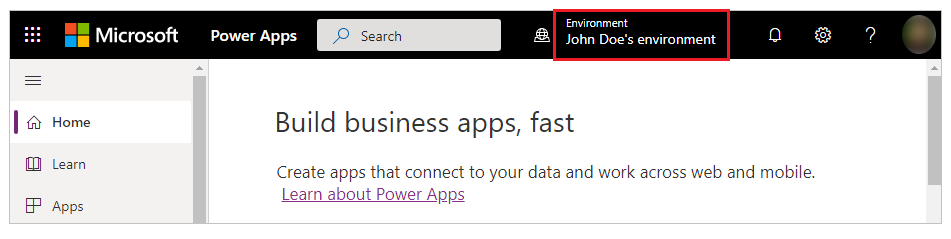
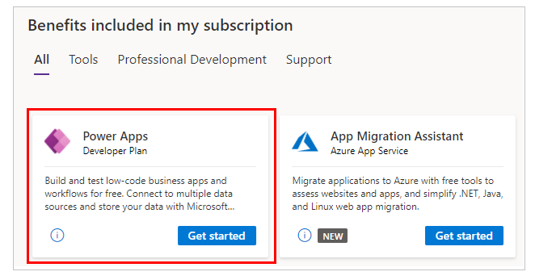

# Sign up for the Power Apps Developer Plan

The Power Apps Developer Plan gives you a free development environment to build and test with Power Apps, Power Automate, and Microsoft Dataverse.

The plan enables you to:

- Create apps and flows without writing code, with full-featured Power Apps and Power Automate development tools. Easily share and collaborate on these solutions with others.

- Connect to any data source by using 400+ [out of the box connectors](canvas-apps/connections-list.md) or by creating your own [custom connectors](canvas-apps/register-custom-api.md).

- Use a fully managed, scalable data platform with [Dataverse](/common-data-service/entity-reference/introduction), including support for common business application actions. Use out-of-the-box common tables or build your own data schema.

- Create more environments to exercise application lifecycle management (coming soon).

- Export the solutions you create in your developer environment, and [publish them on Microsoft AppSource](/powerapps/developer/data-platform/publish-app-appsource) so your customers can test-drive them.

## Improvements from the previous Power Apps Community Plan

In May 2021, we extended the capabilities of the Power Apps Community Plan to meet the needs of developers and rebranded it as the **Power Apps Developer Plan**.

Key changes include:

- The ability to share apps with team members for development and testing purposes
- Increased capacity allocations
- The ability to create more environments to support ALM (application lifecycle management) scenarios (coming soon)

> [!NOTE]
> Existing Power Apps Community Plan users will also get all of these updates.

## Who can sign up for the Power Apps Developer Plan?

Anyone with a [work or school email address](signup-for-powerapps.md#faq) backed by [Azure Active Directory](/azure/active-directory/fundamentals/sign-up-organization) can sign up for the Power Apps Developer Plan.

## Where can I sign up for the Power Apps Developer Plan?

Sign up on the [Power Apps Developer Plan website](https://aka.ms/PowerAppsDevPlan). If you're an existing Power Apps user, you can also [create a developer environment](https://make.powerapps.com/community/signup).

After signing up for the Developer Plan, you'll be redirected to [Power Apps](https://make.powerapps.com/?utm_source=padocs&utm_medium=linkinadoc&utm_campaign=referralsfromdoc). You
may need to select your developer environment from the top right of the screen. It will be shown with your name, for example "John Doe's environment." If there's already an environment with that name, the developer environment will be named "John Doe's (1) environment." You'll need to use this developer environment, instead of your tenant’s default environment, to use certain capabilities such as premium and custom connectors.



### Get the Developer Plan with Visual Studio Dev Essentials

If you're a Visual Studio Dev Essentials user, the Power Apps Developer Plan is included in your benefits. Visit [My
benefits](https://my.visualstudio.com/benefits) and select the Power Apps tile to sign up for the Power Apps Developer Plan.



## Which features are included in the Power Apps Developer Plan?

With the developer environment, you get the following functionality:

| **Functionalities**                                                                                              | **Developer environment**                                            |
| - | - |
| **Key features**                                                                                                 |                                                                      |
| Create and test apps                                                                                             | Yes. You can create unlimited apps for development and test purposes. |
| Share apps                                                                                                       | Yes                                                                  |
| Use Dataverse                                                                                                    | Yes                                                                  |
| Model your data using Dataverse                                                                                  | Yes                                                                  |
| Enterprise-grade administration of the environment and user policies                                             | Yes                                                                  |
| **Connectivity**                                                                                                 |                                                                      |
| Connect to Office 365, Dynamics 365, and other connectors                                                        | Yes                                                                  |
| Connect to cloud-based services like Azure SQL, Dropbox, Twitter, and many more                                  | Yes                                                                  |
| Use premium connectors like Salesforce, DB2 and many more                                                        | Yes                                                                  |
| Access on‐premises data using an on-premises gateway                                                             | Yes                                                                  |
| Create custom connectors to connect to your own systems                                                          | Yes                                                                  |
| **Dataverse**                                                                                                    |                                                                      |
| Create and run applications In Power Platform, Dynamics 365, Teams, or Standalone using the .Net SDK or OData API | Yes                                                                  |
| Model your data in Dataverse                                                                                     | Yes                                                                  |
| Create a database in Dataverse                                                                                   | Yes                                                                  |
| Create and use dataflows                                                                                         | No                                                                   |
| **Management**                                                                                                 |                                                                      |
| Add coworkers as environment makers and admins                                                                  | Yes                                                                   |
| Add coworkers to the database roles                                                                             | Yes                                                                   |
| Supports data policies established by the Office 365 administrator                                               | Yes                                                                  |
| Establish data policies for the developer environment                                                           | Yes                                                                  |


## What are the capacity limits for the developer environment?

The following capacity limits apply to the developer environments:

| **Capacity**                                                    | **Limits** |
| - | - |
| Flow runs/month                                                 | 750        |
| Database size                                                   | 2 GB        |
|                                                                 |            |

You can't increase capacity by applying add-ons to the quantities we include. If you hit capacity limits, we recommend purchasing the Power Apps Per User Plan. Learn more from the [Power Apps pricing page](https://powerapps.microsoft.com/pricing/).

> [!NOTE]
> The capacity entitlements of the developer environment, whether used or not, doesn't contribute to your company's overall quota.

## Publishing to Microsoft AppSource

Do you have an app that you'd like to share with customers? We now support Power Apps solutions on [Microsoft AppSource](https://appsource.microsoft.com/) as a way for you to share apps and flows with customers, and generate leads for your
business. For more information, see [Publish your app on
AppSource](../developer/data-platform/publish-app-appsource.md).

## FAQ

The following section lists frequently asked questions relevant to the Power Apps Developer Plan. For more information about different types of environments including the developer environment, see [Types of environments in Power Platform](/power-platform/admin/environments-overview#types-of-environments).

### What should I do if I reach the capacity limits of the environment?

There's a limited capacity provided because this environment is meant for development and test purposes, not for production use. The capacity limits are:

| **Capacity**                                                          | **Limits** |
| - | - |
| Flow runs/month                                                       | 750        |
| Database size                                                         | 2 GB       |

If you reach one or more capacity limits, we recommend you purchase a plan that
supports production use. Learn more about our plans on the [Power Apps pricing
page](https://powerapps.microsoft.com/pricing/).

### Can I transfer the apps, flows, and other resources created in the developer environment to another environment?

Yes, you should be able to export the resources from this environment to other environments. For more information,
see [Solutions](data-platform/solutions-overview.md).

### Will my Power Apps Developer Plan subscription ever expire?

You can continue using your Power Apps Developer Plan for free as long as there's active usage and no abuse of the plan (for example, apps aren't used for production purposes and the capacity limits aren't exceeded).

### Can I get or create multiple developer environments?

Currently, no. You can only have one developer environment, which is created for you by Power Apps when you sign up for the Developer Plan.

The ability to create more environments to support ALM scenarios is coming soon. Stay tuned for more details.

### What's the difference between the Power Apps Plan Trial and Power Apps Developer Plan. Which one should I sign up for?

Both Power Apps Plan Trial and Power Apps Developer Plan are free, but are created for different purposes:

- **Power Apps Plan Trial** gives you the Power Apps per user plan for 30 days. This duration is meant for trying out production Power Apps applications. Once your trial
expires, you can purchase a plan. If you're already using Power Apps with Office 365 or Dynamics 365, this is the right plan to test the premium functionalities of Power Apps, which are available with paid Power Apps plans.

- **Power Apps Developer Plan** gives you perpetual access to the same Power Apps functionality available in paid plans (aligned with Trials), including Dataverse and Power Automate, but in a developer environment meant for development and test use only. A paid plan is required to deploy or run solutions in a production environment for production use.

### Can I sign up with my personal account?

No, we currently don't support signing up with a personal account. You can only sign up with your [work or school
account](signup-for-powerapps.md#faq).

### Can I delete my developer environment?

End user (creator), Power Platform admins and tenant-level admins have the permissions needed to delete a developer environment through the user interface. In addition, an end user can also delete a developer environment through a [Power Apps PowerShell admin cmdlet](/power-platform/admin/powerapps-powershell#power-apps-cmdlets-for-administrators).

```powershell
Remove-AdminPowerAppEnvironment -EnvironmentName <environmentGuid>
```

### Can I reset my developer environment?

Resetting a developer environment isn't currently supported; however, it can be deleted. A new developer environment will be created if the Developer Plan licensed user (whose environment is deleted) signs in to the Power Apps maker portal again. The user can then provision a Dataverse database in the environment. Currently, the only way to remove the Developer Plan from a user is for a tenant-level admin to block all "internal" consent plans in the tenant using PowerShell. For more information, see [Block trial licenses commands](/power-platform/admin/powerapps-powershell#block-trial-licenses-commands).

[!INCLUDE[footer-include](../includes/footer-banner.md)]

### Does the Power Apps Developer plan include Power Automate RPA use rights?
No. However, users may start a Power Automate trial including RPA use rights to try out RPA capabilities. Power Apps Developer plan includes cloud flow use rights since these can be connected to an act as an extension of Power Apps apps. 
